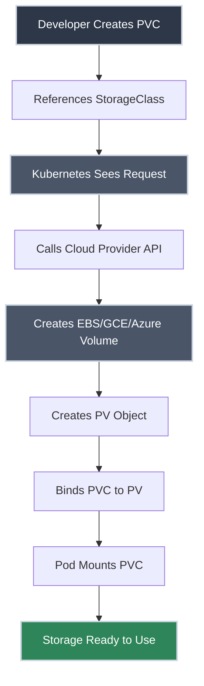

# StorageClasses

!!! tip "Part of Level 4: Storage and State"
    This article is part of [Level 4: Storage and State](overview.md). Complete [Persistent Volume Claims (PVC)](persistent_volume_claims.md) first if you haven't already.

You're tired of creating Persistent Volumes manually. Every time a developer requests storage, you create a PV by hand—choosing the right size, configuring the backend, tracking which PVs are available. It's tedious, error-prone, and doesn't scale.

StorageClasses solve this by enabling **dynamic provisioning**. Define your storage types once (fast SSD, cheap HDD, network storage), and Kubernetes automatically creates PVs when developers request them. No manual work. No pre-provisioning. Just self-service storage that scales with your team.

This is how modern Kubernetes environments handle storage.

---

## What You'll Learn

- What StorageClasses are and why they matter
- How dynamic provisioning works
- Creating and configuring StorageClasses
- Common storage parameters for cloud providers
- Default StorageClasses
- Reclaim policies and volume binding modes
- When to use dynamic vs static provisioning

---

## The Storage Provisioning Problem

```mermaid
graph TB
    subgraph "Manual Provisioning (Static)"
        A1[Dev Requests Storage] --> A2[Ticket to Admin]
        A2 --> A3[Admin Creates PV]
        A3 --> A4[Dev Creates PVC]
        A4 --> A5[Kubernetes Binds]
        A5 --> A6[Finally: Storage Ready]
    end

    subgraph "Dynamic Provisioning"
        B1[Dev Creates PVC] --> B2[Kubernetes Sees Request]
        B2 --> B3[Auto-Creates PV]
        B3 --> B4[Auto-Binds]
        B4 --> B5[Storage Ready]
    end

    style A1 fill:#2d3748,stroke:#cbd5e0,stroke-width:2px,color:#fff
    style A2 fill:#c53030,stroke:#cbd5e0,stroke-width:2px,color:#fff
    style A3 fill:#c53030,stroke:#cbd5e0,stroke-width:2px,color:#fff
    style A6 fill:#2f855a,stroke:#cbd5e0,stroke-width:2px,color:#fff
    style B1 fill:#2d3748,stroke:#cbd5e0,stroke-width:2px,color:#fff
    style B5 fill:#2f855a,stroke:#cbd5e0,stroke-width:2px,color:#fff
```



**Key insight:** StorageClasses move from manual, ticket-driven provisioning to automated, self-service storage.

---

## How StorageClasses Work

A **StorageClass** is a template that describes a type of storage. When a developer creates a PVC that references a StorageClass, Kubernetes automatically:

1. **Creates the underlying storage** (EBS volume, GCE disk, etc.)
2. **Creates a PV** pointing to that storage
3. **Binds the PVC** to the new PV
4. **Mounts it** when a Pod requests it

<div class="grid cards" markdown>

-   :material-file-cog: **StorageClass: The Template**

    ---

    **Why it matters:** Defines storage types available to developers.

    **What it contains:**
    - Provisioner (which storage backend)
    - Parameters (size, type, performance tier)
    - Reclaim policy (what happens on deletion)
    - Volume binding mode (immediate vs delayed)

    **Analogy:** Like a menu at a restaurant—"Fast SSD," "Standard HDD," "Network Storage." Developers order from the menu; the kitchen (Kubernetes) prepares it.

-   :material-account-hard-hat: **Who Creates Them**

    ---

    **Why it matters:** StorageClasses are cluster-wide resources.

    **Created by:**
    - **Cluster administrators** (on-prem)
    - **Cloud provider defaults** (EKS, GKE, AKS)
    - **Platform teams** (defining org standards)

    **Used by:**
    - **Application developers** (reference in PVCs)
    - **CI/CD pipelines** (automated deployments)

</div>

---

## Creating a StorageClass

=== "AWS EBS (General Purpose SSD)"

    **Scenario:** Create a StorageClass for AWS EBS gp3 volumes with encryption.

    ``` yaml title="storageclass-aws-gp3.yaml" linenums="1"
    apiVersion: storage.k8s.io/v1  # (1)!
    kind: StorageClass
    metadata:
      name: fast-ssd  # (2)!
    provisioner: ebs.csi.aws.com  # (3)!
    parameters:
      type: gp3  # (4)!
      iops: "3000"  # (5)!
      throughput: "125"  # (6)!
      encrypted: "true"  # (7)!
      kmsKeyId: arn:aws:kms:us-east-1:123456789:key/abc-123  # (8)!
    reclaimPolicy: Delete  # (9)!
    allowVolumeExpansion: true  # (10)!
    volumeBindingMode: WaitForFirstConsumer  # (11)!
    ```

    1. StorageClass API version
    2. Name developers reference in PVCs
    3. AWS EBS CSI driver—handles creating EBS volumes
    4. gp3 = General Purpose SSD (newer, cheaper than gp2)
    5. IOPS (Input/Output Operations Per Second)
    6. Throughput in MB/s
    7. Encrypt volumes at rest
    8. Optional: Custom KMS key for encryption
    9. Delete underlying EBS volume when PVC is deleted
    10. Allow resizing volumes without recreating
    11. Wait to create volume until Pod is scheduled (zone-aware)

    ``` bash title="Create StorageClass"
    kubectl apply -f storageclass-aws-gp3.yaml
    # storageclass.storage.k8s.io/fast-ssd created

    kubectl get storageclass
    # NAME       PROVISIONER         RECLAIMPOLICY   VOLUMEBINDINGMODE      AGE
    # fast-ssd   ebs.csi.aws.com     Delete          WaitForFirstConsumer   10s
    ```

=== "GCE Persistent Disk (SSD)"

    **Scenario:** Create a StorageClass for Google Cloud SSD persistent disks.

    ``` yaml title="storageclass-gce-ssd.yaml" linenums="1"
    apiVersion: storage.k8s.io/v1
    kind: StorageClass
    metadata:
      name: gce-ssd
    provisioner: pd.csi.storage.gke.io  # (1)!
    parameters:
      type: pd-ssd  # (2)!
      replication-type: regional-pd  # (3)!
    reclaimPolicy: Delete
    allowVolumeExpansion: true
    volumeBindingMode: WaitForFirstConsumer
    ```

    1. GCE Persistent Disk CSI driver
    2. pd-ssd = SSD (faster), pd-standard = HDD (cheaper)
    3. regional-pd = replicated across zones (higher availability)

=== "Azure Disk (Premium SSD)"

    **Scenario:** Create a StorageClass for Azure Premium SSD managed disks.

    ``` yaml title="storageclass-azure-premium.yaml" linenums="1"
    apiVersion: storage.k8s.io/v1
    kind: StorageClass
    metadata:
      name: azure-premium
    provisioner: disk.csi.azure.com  # (1)!
    parameters:
      skuName: Premium_LRS  # (2)!
      kind: Managed  # (3)!
      cachingmode: ReadOnly  # (4)!
    reclaimPolicy: Delete
    allowVolumeExpansion: true
    volumeBindingMode: WaitForFirstConsumer
    ```

    1. Azure Disk CSI driver
    2. Premium_LRS = Premium SSD with local redundancy
    3. Managed disk (Azure handles replication)
    4. ReadOnly cache improves read performance

=== "NFS (Manual Provisioner)"

    **Scenario:** Create a StorageClass for NFS volumes (requires external provisioner).

    ``` yaml title="storageclass-nfs.yaml" linenums="1"
    apiVersion: storage.k8s.io/v1
    kind: StorageClass
    metadata:
      name: nfs-storage
    provisioner: example.com/nfs  # (1)!
    parameters:
      server: nfs.example.com  # (2)!
      path: /exports/kubernetes  # (3)!
    reclaimPolicy: Retain  # (4)!
    volumeBindingMode: Immediate
    ```

    1. Custom provisioner—must be deployed separately
    2. NFS server hostname or IP
    3. NFS export path
    4. Retain data when PVC is deleted (manual cleanup)

    !!! warning "NFS Requires External Provisioner"
        Kubernetes doesn't include an NFS provisioner. You must deploy one separately (e.g., [nfs-subdir-external-provisioner](https://github.com/kubernetes-sigs/nfs-subdir-external-provisioner)).

---

## StorageClass Parameters

### Common Parameters Across Providers

<div class="grid cards" markdown>

-   :material-delete: **Reclaim Policy**

    ---

    **Why it matters:** Determines what happens to storage when PVC is deleted.

    | Policy | Behavior | Use Case |
    |--------|----------|----------|
    | **Delete** | Auto-delete underlying storage | Dev/test, cloud environments |
    | **Retain** | Keep storage, manual cleanup | Production, data preservation |

    **Default:** `Delete` (most StorageClasses)

    **Set it:**
    ```yaml
    reclaimPolicy: Retain
    ```

-   :material-resize: **Volume Expansion**

    ---

    **Why it matters:** Allows resizing PVCs without recreating them.

    **Enable it:**
    ```yaml
    allowVolumeExpansion: true
    ```

    **Usage:**
    ```bash
    # Edit PVC and increase storage size
    kubectl edit pvc my-pvc
    # Change: storage: 10Gi -> storage: 20Gi
    ```

    !!! warning "Not All Backends Support Expansion"
        Check cloud provider docs. Most support expansion, some require downtime.

-   :material-clock-outline: **Volume Binding Mode**

    ---

    **Why it matters:** Controls when PV is created and bound.

    | Mode | Behavior | Use Case |
    |------|----------|----------|
    | **Immediate** | Create PV as soon as PVC is created | Zone-agnostic storage (NFS) |
    | **WaitForFirstConsumer** | Create PV when Pod is scheduled | Zone-aware storage (EBS, GCE) |

    **Why WaitForFirstConsumer?**

    AWS EBS volumes are zone-specific. If PV is created in `us-east-1a` but Pod schedules in `us-east-1b`, binding fails. `WaitForFirstConsumer` creates the PV in the same zone as the Pod.

    ```yaml
    volumeBindingMode: WaitForFirstConsumer
    ```

</div>

---

## Default StorageClass

Every cluster can have **one default StorageClass**. When a PVC doesn't specify `storageClassName`, the default is used.

### Checking Default StorageClass

``` bash title="List StorageClasses"
kubectl get storageclass
# NAME                PROVISIONER             RECLAIMPOLICY   VOLUMEBINDINGMODE
# gp2 (default)       ebs.csi.aws.com         Delete          WaitForFirstConsumer
# fast-ssd            ebs.csi.aws.com         Delete          WaitForFirstConsumer
# standard            kubernetes.io/gce-pd    Delete          Immediate
```

The `(default)` annotation shows which is default.

### Setting a Default StorageClass

``` yaml title="Mark as Default" linenums="1"
apiVersion: storage.k8s.io/v1
kind: StorageClass
metadata:
  name: fast-ssd
  annotations:
    storageclass.kubernetes.io/is-default-class: "true"  # (1)!
provisioner: ebs.csi.aws.com
# ... rest of spec
```

1. This annotation makes this StorageClass the default

!!! warning "Only One Default"
    If multiple StorageClasses are marked default, PVC binding behavior is undefined. Ensure only one has the default annotation.

### Removing Default

``` bash title="Remove Default Annotation"
kubectl patch storageclass gp2 -p '{"metadata": {"annotations":{"storageclass.kubernetes.io/is-default-class":"false"}}}'
```

---

## Using StorageClasses in PVCs

=== "Use Default StorageClass"

    **Scenario:** Don't specify `storageClassName`—use cluster default.

    ``` yaml title="pvc-default.yaml" linenums="1"
    apiVersion: v1
    kind: PersistentVolumeClaim
    metadata:
      name: my-pvc
    spec:
      accessModes:
        - ReadWriteOnce
      resources:
        requests:
          storage: 10Gi
      # storageClassName not specified = use default
    ```

    Kubernetes uses the default StorageClass automatically.

=== "Specify StorageClass"

    **Scenario:** Explicitly request a specific StorageClass.

    ``` yaml title="pvc-fast-ssd.yaml" linenums="1"
    apiVersion: v1
    kind: PersistentVolumeClaim
    metadata:
      name: database-pvc
    spec:
      accessModes:
        - ReadWriteOnce
      storageClassName: fast-ssd  # (1)!
      resources:
        requests:
          storage: 50Gi
    ```

    1. Request storage from the `fast-ssd` StorageClass

    Kubernetes creates a PV using the `fast-ssd` StorageClass parameters.

=== "Disable Dynamic Provisioning"

    **Scenario:** Use static PVs (no StorageClass).

    ``` yaml title="pvc-static.yaml" linenums="1"
    apiVersion: v1
    kind: PersistentVolumeClaim
    metadata:
      name: static-pvc
    spec:
      accessModes:
        - ReadWriteOnce
      storageClassName: ""  # (1)!
      resources:
        requests:
          storage: 20Gi
    ```

    1. Empty string disables dynamic provisioning—bind to manually created PVs only

    Kubernetes binds to a pre-created PV that matches the request.

---

## Dynamic Provisioning Workflow



**Step-by-step:**

1. **Developer** creates PVC requesting 50Gi from `fast-ssd` StorageClass
2. **Kubernetes** sees the PVC, checks StorageClass `fast-ssd`
3. **Provisioner** (e.g., `ebs.csi.aws.com`) calls AWS API
4. **AWS** creates a 50Gi gp3 EBS volume
5. **Kubernetes** creates a PV pointing to that EBS volume
6. **Kubernetes** binds PVC to the new PV
7. **Pod** mounts the PVC and writes data

All automatic. No admin intervention.

---

## Common StorageClass Patterns

<div class="grid cards" markdown>

-   :material-flash: **Performance Tiers**

    ---

    **Why it matters:** Different workloads need different performance.

    **Pattern:** Create StorageClasses for each tier.

    ```yaml
    # High Performance
    name: premium-ssd
    type: gp3
    iops: "16000"

    # Standard
    name: standard
    type: gp3
    iops: "3000"

    # Archive/Backup
    name: slow
    type: st1  # Throughput-optimized HDD
    ```

    **Usage:**
    - Databases → `premium-ssd`
    - Application logs → `standard`
    - Long-term backups → `slow`

-   :material-earth: **Multi-Zone Redundancy**

    ---

    **Why it matters:** Availability vs cost tradeoff.

    **Pattern:** Zone-local vs replicated.

    ```yaml
    # Single Zone (Cheaper)
    name: zonal
    replication-type: none

    # Regional (HA)
    name: regional
    replication-type: regional-pd
    ```

    **Usage:**
    - Dev/test → `zonal`
    - Production databases → `regional`

-   :material-lock: **Encryption Levels**

    ---

    **Why it matters:** Compliance and security requirements.

    **Pattern:** Encrypted vs unencrypted.

    ```yaml
    # Encrypted (Default)
    name: secure
    encrypted: "true"

    # Custom Key
    name: secure-pci
    encrypted: "true"
    kmsKeyId: arn:aws:kms:...
    ```

    **Usage:**
    - All production → `secure`
    - PCI/HIPAA data → `secure-pci`

</div>

---

## Practice Exercises

??? question "Exercise 1: Create a StorageClass"
    Create a StorageClass for your cloud provider with dynamic provisioning.

    **Goal:** Understand how to define storage types.

    **Hint:** Use the examples above matching your environment (AWS, GCE, Azure).

    ??? tip "Solution"
        **For AWS:**

        ``` yaml title="storageclass-standard.yaml" linenums="1"
        apiVersion: storage.k8s.io/v1
        kind: StorageClass
        metadata:
          name: standard-ssd
        provisioner: ebs.csi.aws.com
        parameters:
          type: gp3
          encrypted: "true"
        reclaimPolicy: Delete
        allowVolumeExpansion: true
        volumeBindingMode: WaitForFirstConsumer
        ```

        ``` bash title="Apply and Verify"
        kubectl apply -f storageclass-standard.yaml
        # storageclass.storage.k8s.io/standard-ssd created

        kubectl get storageclass standard-ssd
        # NAME           PROVISIONER         RECLAIMPOLICY   VOLUMEBINDINGMODE
        # standard-ssd   ebs.csi.aws.com     Delete          WaitForFirstConsumer

        kubectl describe storageclass standard-ssd
        # Shows provisioner, parameters, policies
        ```

        **What you learned:** StorageClasses define storage templates that provisioners use to create PVs dynamically.

??? question "Exercise 2: Use a StorageClass in a PVC"
    Create a PVC that uses your new StorageClass.

    **Goal:** See dynamic provisioning in action.

    ??? tip "Solution"
        ``` yaml title="pvc-dynamic.yaml" linenums="1"
        apiVersion: v1
        kind: PersistentVolumeClaim
        metadata:
          name: app-storage
        spec:
          accessModes:
            - ReadWriteOnce
          storageClassName: standard-ssd  # (1)!
          resources:
            requests:
              storage: 10Gi
        ```

        1. References the StorageClass you created

        ``` bash title="Create PVC"
        kubectl apply -f pvc-dynamic.yaml
        # persistentvolumeclaim/app-storage created

        kubectl get pvc app-storage
        # NAME          STATUS    VOLUME   CAPACITY   ACCESS MODES   STORAGECLASS
        # app-storage   Pending   ...      ...        ...            standard-ssd
        ```

        **STATUS: Pending** - This is normal! With `WaitForFirstConsumer`, the PV isn't created until a Pod uses the PVC.

        ``` yaml title="pod-using-pvc.yaml" linenums="1"
        apiVersion: v1
        kind: Pod
        metadata:
          name: test-pod
        spec:
          containers:
          - name: app
            image: nginx:1.21
            volumeMounts:
            - name: storage
              mountPath: /data
          volumes:
          - name: storage
            persistentVolumeClaim:
              claimName: app-storage
        ```

        ``` bash title="Create Pod and Check PVC"
        kubectl apply -f pod-using-pvc.yaml

        # Wait a moment, then check PVC status
        kubectl get pvc app-storage
        # NAME          STATUS   VOLUME                                     CAPACITY
        # app-storage   Bound    pvc-abc123-4567-89de-f012-3456789abcde    10Gi
        ```

        **STATUS: Bound** - Kubernetes created the EBS volume and PV automatically!

        ``` bash title="Verify PV Was Created"
        kubectl get pv
        # Shows auto-generated PV bound to your PVC
        ```

        **What you learned:** With StorageClasses, storage is created on-demand when Pods need it.

??? question "Exercise 3: Set a Default StorageClass"
    Mark your StorageClass as default so PVCs without `storageClassName` use it.

    **Goal:** Understand how default StorageClasses simplify developer workflows.

    ??? tip "Solution"
        ``` bash title="Add Default Annotation"
        kubectl annotate storageclass standard-ssd storageclass.kubernetes.io/is-default-class=true
        # storageclass.storage.k8s.io/standard-ssd annotated

        kubectl get storageclass
        # NAME                     PROVISIONER         RECLAIMPOLICY
        # standard-ssd (default)   ebs.csi.aws.com     Delete
        ```

        Now test with a PVC that doesn't specify `storageClassName`:

        ``` yaml title="pvc-no-class.yaml" linenums="1"
        apiVersion: v1
        kind: PersistentVolumeClaim
        metadata:
          name: default-test
        spec:
          accessModes:
            - ReadWriteOnce
          resources:
            requests:
              storage: 5Gi
          # No storageClassName specified
        ```

        ``` bash title="Apply and Check"
        kubectl apply -f pvc-no-class.yaml

        kubectl get pvc default-test
        # Shows STORAGECLASS: standard-ssd (the default)
        ```

        **What you learned:** Default StorageClasses simplify PVC creation—developers don't need to know which StorageClass to use.

---

## Common Pitfalls

!!! warning "VolumeBindingMode Mismatch"
    If you use `Immediate` binding with zone-specific storage (EBS, GCE PD), the PV might be created in the wrong zone, and Pods can't schedule.

    **Fix:** Use `volumeBindingMode: WaitForFirstConsumer` for zone-aware storage.

!!! warning "Wrong Provisioner"
    Using `kubernetes.io/aws-ebs` (deprecated) instead of `ebs.csi.aws.com` (current CSI driver).

    **Fix:** Check your Kubernetes version and use CSI drivers:
    - AWS: `ebs.csi.aws.com`
    - GCE: `pd.csi.storage.gke.io`
    - Azure: `disk.csi.azure.com`

!!! warning "Reclaim Policy Confusion"
    Setting `reclaimPolicy: Delete` in production means data is deleted when PVC is deleted.

    **Fix:** Use `Retain` for production databases, `Delete` for dev/test. Always back up before deleting PVCs.

!!! warning "Missing CSI Driver"
    Creating a StorageClass before the CSI driver is installed.

    **Check:**
    ```bash
    kubectl get pods -n kube-system | grep csi
    # Should see driver pods running
    ```

    **Fix:** Install the CSI driver for your cloud provider.

---

## Quick Reference

### Volume Binding Modes

| Mode | When PV Created | Use Case |
|------|-----------------|----------|
| **Immediate** | When PVC is created | Zone-agnostic storage (NFS, CephFS) |
| **WaitForFirstConsumer** | When Pod is scheduled | Zone-specific storage (EBS, GCE PD, Azure) |

### Common Provisioners

| Cloud | Provisioner | Storage Type |
|-------|-------------|--------------|
| AWS | `ebs.csi.aws.com` | Elastic Block Store (EBS) |
| GCE | `pd.csi.storage.gke.io` | Persistent Disk |
| Azure | `disk.csi.azure.com` | Managed Disks |
| NFS | Custom (external) | NFS shares |

### Essential Commands

``` bash
# List StorageClasses
kubectl get storageclass

# Describe StorageClass
kubectl describe storageclass <name>

# Set default
kubectl annotate storageclass <name> storageclass.kubernetes.io/is-default-class=true

# Remove default
kubectl annotate storageclass <name> storageclass.kubernetes.io/is-default-class-

# Delete StorageClass (doesn't affect existing PVs)
kubectl delete storageclass <name>
```

---

## Quick Recap

- **StorageClasses enable dynamic provisioning:** Kubernetes creates PVs automatically when PVCs are created
- **Provisioners do the work:** CSI drivers call cloud provider APIs to create underlying storage
- **Parameters customize storage:** Performance, encryption, replication, zone placement
- **Default StorageClass:** Used when PVC doesn't specify `storageClassName`
- **Volume binding modes:** Immediate vs WaitForFirstConsumer (zone-aware)
- **Reclaim policies:** Delete (auto-cleanup) vs Retain (manual cleanup)
- **Allow volume expansion:** Resize PVCs without recreating them

---

## Further Reading

### Official Documentation

- [Storage Classes](https://kubernetes.io/docs/concepts/storage/storage-classes/) - Complete StorageClass reference
- [Dynamic Volume Provisioning](https://kubernetes.io/docs/concepts/storage/dynamic-provisioning/) - How dynamic provisioning works
- [CSI Drivers](https://kubernetes-csi.github.io/docs/drivers.html) - List of available CSI drivers

### Cloud Provider Guides

- [AWS EBS CSI Driver](https://github.com/kubernetes-sigs/aws-ebs-csi-driver) - AWS-specific parameters and setup
- [GCE Persistent Disk CSI](https://github.com/kubernetes-sigs/gcp-compute-persistent-disk-csi-driver) - GCP-specific configuration
- [Azure Disk CSI Driver](https://github.com/kubernetes-sigs/azuredisk-csi-driver) - Azure-specific parameters

### Deep Dives

- [Volume Binding Modes Explained](https://kubernetes.io/blog/2018/04/13/local-persistent-volumes-beta/) - Understanding WaitForFirstConsumer
- [Resizing Persistent Volumes](https://kubernetes.io/docs/concepts/storage/persistent-volumes/#expanding-persistent-volumes-claims) - How volume expansion works

### Related Articles

- [Persistent Volumes (PV)](persistent_volumes.md) - Understanding PVs
- [Persistent Volume Claims (PVC)](persistent_volume_claims.md) - How to request storage
- [Running Databases on Kubernetes](databases_on_k8s.md) - Using StorageClasses with StatefulSets (next)

---

## What's Next?

You understand dynamic provisioning and StorageClasses. Next, learn when and how to run stateful applications: **[Running Databases on Kubernetes](databases_on_k8s.md)**.
