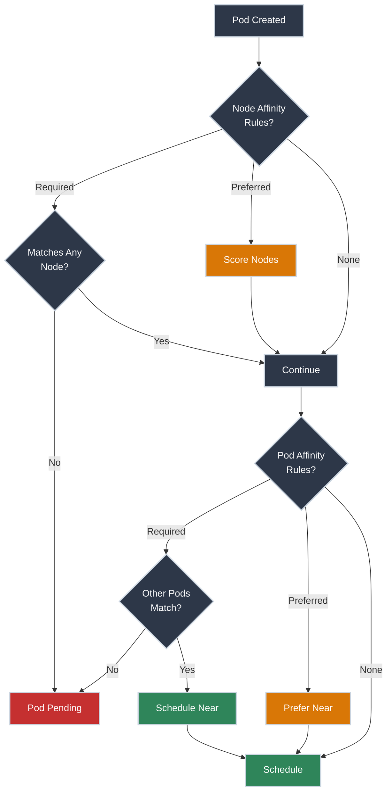

# Node Affinity and Pod Affinity

!!! tip "Part of Level 5: Advanced Scheduling & Security"
    This is the third article in [Level 5: Advanced Scheduling & Security](overview.md). Make sure you understand [Taints and Tolerations](taints_tolerations.md) first.

You need your frontend pods to run near your backend pods (low latency). Or you need pods spread across availability zones (high availability). Or you want to ensure certain pods never run together (anti-affinity).

**Taints and tolerations** push pods away from nodes. **Affinity rules** pull pods toward or away from nodes or other pods.

Think of affinity like seating preferences at a conference: "I want to sit near my team" (affinity) vs. "I don't want to sit next to my competitor" (anti-affinity).

!!! info "What You'll Learn"

    By the end of this article, you'll know how to:

    - **Use node affinity** - Schedule pods on specific nodes (better than nodeSelector)
    - **Understand required vs preferred** - Hard requirements vs. soft preferences
    - **Implement pod affinity** - Co-locate related pods
    - **Configure anti-affinity** - Spread pods for high availability
    - **Use topology spread constraints** - Even distribution across zones/nodes
    - **Combine affinity with taints** - Complete scheduling control

## The Affinity Decision Flow



---

## Node Affinity: Advanced Node Selection

Node affinity is like `nodeSelector` but more powerful. It allows complex matching rules and soft preferences.

### Node Affinity vs nodeSelector

<div class="grid cards" markdown>

-   :material-tag-outline: **nodeSelector (Simple)**

    ---

    **Why it matters:** Basic node selection—requires exact label match.

    ``` yaml title="deployment-nodeselector.yaml" linenums="1"
    apiVersion: apps/v1
    kind: Deployment
    metadata:
      name: web-app
    spec:
      replicas: 3
      selector:
        matchLabels:
          app: web
      template:
        metadata:
          labels:
            app: web
        spec:
          nodeSelector:
            disktype: ssd  # (1)!
          containers:
          - name: nginx
            image: nginx:1.21
    ```

    1. Pod MUST run on nodes with label `disktype=ssd`

    **Limitations:**

    - Only AND logic (must match all labels)
    - No OR, NOT, or IN operators
    - No preference weights
    - Required only (no "prefer but allow")

-   :material-target: **Node Affinity (Advanced)**

    ---

    **Why it matters:** Complex matching with operators, OR logic, soft preferences.

    ``` yaml title="deployment-node-affinity.yaml" linenums="1"
    apiVersion: apps/v1
    kind: Deployment
    metadata:
      name: web-app
    spec:
      replicas: 3
      selector:
        matchLabels:
          app: web
      template:
        metadata:
          labels:
            app: web
        spec:
          affinity:
            nodeAffinity:
              requiredDuringSchedulingIgnoredDuringExecution:  # (1)!
                nodeSelectorTerms:
                - matchExpressions:
                  - key: disktype
                    operator: In  # (2)!
                    values:
                    - ssd
                    - nvme
          containers:
          - name: nginx
            image: nginx:1.21
    ```

    1. Hard requirement—pod won't schedule without match
    2. Operator `In` allows OR logic—match `ssd` OR `nvme`

    **Advantages:**

    - Multiple operators (In, NotIn, Exists, DoesNotExist, Gt, Lt)
    - OR logic across values
    - Soft preferences (preferred rules)
    - More expressive matching

</div>

### Node Affinity Types

=== "Required (Hard Constraint)"
    **Field:** `requiredDuringSchedulingIgnoredDuringExecution`

    **Behavior:** Pod **must** match—won't schedule without it.

    ``` yaml title="required-node-affinity.yaml" linenums="1"
    affinity:
      nodeAffinity:
        requiredDuringSchedulingIgnoredDuringExecution:
          nodeSelectorTerms:  # (1)!
          - matchExpressions:
            - key: zone
              operator: In
              values:
              - us-west-2a
              - us-west-2b
    ```

    1. Pod MUST run in `us-west-2a` OR `us-west-2b` zones

    **Use for:** Hard requirements (availability zones, hardware types, compliance).

=== "Preferred (Soft Constraint)"
    **Field:** `preferredDuringSchedulingIgnoredDuringExecution`

    **Behavior:** Scheduler **prefers** matching nodes but allows others if needed.

    ``` yaml title="preferred-node-affinity.yaml" linenums="1"
    affinity:
      nodeAffinity:
        preferredDuringSchedulingIgnoredDuringExecution:
        - weight: 100  # (1)!
          preference:
            matchExpressions:
            - key: disktype
              operator: In
              values:
              - ssd
    ```

    1. Weight 1-100—higher weight = stronger preference

    **Use for:** Performance optimizations, cost savings (prefer spot instances but allow on-demand).

=== "Both Required AND Preferred"
    **Combine hard requirements with soft preferences:**

    ``` yaml title="combined-node-affinity.yaml" linenums="1"
    affinity:
      nodeAffinity:
        requiredDuringSchedulingIgnoredDuringExecution:
          nodeSelectorTerms:
          - matchExpressions:
            - key: region
              operator: In
              values:
              - us-west-2  # (1)!
        preferredDuringSchedulingIgnoredDuringExecution:
        - weight: 80
          preference:
            matchExpressions:
            - key: disktype
              operator: In
              values:
              - ssd  # (2)!
    ```

    1. MUST run in `us-west-2` region (required)
    2. PREFER nodes with SSD (preferred)

    **Result:** Pod schedules in `us-west-2` (required), preferring SSD nodes if available.

### Node Affinity Operators

| Operator | Meaning | Example |
|----------|---------|---------|
| **In** | Label value in list | `disktype In [ssd, nvme]` |
| **NotIn** | Label value NOT in list | `instance NotIn [spot]` |
| **Exists** | Label key exists (value ignored) | `gpu Exists` |
| **DoesNotExist** | Label key does NOT exist | `dedicated DoesNotExist` |
| **Gt** | Numeric value greater than | `cpu-cores Gt 8` |
| **Lt** | Numeric value less than | `memory-gb Lt 16` |

### Node Affinity Example: Multi-Zone Deployment

**Scenario:** Deploy app in `us-west-2a` or `us-west-2b`, preferring `us-west-2a`.

``` yaml title="multi-zone-affinity.yaml" linenums="1"
apiVersion: apps/v1
kind: Deployment
metadata:
  name: web-app
spec:
  replicas: 6
  selector:
    matchLabels:
      app: web
  template:
    metadata:
      labels:
        app: web
    spec:
      affinity:
        nodeAffinity:
          requiredDuringSchedulingIgnoredDuringExecution:
            nodeSelectorTerms:
            - matchExpressions:
              - key: topology.kubernetes.io/zone  # (1)!
                operator: In
                values:
                - us-west-2a
                - us-west-2b
          preferredDuringSchedulingIgnoredDuringExecution:
          - weight: 100  # (2)!
            preference:
              matchExpressions:
              - key: topology.kubernetes.io/zone
                operator: In
                values:
                - us-west-2a
      containers:
      - name: nginx
        image: nginx:1.21
```

1. Standard Kubernetes topology label for availability zones
2. Strongly prefer `us-west-2a` but allow `us-west-2b`

⚠️ **Caution (Modifies Resources):**

```bash title="Apply Multi-Zone Deployment"
kubectl apply -f multi-zone-affinity.yaml
# deployment.apps/web-app created
```

✅ **Safe (Read-Only):**

```bash title="Verify Pod Distribution"
kubectl get pods -o wide
# NAME                       READY   STATUS    RESTARTS   AGE   NODE
# web-app-7c5ddbdf54-2xkqn   1/1     Running   0          10s   node-us-west-2a-1
# web-app-7c5ddbdf54-8mz4p   1/1     Running   0          10s   node-us-west-2a-2
# web-app-7c5ddbdf54-kx9qw   1/1     Running   0          10s   node-us-west-2a-3
# web-app-7c5ddbdf54-m4n7r   1/1     Running   0          10s   node-us-west-2b-1
# web-app-7c5ddbdf54-p8q2s   1/1     Running   0          10s   node-us-west-2b-2
# web-app-7c5ddbdf54-r3t5u   1/1     Running   0          10s   node-us-west-2b-3
```

**Most pods in `us-west-2a` (preferred), some in `us-west-2b` (allowed).**

---

## Pod Affinity: Co-Locate Related Pods

Pod affinity schedules pods **near other pods** based on labels and topology.

**Use cases:**

- Frontend near backend (low latency)
- Cache near application
- Related microservices together

### Pod Affinity Structure

``` yaml title="deployment-pod-affinity.yaml" linenums="1"
apiVersion: apps/v1
kind: Deployment
metadata:
  name: frontend
spec:
  replicas: 3
  selector:
    matchLabels:
      app: frontend
  template:
    metadata:
      labels:
        app: frontend
    spec:
      affinity:
        podAffinity:
          requiredDuringSchedulingIgnoredDuringExecution:  # (1)!
          - labelSelector:
              matchExpressions:
              - key: app
                operator: In
                values:
                - backend  # (2)!
            topologyKey: kubernetes.io/hostname  # (3)!
      containers:
      - name: frontend
        image: frontend:1.0
```

1. Hard requirement—frontend MUST be co-located with backend
2. Match pods with label `app=backend`
3. Topology key defines "near"—same hostname = same node

**Result:** Frontend pods schedule on nodes that already have backend pods.

### Topology Keys

The `topologyKey` defines what "near" means:

| Topology Key | Meaning | Use Case |
|--------------|---------|----------|
| `kubernetes.io/hostname` | Same node | Extreme low latency, shared resources |
| `topology.kubernetes.io/zone` | Same availability zone | Regional low latency |
| `topology.kubernetes.io/region` | Same region | Multi-region apps |
| Custom labels | Your topology | Custom node groupings |

**Example: Frontend and Backend in Same Zone (not same node)**

``` yaml
podAffinity:
  requiredDuringSchedulingIgnoredDuringExecution:
  - labelSelector:
      matchLabels:
        app: backend
    topologyKey: topology.kubernetes.io/zone  # (1)!
```

1. Frontend runs in same zone as backend (lower latency than cross-zone)

### Preferred Pod Affinity

**Use when:** You prefer co-location but don't require it.

``` yaml title="preferred-pod-affinity.yaml" linenums="1"
affinity:
  podAffinity:
    preferredDuringSchedulingIgnoredDuringExecution:
    - weight: 100  # (1)!
      podAffinityTerm:
        labelSelector:
          matchLabels:
            app: cache
        topologyKey: kubernetes.io/hostname
```

1. Strongly prefer same node as cache pods, but allow other nodes

---

## Pod Anti-Affinity: Spread Pods for High Availability

Pod anti-affinity schedules pods **away from other pods**—prevents single points of failure.

**Use cases:**

- Spread replicas across nodes (node failure tolerance)
- Spread replicas across zones (zone failure tolerance)
- Prevent resource contention (multiple heavy workloads on same node)

### Anti-Affinity Structure

``` yaml title="deployment-anti-affinity.yaml" linenums="1"
apiVersion: apps/v1
kind: Deployment
metadata:
  name: web-app
spec:
  replicas: 3
  selector:
    matchLabels:
      app: web
  template:
    metadata:
      labels:
        app: web
    spec:
      affinity:
        podAntiAffinity:
          requiredDuringSchedulingIgnoredDuringExecution:  # (1)!
          - labelSelector:
              matchLabels:
                app: web  # (2)!
            topologyKey: kubernetes.io/hostname  # (3)!
      containers:
      - name: nginx
        image: nginx:1.21
```

1. Hard requirement—pods MUST be on different nodes
2. Anti-affinity with ITSELF (app=web)—spread own replicas
3. Each replica on different node (hostname)

**Result:** Each of 3 replicas on different nodes. If only 2 nodes available, third pod stays Pending.

### Preferred Anti-Affinity (Production Standard)

**Problem:** Required anti-affinity can block scheduling if constraints can't be met.

**Solution:** Use preferred anti-affinity—best effort spreading without blocking.

``` yaml title="preferred-anti-affinity.yaml" linenums="1"
apiVersion: apps/v1
kind: Deployment
metadata:
  name: web-app
spec:
  replicas: 5
  selector:
    matchLabels:
      app: web
  template:
    metadata:
      labels:
        app: web
    spec:
      affinity:
        podAntiAffinity:
          preferredDuringSchedulingIgnoredDuringExecution:  # (1)!
          - weight: 100  # (2)!
            podAffinityTerm:
              labelSelector:
                matchLabels:
                  app: web
              topologyKey: kubernetes.io/hostname
      containers:
      - name: nginx
        image: nginx:1.21
```

1. Soft preference—spread if possible
2. Strong preference (weight 100)

**Result:** Scheduler spreads replicas across nodes as much as possible. If only 3 nodes, puts 2 replicas on some nodes.

!!! tip "Production Recommendation: Preferred Anti-Affinity"
    **Use preferred anti-affinity** for most deployments:

    - Ensures high availability when possible
    - Doesn't block scaling if nodes are limited
    - Gracefully handles node failures

    **Use required anti-affinity** only when:

    - Regulatory/compliance requires physical separation
    - Licensing restrictions (one instance per node)
    - Extreme resource contention concerns

### Multi-Zone Anti-Affinity

**Goal:** Spread replicas across availability zones.

``` yaml title="multi-zone-anti-affinity.yaml" linenums="1"
apiVersion: apps/v1
kind: Deployment
metadata:
  name: web-app
spec:
  replicas: 6
  selector:
    matchLabels:
      app: web
  template:
    metadata:
      labels:
        app: web
    spec:
      affinity:
        podAntiAffinity:
          preferredDuringSchedulingIgnoredDuringExecution:
          - weight: 100
            podAffinityTerm:
              labelSelector:
                matchLabels:
                  app: web
              topologyKey: topology.kubernetes.io/zone  # (1)!
      containers:
      - name: nginx
        image: nginx:1.21
```

1. Spread across zones (not just nodes)

**Result:** Replicas distributed across zones—survives zone failure.

---

## Topology Spread Constraints: Even Distribution

Topology spread constraints provide **fine-grained control** over pod distribution across topology domains (zones, nodes, racks).

**Why better than anti-affinity:**

- Guarantees maximum skew (how uneven distribution can be)
- More predictable than weight-based preferences
- Built-in spreading logic

### Basic Topology Spread

``` yaml title="deployment-topology-spread.yaml" linenums="1"
apiVersion: apps/v1
kind: Deployment
metadata:
  name: web-app
spec:
  replicas: 6
  selector:
    matchLabels:
      app: web
  template:
    metadata:
      labels:
        app: web
    spec:
      topologySpreadConstraints:
      - maxSkew: 1  # (1)!
        topologyKey: topology.kubernetes.io/zone  # (2)!
        whenUnsatisfiable: DoNotSchedule  # (3)!
        labelSelector:
          matchLabels:
            app: web  # (4)!
      containers:
      - name: nginx
        image: nginx:1.21
```

1. Maximum difference between zones—1 means nearly even
2. Spread across zones
3. Block scheduling if skew would exceed maxSkew
4. Apply constraint to pods with this label

**Result:** 6 replicas in 3 zones = 2 per zone (perfectly even).

### Topology Spread Parameters

| Parameter | Values | Meaning |
|-----------|--------|---------|
| **maxSkew** | Integer (1+) | Max difference in pod count between domains |
| **topologyKey** | Label key | Defines topology domains (zone, node, rack) |
| **whenUnsatisfiable** | DoNotSchedule, ScheduleAnyway | Hard vs. soft constraint |
| **labelSelector** | Label selector | Which pods to consider |

**Example with maxSkew:**

- `maxSkew: 1` - Domain A: 3 pods, Domain B: 2 pods (diff = 1, allowed)
- `maxSkew: 1` - Domain A: 4 pods, Domain B: 2 pods (diff = 2, blocked if DoNotSchedule)

### Multiple Topology Constraints

**Spread across both zones AND nodes:**

``` yaml title="multi-level-topology-spread.yaml" linenums="1"
apiVersion: apps/v1
kind: Deployment
metadata:
  name: web-app
spec:
  replicas: 9
  selector:
    matchLabels:
      app: web
  template:
    metadata:
      labels:
        app: web
    spec:
      topologySpreadConstraints:
      - maxSkew: 1
        topologyKey: topology.kubernetes.io/zone  # (1)!
        whenUnsatisfiable: DoNotSchedule
        labelSelector:
          matchLabels:
            app: web
      - maxSkew: 1
        topologyKey: kubernetes.io/hostname  # (2)!
        whenUnsatisfiable: ScheduleAnyway  # (3)!
        labelSelector:
          matchLabels:
            app: web
      containers:
      - name: nginx
        image: nginx:1.21
```

1. Hard constraint: even spread across zones
2. Soft constraint: even spread across nodes within zones
3. Allow skew if needed (don't block scheduling)

**Result:** 9 replicas spread evenly across 3 zones (3 per zone), and within each zone, spread across nodes.

---

## Combining Affinity, Anti-Affinity, and Taints

**Production pattern:** Combine multiple scheduling controls for complete control.

### Example: Dedicated GPU Nodes with Pod Co-Location

**Requirements:**

1. ML training pods run ONLY on GPU nodes (taint + node affinity)
2. ML API pods run near training pods (pod affinity)
3. Training pods spread across GPU nodes (anti-affinity)

``` yaml title="ml-training-deployment.yaml" linenums="1"
apiVersion: apps/v1
kind: Deployment
metadata:
  name: ml-training
spec:
  replicas: 3
  selector:
    matchLabels:
      app: ml-training
  template:
    metadata:
      labels:
        app: ml-training
        tier: training
    spec:
      tolerations:  # (1)!
      - key: "gpu"
        operator: "Equal"
        value: "nvidia"
        effect: "NoSchedule"
      affinity:
        nodeAffinity:  # (2)!
          requiredDuringSchedulingIgnoredDuringExecution:
            nodeSelectorTerms:
            - matchExpressions:
              - key: gpu
                operator: In
                values:
                - nvidia
        podAntiAffinity:  # (3)!
          preferredDuringSchedulingIgnoredDuringExecution:
          - weight: 100
            podAffinityTerm:
              labelSelector:
                matchLabels:
                  app: ml-training
              topologyKey: kubernetes.io/hostname
      containers:
      - name: training
        image: ml-training:1.0
        resources:
          limits:
            nvidia.com/gpu: 1
```

1. Tolerate GPU node taints (allows scheduling)
2. Require GPU nodes (ensures only GPU nodes)
3. Spread across GPU nodes (high availability)

``` yaml title="ml-api-deployment.yaml" linenums="1"
apiVersion: apps/v1
kind: Deployment
metadata:
  name: ml-api
spec:
  replicas: 6
  selector:
    matchLabels:
      app: ml-api
  template:
    metadata:
      labels:
        app: ml-api
        tier: api
    spec:
      affinity:
        podAffinity:  # (1)!
          preferredDuringSchedulingIgnoredDuringExecution:
          - weight: 100
            podAffinityTerm:
              labelSelector:
                matchLabels:
                  tier: training
              topologyKey: topology.kubernetes.io/zone
        podAntiAffinity:  # (2)!
          preferredDuringSchedulingIgnoredDuringExecution:
          - weight: 100
            podAffinityTerm:
              labelSelector:
                matchLabels:
                  app: ml-api
              topologyKey: kubernetes.io/hostname
      containers:
      - name: api
        image: ml-api:1.0
```

1. Prefer same zone as training pods (low latency)
2. Spread API replicas across nodes (high availability)

**Result:**

- Training pods ONLY on GPU nodes, spread across them
- API pods in same zones as training (low latency), spread across non-GPU nodes

---

## Troubleshooting Affinity and Anti-Affinity

### Pods Stuck in Pending

✅ **Safe (Read-Only):**

```bash title="Check Scheduling Failure Reason"
kubectl describe pod web-app-7c5ddbdf54-2xkqn
# Events:
#   Type     Reason            Message
#   ----     ------            -------
#   Warning  FailedScheduling  0/10 nodes are available: 3 node(s) didn't match pod affinity rules, 7 node(s) didn't match node selector.
```

**Common causes:**

- **Required affinity can't be satisfied** - No nodes match rules
- **Required anti-affinity blocks scheduling** - Not enough nodes to spread
- **Topology constraint too strict** - maxSkew can't be maintained

**Solutions:**

- Change required to preferred (soft constraint)
- Increase maxSkew for topology constraints
- Add more nodes to cluster
- Relax matching rules

### Uneven Pod Distribution

**Problem:** Pods not spreading as expected.

**Check topology spread:**

```bash title="View Pod Distribution by Zone"
kubectl get pods -o wide -l app=web | awk '{print $7}' | sort | uniq -c
# 5 node-us-west-2a-1
# 2 node-us-west-2b-1
# 1 node-us-west-2c-1
```

**Causes:**

- Using preferred instead of required (allows skew)
- maxSkew too high
- Not enough capacity in some zones
- Existing pods not managed by constraint (deployed before constraint added)

**Solutions:**

- Use required with whenUnsatisfiable: DoNotSchedule
- Lower maxSkew (1 = most even)
- Redeploy all pods to apply new constraints

### Pod Affinity Not Working

**Check label selectors:**

```bash title="Verify Pod Labels"
kubectl get pods -l app=backend --show-labels
# NAME                       READY   STATUS    RESTARTS   AGE   LABELS
# backend-7c5ddbdf54-2xkqn   1/1     Running   0          10m   app=backend,version=v1
```

```bash title="Check Affinity Rules Match"
kubectl get pod frontend-8mz4p -o yaml | grep -A 10 podAffinity
# podAffinity:
#   requiredDuringSchedulingIgnoredDuringExecution:
#   - labelSelector:
#       matchLabels:
#         app: backend  # Must match pod labels exactly
```

**Common mistakes:**

- Label mismatch (typo in affinity selector)
- Topology key doesn't exist on nodes
- Backend pods deployed AFTER frontend (nothing to match)

---

## Production Best Practices

<div class="grid cards" markdown>

-   :material-check-decagram: **Use Preferred Anti-Affinity**

    ---

    **For most deployments:**

    - Spread replicas for high availability
    - Don't block scaling if constraints can't be met
    - Weight: 100 for strong preference

-   :material-earth: **Spread Across Availability Zones**

    ---

    **For production services:**

    - Use topology spread constraints with `topology.kubernetes.io/zone`
    - maxSkew: 1-2 (nearly even distribution)
    - Survives zone failures

-   :material-layers-triple: **Combine Multiple Constraints**

    ---

    **Layered approach:**

    - Topology spread: Even zone distribution
    - Anti-affinity: Spread within zones
    - Node affinity: Hardware requirements

-   :material-speedometer: **Use Preferred for Performance**

    ---

    **For latency-sensitive apps:**

    - Preferred pod affinity (co-locate related services)
    - Don't block scheduling with required
    - Balance performance vs. availability

-   :material-label: **Label Nodes Appropriately**

    ---

    **Standard labels:**

    - `topology.kubernetes.io/zone` - Availability zone
    - `topology.kubernetes.io/region` - Region
    - `kubernetes.io/hostname` - Node name
    - Custom: `disktype`, `gpu`, `rack`

-   :material-test-tube: **Test Scheduling Behavior**

    ---

    **Before production:**

    - Deploy with 1 replica—where does it go?
    - Scale to N replicas—how do they distribute?
    - Drain a node—how do pods reschedule?

</div>

---

## Practice Exercises

??? question "Exercise 1: Node Affinity with SSD Requirement"
    **Goal:** Deploy pods only on SSD nodes using node affinity.

    **Steps:**

    1. Label some nodes with `disktype=ssd`
    2. Deploy app with required node affinity for SSD
    3. Verify pods only schedule on SSD nodes

    ??? tip "Solution"
        **Step 1: Label nodes**

        ```bash
        kubectl label nodes worker-1 disktype=ssd
        kubectl label nodes worker-2 disktype=ssd
        # node/worker-1 labeled
        # node/worker-2 labeled
        ```

        **Step 2: Deploy with node affinity**

        ``` yaml title="ssd-app.yaml" linenums="1"
        apiVersion: apps/v1
        kind: Deployment
        metadata:
          name: ssd-app
        spec:
          replicas: 3
          selector:
            matchLabels:
              app: ssd-app
          template:
            metadata:
              labels:
                app: ssd-app
            spec:
              affinity:
                nodeAffinity:
                  requiredDuringSchedulingIgnoredDuringExecution:
                    nodeSelectorTerms:
                    - matchExpressions:
                      - key: disktype
                        operator: In
                        values:
                        - ssd
              containers:
              - name: nginx
                image: nginx:1.21
        ```

        ```bash
        kubectl apply -f ssd-app.yaml
        # deployment.apps/ssd-app created
        ```

        **Step 3: Verify placement**

        ```bash
        kubectl get pods -o wide -l app=ssd-app
        # NAME                      READY   STATUS    RESTARTS   AGE   NODE
        # ssd-app-7c5ddbdf54-2xkqn  1/1     Running   0          10s   worker-1
        # ssd-app-7c5ddbdf54-8mz4p  1/1     Running   0          10s   worker-2
        # ssd-app-7c5ddbdf54-kx9qw  1/1     Running   0          10s   worker-1
        ```

        All pods on SSD-labeled nodes.

        **Cleanup:**

        ```bash
        kubectl delete deployment ssd-app
        kubectl label nodes worker-1 disktype-
        kubectl label nodes worker-2 disktype-
        ```

        **What you learned:** Node affinity with required constraint ensures pods only run on matching nodes.

??? question "Exercise 2: Pod Anti-Affinity for High Availability"
    **Goal:** Deploy 5 replicas with anti-affinity to spread across nodes.

    **Steps:**

    1. Deploy app with required anti-affinity (same hostname)
    2. Check distribution—each pod on different node
    3. Change to preferred anti-affinity
    4. Scale beyond node count—observe behavior

    ??? tip "Solution"
        **Step 1: Deploy with required anti-affinity**

        ``` yaml title="ha-app-required.yaml" linenums="1"
        apiVersion: apps/v1
        kind: Deployment
        metadata:
          name: ha-app
        spec:
          replicas: 3
          selector:
            matchLabels:
              app: ha-app
          template:
            metadata:
              labels:
                app: ha-app
            spec:
              affinity:
                podAntiAffinity:
                  requiredDuringSchedulingIgnoredDuringExecution:
                  - labelSelector:
                      matchLabels:
                        app: ha-app
                    topologyKey: kubernetes.io/hostname
              containers:
              - name: nginx
                image: nginx:1.21
        ```

        ```bash
        kubectl apply -f ha-app-required.yaml
        # deployment.apps/ha-app created

        kubectl get pods -o wide -l app=ha-app
        # NAME                      READY   STATUS    RESTARTS   AGE   NODE
        # ha-app-7c5ddbdf54-2xkqn   1/1     Running   0          10s   worker-1
        # ha-app-7c5ddbdf54-8mz4p   1/1     Running   0          10s   worker-2
        # ha-app-7c5ddbdf54-kx9qw   1/1     Running   0          10s   worker-3
        ```

        **Step 2: Try to scale beyond nodes**

        ```bash
        kubectl scale deployment ha-app --replicas=5
        # deployment.apps/ha-app scaled

        kubectl get pods -l app=ha-app
        # NAME                      READY   STATUS    RESTARTS   AGE
        # ha-app-7c5ddbdf54-2xkqn   1/1     Running   0          1m
        # ha-app-7c5ddbdf54-8mz4p   1/1     Running   0          1m
        # ha-app-7c5ddbdf54-kx9qw   1/1     Running   0          1m
        # ha-app-7c5ddbdf54-new1    0/1     Pending   0          10s
        # ha-app-7c5ddbdf54-new2    0/1     Pending   0          10s

        kubectl describe pod ha-app-7c5ddbdf54-new1
        # Events:
        #   Warning  FailedScheduling  didn't match pod anti-affinity rules
        ```

        **Step 3: Change to preferred anti-affinity**

        ```bash
        kubectl delete deployment ha-app
        ```

        ``` yaml title="ha-app-preferred.yaml" linenums="1"
        apiVersion: apps/v1
        kind: Deployment
        metadata:
          name: ha-app
        spec:
          replicas: 5
          selector:
            matchLabels:
              app: ha-app
          template:
            metadata:
              labels:
                app: ha-app
            spec:
              affinity:
                podAntiAffinity:
                  preferredDuringSchedulingIgnoredDuringExecution:
                  - weight: 100
                    podAffinityTerm:
                      labelSelector:
                        matchLabels:
                          app: ha-app
                      topologyKey: kubernetes.io/hostname
              containers:
              - name: nginx
                image: nginx:1.21
        ```

        ```bash
        kubectl apply -f ha-app-preferred.yaml
        # deployment.apps/ha-app created

        kubectl get pods -o wide -l app=ha-app
        # NAME                      READY   STATUS    RESTARTS   AGE   NODE
        # ha-app-8c7ddbdf54-1abc    1/1     Running   0          10s   worker-1
        # ha-app-8c7ddbdf54-2def    1/1     Running   0          10s   worker-2
        # ha-app-8c7ddbdf54-3ghi    1/1     Running   0          10s   worker-3
        # ha-app-8c7ddbdf54-4jkl    1/1     Running   0          10s   worker-1
        # ha-app-8c7ddbdf54-5mno    1/1     Running   0          10s   worker-2
        ```

        Now 5 pods scheduled—spread best effort across 3 nodes.

        **Cleanup:**

        ```bash
        kubectl delete deployment ha-app
        ```

        **What you learned:** Required anti-affinity blocks scheduling when constraints can't be met. Preferred anti-affinity spreads best effort without blocking.

??? question "Exercise 3: Topology Spread Constraints Across Zones"
    **Goal:** Deploy 6 replicas spread evenly across 3 zones using topology spread constraints.

    **Steps:**

    1. Label nodes with zone labels (simulate 3 zones)
    2. Deploy with topology spread constraint (maxSkew: 1)
    3. Verify even distribution (2 per zone)

    ??? tip "Solution"
        **Step 1: Label nodes with zones**

        ```bash
        kubectl label nodes worker-1 topology.kubernetes.io/zone=us-west-2a
        kubectl label nodes worker-2 topology.kubernetes.io/zone=us-west-2b
        kubectl label nodes worker-3 topology.kubernetes.io/zone=us-west-2c
        # node/worker-1 labeled
        # node/worker-2 labeled
        # node/worker-3 labeled
        ```

        **Step 2: Deploy with topology spread**

        ``` yaml title="zone-spread-app.yaml" linenums="1"
        apiVersion: apps/v1
        kind: Deployment
        metadata:
          name: zone-app
        spec:
          replicas: 6
          selector:
            matchLabels:
              app: zone-app
          template:
            metadata:
              labels:
                app: zone-app
            spec:
              topologySpreadConstraints:
              - maxSkew: 1
                topologyKey: topology.kubernetes.io/zone
                whenUnsatisfiable: DoNotSchedule
                labelSelector:
                  matchLabels:
                    app: zone-app
              containers:
              - name: nginx
                image: nginx:1.21
        ```

        ```bash
        kubectl apply -f zone-spread-app.yaml
        # deployment.apps/zone-app created
        ```

        **Step 3: Verify distribution**

        ```bash
        kubectl get pods -o wide -l app=zone-app
        # NAME                        READY   STATUS    RESTARTS   AGE   NODE
        # zone-app-7c5ddbdf54-1abc    1/1     Running   0          10s   worker-1  (us-west-2a)
        # zone-app-7c5ddbdf54-2def    1/1     Running   0          10s   worker-1  (us-west-2a)
        # zone-app-7c5ddbdf54-3ghi    1/1     Running   0          10s   worker-2  (us-west-2b)
        # zone-app-7c5ddbdf54-4jkl    1/1     Running   0          10s   worker-2  (us-west-2b)
        # zone-app-7c5ddbdf54-5mno    1/1     Running   0          10s   worker-3  (us-west-2c)
        # zone-app-7c5ddbdf54-6pqr    1/1     Running   0          10s   worker-3  (us-west-2c)
        ```

        Perfectly even: 2 pods per zone.

        **Cleanup:**

        ```bash
        kubectl delete deployment zone-app
        kubectl label nodes worker-1 topology.kubernetes.io/zone-
        kubectl label nodes worker-2 topology.kubernetes.io/zone-
        kubectl label nodes worker-3 topology.kubernetes.io/zone-
        ```

        **What you learned:** Topology spread constraints ensure even distribution across topology domains (zones, nodes, racks).

---

## Quick Recap

| Concept | Purpose | Use Case |
|---------|---------|----------|
| **Node Affinity** | Schedule pods on specific nodes | GPU nodes, SSD nodes, specific zones |
| **Required Affinity** | Hard constraint—must match | Compliance, licensing, hardware requirements |
| **Preferred Affinity** | Soft constraint—prefer but allow | Performance optimization, cost savings |
| **Pod Affinity** | Co-locate related pods | Frontend near backend, cache near app |
| **Pod Anti-Affinity** | Spread pods for HA | High availability, resource isolation |
| **Topology Spread** | Even distribution across domains | Multi-zone, multi-node, multi-rack |

---

## Further Reading

### Official Documentation

- [Kubernetes Docs: Affinity and Anti-Affinity](https://kubernetes.io/docs/concepts/scheduling-eviction/assign-pod-node/#affinity-and-anti-affinity) - Complete reference
- [Kubernetes Docs: Topology Spread Constraints](https://kubernetes.io/docs/concepts/scheduling-eviction/topology-spread-constraints/) - Even pod distribution
- [Kubernetes Docs: Well-Known Labels](https://kubernetes.io/docs/reference/labels-annotations-taints/) - Standard topology keys

### Deep Dives

- [Pod Scheduling Readiness](https://kubernetes.io/docs/concepts/scheduling-eviction/pod-scheduling-readiness/) - Advanced scheduling controls
- [Scheduler Performance Tuning](https://kubernetes.io/docs/concepts/scheduling-eviction/scheduler-perf-tuning/) - Optimizing scheduler for large clusters

### Related Articles

- [Level 5 Overview](overview.md) - See all Level 5 articles
- [Resource Requests and Limits](resources.md) - Foundation for scheduling decisions
- [Taints and Tolerations](taints_tolerations.md) - Complementary node selection

---

## What's Next?

You've mastered advanced scheduling! Next up in Level 5:

- **RBAC** - Users, service accounts, roles, role bindings, least privilege (coming soon)
- **Security Best Practices** - Pod Security Standards, security contexts, network policies (coming soon)

Advanced scheduling is complete. Now secure your cluster.
