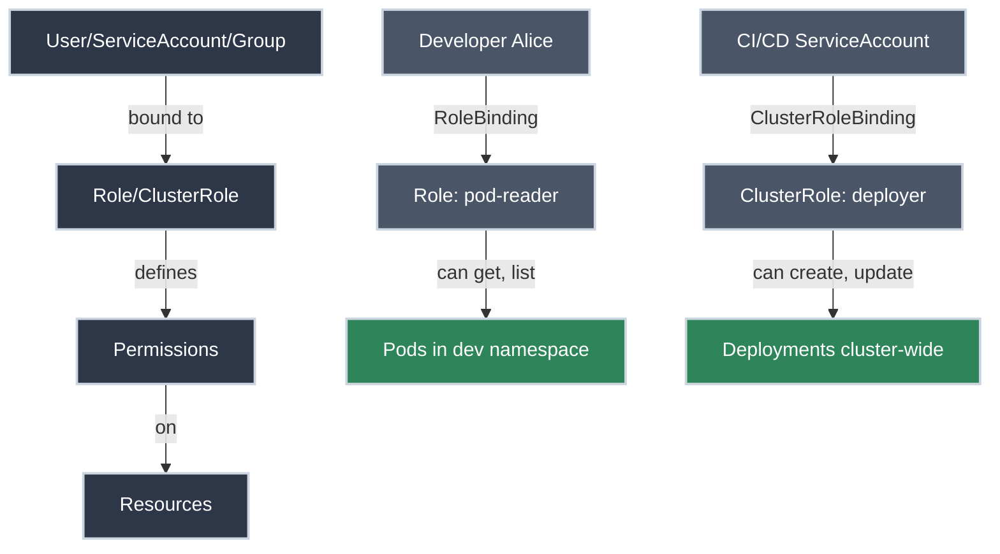

# RBAC: Role-Based Access Control

!!! tip "Part of Level 5: Advanced Scheduling & Security"
    This article is part of [Level 5: Advanced Scheduling & Security](overview.md). You're now entering platform engineering territory—securing clusters for production.

Your cluster is running applications. Multiple teams are deploying services. Different people need different levels of access. How do you ensure developers can deploy their apps without accidentally deleting someone else's database?

This is where **RBAC (Role-Based Access Control)** comes in.

RBAC lets you answer critical questions:

- Who can deploy applications?
- Who can view logs but not modify resources?
- Who can create namespaces?
- Can this service account read secrets?

By the end of this article, you'll understand how to implement **least-privilege access** in Kubernetes—giving users and applications exactly the permissions they need, and nothing more.

!!! info "What You'll Learn"

    By the end of this article, you'll know how to:

    - **Understand RBAC entities** - Users, Groups, ServiceAccounts
    - **Create Roles and ClusterRoles** - Define permissions
    - **Bind roles to subjects** - RoleBindings and ClusterRoleBindings
    - **Apply least privilege** - Security best practices
    - **Debug permissions** - Using `kubectl auth can-i`
    - **Implement common patterns** - Read-only users, namespace admins, CI/CD accounts

## The RBAC Model



---

## RBAC Components

<div class="grid cards" markdown>

-   :material-account: **Subjects (Who)**

    ---

    **Why it matters:** Subjects are the entities requesting access—humans, applications, or groups.

    **Three types:**

    - **User** - Human with cluster access (managed externally, not in Kubernetes)
    - **ServiceAccount** - Application identity (managed by Kubernetes)
    - **Group** - Collection of users (often from SSO/LDAP)

    **Key insight:** ServiceAccounts are for apps, Users are for people. Kubernetes doesn't manage user authentication—that's handled by your identity provider (LDAP, OIDC, certificates).

-   :material-shield-lock: **Roles (What)**

    ---

    **Why it matters:** Roles define permissions—what actions are allowed on which resources.

    **Two types:**

    - **Role** - Permissions within a single namespace
    - **ClusterRole** - Cluster-wide permissions (or reusable across namespaces)

    **Key insight:** Roles use "verbs" (get, list, create, delete) to describe allowed actions on "resources" (pods, services, deployments).

-   :material-link-variant: **Bindings (Connects Who to What)**

    ---

    **Why it matters:** Bindings connect subjects to roles—granting the defined permissions.

    **Two types:**

    - **RoleBinding** - Grants Role permissions within a namespace
    - **ClusterRoleBinding** - Grants ClusterRole permissions cluster-wide

    **Key insight:** You can bind a ClusterRole with a RoleBinding to limit its scope to a single namespace. This lets you define permissions once and reuse them.

</div>

---

## Understanding Roles

A **Role** defines permissions within a namespace. Think of it as a job description: "This role can read pods and view logs."

### Creating a Read-Only Role

``` yaml title="pod-reader-role.yaml" linenums="1"
apiVersion: rbac.authorization.k8s.io/v1  # (1)!
kind: Role  # (2)!
metadata:
  namespace: dev  # (3)!
  name: pod-reader
rules:  # (4)!
- apiGroups: [""]  # (5)!
  resources: ["pods", "pods/log"]  # (6)!
  verbs: ["get", "list", "watch"]  # (7)!
```

1. RBAC API group
2. Namespace-scoped role
3. Only applies to the `dev` namespace
4. List of permission rules
5. Empty string means core API group (pods, services, etc.)
6. Can access pods and pod logs
7. Read-only verbs—no create, update, or delete

**This role allows:**

- ✅ `kubectl get pods -n dev`
- ✅ `kubectl logs <pod> -n dev`
- ✅ `kubectl describe pod <pod> -n dev`

**This role blocks:**

- ❌ `kubectl delete pod <pod> -n dev`
- ❌ `kubectl apply -f deployment.yaml -n dev`
- ❌ Any actions outside the `dev` namespace

### Creating a Deployment Manager Role

``` yaml title="deployment-manager-role.yaml" linenums="1"
apiVersion: rbac.authorization.k8s.io/v1
kind: Role
metadata:
  namespace: dev
  name: deployment-manager
rules:
- apiGroups: ["apps"]  # (1)!
  resources: ["deployments"]
  verbs: ["get", "list", "watch", "create", "update", "patch", "delete"]  # (2)!
- apiGroups: [""]
  resources: ["pods", "pods/log"]
  verbs: ["get", "list", "watch"]  # (3)!
```

1. `apps` API group for Deployments (not core)
2. Full CRUD permissions on Deployments
3. Read-only access to Pods (to view what Deployments created)

**This role allows:**

- ✅ Deploy, update, scale, delete Deployments
- ✅ View Pods and their logs
- ❌ Cannot modify Pods directly (only through Deployments)
- ❌ Cannot access Services, ConfigMaps, or other resources

---

## Understanding ClusterRoles

A **ClusterRole** is like a Role, but it can:

1. Grant access to **cluster-scoped resources** (nodes, namespaces, persistent volumes)
2. Be used **across all namespaces** (when bound with ClusterRoleBinding)
3. Be **reused in multiple namespaces** (when bound with RoleBinding)

### Cluster-Wide Read-Only Access

``` yaml title="cluster-viewer-clusterrole.yaml" linenums="1"
apiVersion: rbac.authorization.k8s.io/v1
kind: ClusterRole  # (1)!
metadata:
  name: cluster-viewer  # (2)!
rules:
- apiGroups: [""]
  resources: ["pods", "services", "configmaps", "namespaces"]  # (3)!
  verbs: ["get", "list", "watch"]
- apiGroups: ["apps"]
  resources: ["deployments", "replicasets", "statefulsets"]
  verbs: ["get", "list", "watch"]
- apiGroups: [""]
  resources: ["nodes"]  # (4)!
  verbs: ["get", "list"]
```

1. ClusterRole—not tied to a namespace
2. No namespace in metadata (cluster-scoped)
3. Can view common resources across all namespaces
4. Can view nodes (cluster-level resource)

**Use case:** Platform engineer who needs read-only access to monitor all namespaces.

### Namespace Admin ClusterRole (Reusable)

``` yaml title="namespace-admin-clusterrole.yaml" linenums="1"
apiVersion: rbac.authorization.k8s.io/v1
kind: ClusterRole
metadata:
  name: namespace-admin  # (1)!
rules:
- apiGroups: ["", "apps", "batch"]
  resources: ["*"]  # (2)!
  verbs: ["*"]  # (3)!
```

1. Defined once, can be bound to multiple namespaces
2. All resources in these API groups
3. All verbs (full CRUD)

**Important:** This ClusterRole is dangerous if bound with ClusterRoleBinding (grants admin everywhere). Instead, bind it with RoleBinding to limit scope to a single namespace.

---

## RoleBindings: Connecting Subjects to Roles

A **RoleBinding** grants the permissions defined in a Role (or ClusterRole) to a subject within a namespace.

### Binding a User to a Role

``` yaml title="alice-pod-reader-binding.yaml" linenums="1"
apiVersion: rbac.authorization.k8s.io/v1
kind: RoleBinding  # (1)!
metadata:
  name: alice-pod-reader
  namespace: dev  # (2)!
subjects:  # (3)!
- kind: User
  name: alice@example.com  # (4)!
  apiGroup: rbac.authorization.k8s.io
roleRef:  # (5)!
  kind: Role
  name: pod-reader  # (6)!
  apiGroup: rbac.authorization.k8s.io
```

1. RoleBinding (namespace-scoped)
2. Grants permissions only in the `dev` namespace
3. Who gets the permissions (the subject)
4. User identity (from your authentication system)
5. What permissions to grant (the role reference)
6. Must reference a Role in the same namespace

**Result:** User `alice@example.com` can now read pods in the `dev` namespace.

### Binding a ServiceAccount to a Role

``` yaml title="app-deployment-manager-binding.yaml" linenums="1"
apiVersion: rbac.authorization.k8s.io/v1
kind: RoleBinding
metadata:
  name: app-deployment-manager
  namespace: dev
subjects:
- kind: ServiceAccount  # (1)!
  name: app-deployer  # (2)!
  namespace: dev  # (3)!
roleRef:
  kind: Role
  name: deployment-manager
  apiGroup: rbac.authorization.k8s.io
```

1. ServiceAccount (managed by Kubernetes)
2. ServiceAccount name
3. ServiceAccount's namespace (must exist)

**Result:** The `app-deployer` ServiceAccount can manage Deployments in `dev` namespace.

### Binding a ClusterRole with RoleBinding (Namespace Scope)

``` yaml title="bob-namespace-admin-binding.yaml" linenums="1"
apiVersion: rbac.authorization.k8s.io/v1
kind: RoleBinding  # (1)!
metadata:
  name: bob-admin
  namespace: staging
subjects:
- kind: User
  name: bob@example.com
  apiGroup: rbac.authorization.k8s.io
roleRef:
  kind: ClusterRole  # (2)!
  name: namespace-admin  # (3)!
  apiGroup: rbac.authorization.k8s.io
```

1. RoleBinding (limits scope to namespace)
2. Referencing a ClusterRole
3. Reusing the ClusterRole defined earlier

**Result:** Bob has full admin access **only** in the `staging` namespace. The ClusterRole is reused, but scoped by the RoleBinding.

**Why this pattern?** Define common roles once (ClusterRole), then grant them per-namespace (RoleBinding). Reduces duplication.

---

## ClusterRoleBindings: Cluster-Wide Access

A **ClusterRoleBinding** grants permissions across the entire cluster.

!!! warning "Use Sparingly"
    ClusterRoleBindings grant permissions to **all namespaces and cluster resources**. Only use for platform admins, monitoring systems, or cluster-wide operators.

### Cluster Admin Binding

``` yaml title="platform-team-cluster-admin.yaml" linenums="1"
apiVersion: rbac.authorization.k8s.io/v1
kind: ClusterRoleBinding  # (1)!
metadata:
  name: platform-team-admins
subjects:
- kind: Group  # (2)!
  name: platform-team  # (3)!
  apiGroup: rbac.authorization.k8s.io
roleRef:
  kind: ClusterRole
  name: cluster-admin  # (4)!
  apiGroup: rbac.authorization.k8s.io
```

1. ClusterRoleBinding (cluster-wide)
2. Group of users (from SSO/LDAP)
3. Group name from identity provider
4. Built-in `cluster-admin` ClusterRole (full access to everything)

**Result:** All members of the `platform-team` group have full cluster admin rights.

### Monitoring ServiceAccount Binding

``` yaml title="prometheus-cluster-viewer.yaml" linenums="1"
apiVersion: rbac.authorization.k8s.io/v1
kind: ClusterRoleBinding
metadata:
  name: prometheus-viewer
subjects:
- kind: ServiceAccount
  name: prometheus
  namespace: monitoring  # (1)!
roleRef:
  kind: ClusterRole
  name: cluster-viewer  # (2)!
  apiGroup: rbac.authorization.k8s.io
```

1. ServiceAccount in monitoring namespace
2. Custom ClusterRole defined earlier (read-only everywhere)

**Result:** Prometheus can read metrics from all namespaces.

---

## ServiceAccounts: Application Identity

**ServiceAccounts** are Kubernetes-managed identities for applications. Every Pod runs with a ServiceAccount (defaults to `default` if not specified).

### Creating a ServiceAccount

``` yaml title="ci-deployer-serviceaccount.yaml" linenums="1"
apiVersion: v1
kind: ServiceAccount  # (1)!
metadata:
  name: ci-deployer
  namespace: dev
```

1. Kubernetes creates and manages this identity

**Apply it:**

⚠️ **Caution (Modifies Resources):**

```bash title="Create ServiceAccount"
kubectl apply -f ci-deployer-serviceaccount.yaml
# serviceaccount/ci-deployer created
```

### Using a ServiceAccount in a Pod

``` yaml title="deployment-with-serviceaccount.yaml" linenums="1"
apiVersion: apps/v1
kind: Deployment
metadata:
  name: app
  namespace: dev
spec:
  replicas: 2
  selector:
    matchLabels:
      app: myapp
  template:
    metadata:
      labels:
        app: myapp
    spec:
      serviceAccountName: ci-deployer  # (1)!
      containers:
      - name: app
        image: myapp:1.0
```

1. Pod runs as this ServiceAccount (inherits its RBAC permissions)

**Result:** Pods in this Deployment run with `ci-deployer` identity. If you've granted permissions to `ci-deployer` via RoleBinding, the Pod can use the Kubernetes API with those permissions.

### Getting ServiceAccount Token

When a Pod needs to call the Kubernetes API (e.g., a CI/CD tool deploying apps), it uses the ServiceAccount token:

✅ **Safe (Read-Only):**

```bash title="View ServiceAccount Details"
kubectl get serviceaccount ci-deployer -n dev -o yaml
# Shows automountServiceAccountToken (default: true)
```

**Kubernetes automatically mounts the token in the Pod at:**

```
/var/run/secrets/kubernetes.io/serviceaccount/token
```

Applications can use this token to authenticate to the Kubernetes API.

---

## Common RBAC Patterns

### Pattern 1: Read-Only Developer

**Use case:** Developers need to view resources for debugging, but can't modify anything.

=== "Role"
    ``` yaml title="developer-readonly-role.yaml" linenums="1"
    apiVersion: rbac.authorization.k8s.io/v1
    kind: Role
    metadata:
      namespace: dev
      name: developer-readonly
    rules:
    - apiGroups: ["", "apps", "batch"]
      resources: ["pods", "pods/log", "deployments", "services", "configmaps", "jobs"]
      verbs: ["get", "list", "watch"]
    ```

=== "RoleBinding"
    ``` yaml title="developers-readonly-binding.yaml" linenums="1"
    apiVersion: rbac.authorization.k8s.io/v1
    kind: RoleBinding
    metadata:
      name: developers-readonly
      namespace: dev
    subjects:
    - kind: Group
      name: developers
      apiGroup: rbac.authorization.k8s.io
    roleRef:
      kind: Role
      name: developer-readonly
      apiGroup: rbac.authorization.k8s.io
    ```

**Grants:** Read-only access to common resources in `dev` namespace.

### Pattern 2: CI/CD Deployment Bot

**Use case:** CI/CD pipeline needs to deploy and update applications, but shouldn't touch production secrets or nodes.

=== "ClusterRole"
    ``` yaml title="ci-deployer-clusterrole.yaml" linenums="1"
    apiVersion: rbac.authorization.k8s.io/v1
    kind: ClusterRole
    metadata:
      name: ci-deployer
    rules:
    - apiGroups: ["apps"]
      resources: ["deployments", "replicasets"]
      verbs: ["get", "list", "create", "update", "patch", "delete"]
    - apiGroups: [""]
      resources: ["services", "configmaps"]
      verbs: ["get", "list", "create", "update", "patch"]
    - apiGroups: [""]
      resources: ["pods", "pods/log"]
      verbs: ["get", "list"]
    ```

=== "RoleBinding (per namespace)"
    ``` yaml title="ci-deployer-dev-binding.yaml" linenums="1"
    apiVersion: rbac.authorization.k8s.io/v1
    kind: RoleBinding
    metadata:
      name: ci-deployer-binding
      namespace: dev  # (1)!
    subjects:
    - kind: ServiceAccount
      name: ci-deployer
      namespace: dev
    roleRef:
      kind: ClusterRole
      name: ci-deployer
      apiGroup: rbac.authorization.k8s.io
    ```

    1. Create separate RoleBinding for each namespace (dev, staging, prod)

**Grants:** Full deployment management in specific namespaces. No secrets access. No cluster-wide changes.

### Pattern 3: Namespace Administrator

**Use case:** Team lead needs full control over their namespace, but can't affect other namespaces or cluster settings.

=== "RoleBinding to built-in admin"
    ``` yaml title="alice-namespace-admin.yaml" linenums="1"
    apiVersion: rbac.authorization.k8s.io/v1
    kind: RoleBinding
    metadata:
      name: alice-admin
      namespace: team-alpha
    subjects:
    - kind: User
      name: alice@example.com
      apiGroup: rbac.authorization.k8s.io
    roleRef:
      kind: ClusterRole
      name: admin  # (1)!
      apiGroup: rbac.authorization.k8s.io
    ```

    1. Kubernetes built-in `admin` ClusterRole (everything except RBAC and quotas)

**Grants:** Full control within `team-alpha` namespace. Cannot create/modify RBAC or resource quotas (prevents privilege escalation).

### Pattern 4: Monitoring System

**Use case:** Prometheus or Grafana needs to scrape metrics from all Pods cluster-wide.

=== "ClusterRole"
    ``` yaml title="metrics-reader-clusterrole.yaml" linenums="1"
    apiVersion: rbac.authorization.k8s.io/v1
    kind: ClusterRole
    metadata:
      name: metrics-reader
    rules:
    - apiGroups: [""]
      resources: ["nodes", "pods", "services", "endpoints"]
      verbs: ["get", "list", "watch"]
    - apiGroups: [""]
      resources: ["nodes/metrics", "nodes/stats"]  # (1)!
      verbs: ["get"]
    ```

    1. Access to metrics endpoints

=== "ClusterRoleBinding"
    ``` yaml title="prometheus-metrics-reader.yaml" linenums="1"
    apiVersion: rbac.authorization.k8s.io/v1
    kind: ClusterRoleBinding
    metadata:
      name: prometheus-metrics
    subjects:
    - kind: ServiceAccount
      name: prometheus
      namespace: monitoring
    roleRef:
      kind: ClusterRole
      name: metrics-reader
      apiGroup: rbac.authorization.k8s.io
    ```

**Grants:** Read-only access to metrics from all namespaces.

---

## Debugging RBAC: Can I Do This?

The most common RBAC question: "Why can't I run this command?"

### Using `kubectl auth can-i`

✅ **Safe (Read-Only):**

```bash title="Check Your Own Permissions"
kubectl auth can-i create deployments
# yes

kubectl auth can-i delete pods -n production
# no
```

```bash title="Check Specific Namespace"
kubectl auth can-i get pods -n dev
# yes

kubectl auth can-i get secrets -n dev
# no
```

```bash title="Check All Your Permissions"
kubectl auth can-i --list -n dev
# Shows all verbs you can perform on all resources in dev namespace
```

### Checking ServiceAccount Permissions

```bash title="Check ServiceAccount Permissions"
kubectl auth can-i list pods --as=system:serviceaccount:dev:ci-deployer
# Checks if ci-deployer ServiceAccount in dev namespace can list pods
```

```bash title="Impersonate User for Testing"
kubectl auth can-i create deployments --as=alice@example.com -n dev
# Tests if alice can create deployments in dev (requires admin privileges to impersonate)
```

### Viewing Role Details

```bash title="Describe Role"
kubectl describe role pod-reader -n dev
# Shows rules and permissions
```

```bash title="Describe RoleBinding"
kubectl describe rolebinding alice-pod-reader -n dev
# Shows what role is bound to which subjects
```

```bash title="View ClusterRole YAML"
kubectl get clusterrole cluster-admin -o yaml
# Shows full permission rules for built-in cluster-admin role
```

---

## Built-In ClusterRoles

Kubernetes provides several built-in ClusterRoles you can use immediately:

| ClusterRole | Permissions | Use Case |
|-------------|-------------|----------|
| **cluster-admin** | Full access to everything | Platform admins only |
| **admin** | Full access within namespace (except RBAC/quotas) | Namespace owners |
| **edit** | Read/write to most resources (except RBAC) | Developers with deploy permissions |
| **view** | Read-only access to most resources | Developers debugging |

✅ **Safe (Read-Only):**

```bash title="List All Built-In ClusterRoles"
kubectl get clusterroles
# Shows all ClusterRoles (built-in and custom)
```

```bash title="View Permissions of Built-In Role"
kubectl describe clusterrole view
# Shows exactly what "view" role can do
```

**Using built-in roles:**

``` yaml title="grant-developer-edit-access.yaml" linenums="1"
apiVersion: rbac.authorization.k8s.io/v1
kind: RoleBinding
metadata:
  name: developers-edit
  namespace: dev
subjects:
- kind: Group
  name: developers
  apiGroup: rbac.authorization.k8s.io
roleRef:
  kind: ClusterRole
  name: edit  # (1)!
  apiGroup: rbac.authorization.k8s.io
```

1. Built-in `edit` ClusterRole (no need to define custom Role)

---

## Least Privilege Principle

**Least privilege:** Grant the minimum permissions needed to perform a task—nothing more.

!!! danger "Common RBAC Mistakes"

    **DON'T:**

    - ❌ Grant `cluster-admin` to everyone
    - ❌ Use wildcard permissions (`*` resources, `*` verbs) unless absolutely necessary
    - ❌ Grant ClusterRoleBindings when RoleBindings suffice
    - ❌ Run Pods as `default` ServiceAccount with extra permissions
    - ❌ Leave ServiceAccount tokens mounted when not needed

    **DO:**

    - ✅ Start with read-only (`get`, `list`, `watch`) and add permissions as needed
    - ✅ Scope permissions to specific namespaces with RoleBindings
    - ✅ Create separate ServiceAccounts per application with minimal permissions
    - ✅ Use Groups for humans (easier to manage than individual users)
    - ✅ Regularly audit permissions with `kubectl auth can-i --list`

### Auditing Permissions

```bash title="Audit Your Permissions"
kubectl auth can-i --list -n dev
# Lists all your permissions in dev namespace
```

```bash title="Audit ServiceAccount Permissions"
kubectl auth can-i --list --as=system:serviceaccount:dev:app-deployer -n dev
# Lists all permissions for app-deployer ServiceAccount
```

### Disabling ServiceAccount Token Auto-Mount

If your Pod doesn't need Kubernetes API access, disable token mounting:

``` yaml title="deployment-no-sa-token.yaml" linenums="1"
apiVersion: apps/v1
kind: Deployment
metadata:
  name: app
spec:
  template:
    spec:
      automountServiceAccountToken: false  # (1)!
      containers:
      - name: app
        image: myapp:1.0
```

1. Don't mount ServiceAccount token (security hardening)

**Why?** If your Pod is compromised, attackers can't use the ServiceAccount token to access the Kubernetes API.

---

## Common Pitfalls

??? question "My RBAC Changes Aren't Working"
    **Problem:** Applied Role or RoleBinding, but permissions haven't changed.

    **Check:**

    1. **Spelling/name mismatch:** RoleBinding must reference exact Role name
    2. **Wrong namespace:** Role and RoleBinding must be in same namespace
    3. **Subject name wrong:** User/ServiceAccount/Group name must match identity provider
    4. **Cache delay:** Wait 10-30 seconds for RBAC cache to update

    **Debug:**

    ```bash title="Verify RoleBinding Created"
    kubectl get rolebinding -n dev
    kubectl describe rolebinding <name> -n dev
    ```

    ```bash title="Check Role Exists"
    kubectl get role -n dev
    kubectl describe role <name> -n dev
    ```

??? question "ServiceAccount Can't Access Resources"
    **Problem:** Pod using ServiceAccount, but API calls return 403 Forbidden.

    **Check:**

    1. **ServiceAccount exists:** `kubectl get sa <name> -n <namespace>`
    2. **RoleBinding references correct ServiceAccount:** Check subject name and namespace
    3. **Token mounted:** Verify `automountServiceAccountToken` is not `false`

    **Debug from inside Pod:**

    ```bash title="Check Token Exists"
    kubectl exec <pod> -- ls /var/run/secrets/kubernetes.io/serviceaccount/
    # Should show: token, ca.crt, namespace
    ```

    ```bash title="Test API Access"
    kubectl exec <pod> -- cat /var/run/secrets/kubernetes.io/serviceaccount/token
    # Token should exist and be non-empty
    ```

??? question "User Authentication Fails"
    **Problem:** User exists in RBAC, but authentication fails.

    **Issue:** Kubernetes doesn't manage user authentication—only authorization.

    **Solution:**

    - Configure authentication with your identity provider (LDAP, OIDC, client certificates)
    - User name in RoleBinding subject must match user identity from auth provider
    - Contact cluster admin to verify authentication setup

    **Note:** ServiceAccounts ARE managed by Kubernetes (no external auth needed).

??? question "Too Many Permissions / Security Audit Failed"
    **Problem:** Security team found overly permissive RBAC.

    **Audit:**

    ```bash title="Find ClusterRoleBindings with cluster-admin"
    kubectl get clusterrolebindings -o json | grep -i "cluster-admin"
    # Shows who has full cluster access
    ```

    ```bash title="Find Wildcard Permissions"
    kubectl get roles,clusterroles -A -o yaml | grep "verbs.*\*"
    # Shows Roles/ClusterRoles with wildcard verbs
    ```

    **Fix:**

    - Replace `cluster-admin` with scoped ClusterRoles
    - Remove wildcard `*` resources/verbs—be explicit
    - Convert ClusterRoleBindings to RoleBindings where possible
    - Create separate ServiceAccounts per app (don't reuse one ServiceAccount for everything)

---

## Practice Exercises

??? question "Exercise 1: Create Read-Only Access for Developer"
    **Goal:** Give developer Jane read-only access to the `qa` namespace.

    **Steps:**

    1. Create a Role with read-only permissions for pods, services, deployments
    2. Create a RoleBinding granting the Role to user `jane@example.com`
    3. Test permissions with `kubectl auth can-i`

    ??? tip "Solution"
        **Step 1: Create Role**

        Create `jane-readonly-role.yaml`:

        ``` yaml title="jane-readonly-role.yaml" linenums="1"
        apiVersion: rbac.authorization.k8s.io/v1
        kind: Role
        metadata:
          namespace: qa
          name: readonly
        rules:
        - apiGroups: ["", "apps"]
          resources: ["pods", "pods/log", "services", "deployments"]
          verbs: ["get", "list", "watch"]
        ```

        Apply it:

        ```bash
        kubectl apply -f jane-readonly-role.yaml
        # role.rbac.authorization.k8s.io/readonly created
        ```

        **Step 2: Create RoleBinding**

        Create `jane-readonly-binding.yaml`:

        ``` yaml title="jane-readonly-binding.yaml" linenums="1"
        apiVersion: rbac.authorization.k8s.io/v1
        kind: RoleBinding
        metadata:
          name: jane-readonly
          namespace: qa
        subjects:
        - kind: User
          name: jane@example.com
          apiGroup: rbac.authorization.k8s.io
        roleRef:
          kind: Role
          name: readonly
          apiGroup: rbac.authorization.k8s.io
        ```

        Apply it:

        ```bash
        kubectl apply -f jane-readonly-binding.yaml
        # rolebinding.rbac.authorization.k8s.io/jane-readonly created
        ```

        **Step 3: Test Permissions**

        ```bash
        kubectl auth can-i get pods -n qa --as=jane@example.com
        # yes

        kubectl auth can-i delete pods -n qa --as=jane@example.com
        # no

        kubectl auth can-i get secrets -n qa --as=jane@example.com
        # no (not in our Role)
        ```

        **What you learned:**

        - Creating namespace-scoped Roles
        - Binding Roles to Users
        - Testing permissions with `kubectl auth can-i`

??? question "Exercise 2: CI/CD ServiceAccount for Deployments"
    **Goal:** Create a ServiceAccount for CI/CD that can deploy applications to `staging` namespace.

    **Steps:**

    1. Create a ServiceAccount named `ci-bot`
    2. Create a Role allowing create/update/delete on Deployments and Services
    3. Bind the Role to the ServiceAccount
    4. Test permissions

    ??? tip "Solution"
        **Step 1: Create ServiceAccount**

        Create `ci-bot-sa.yaml`:

        ``` yaml title="ci-bot-sa.yaml" linenums="1"
        apiVersion: v1
        kind: ServiceAccount
        metadata:
          name: ci-bot
          namespace: staging
        ```

        Apply it:

        ```bash
        kubectl apply -f ci-bot-sa.yaml
        # serviceaccount/ci-bot created
        ```

        **Step 2: Create Role**

        Create `ci-bot-role.yaml`:

        ``` yaml title="ci-bot-role.yaml" linenums="1"
        apiVersion: rbac.authorization.k8s.io/v1
        kind: Role
        metadata:
          namespace: staging
          name: ci-deployer
        rules:
        - apiGroups: ["apps"]
          resources: ["deployments"]
          verbs: ["get", "list", "create", "update", "patch", "delete"]
        - apiGroups: [""]
          resources: ["services"]
          verbs: ["get", "list", "create", "update", "patch"]
        - apiGroups: [""]
          resources: ["pods", "pods/log"]
          verbs: ["get", "list"]
        ```

        Apply it:

        ```bash
        kubectl apply -f ci-bot-role.yaml
        # role.rbac.authorization.k8s.io/ci-deployer created
        ```

        **Step 3: Create RoleBinding**

        Create `ci-bot-binding.yaml`:

        ``` yaml title="ci-bot-binding.yaml" linenums="1"
        apiVersion: rbac.authorization.k8s.io/v1
        kind: RoleBinding
        metadata:
          name: ci-bot-deployer
          namespace: staging
        subjects:
        - kind: ServiceAccount
          name: ci-bot
          namespace: staging
        roleRef:
          kind: Role
          name: ci-deployer
          apiGroup: rbac.authorization.k8s.io
        ```

        Apply it:

        ```bash
        kubectl apply -f ci-bot-binding.yaml
        # rolebinding.rbac.authorization.k8s.io/ci-bot-deployer created
        ```

        **Step 4: Test Permissions**

        ```bash
        kubectl auth can-i create deployments -n staging --as=system:serviceaccount:staging:ci-bot
        # yes

        kubectl auth can-i delete services -n staging --as=system:serviceaccount:staging:ci-bot
        # no (only get, list, create, update, patch)

        kubectl auth can-i get secrets -n staging --as=system:serviceaccount:staging:ci-bot
        # no (not in our Role)
        ```

        **What you learned:**

        - Creating ServiceAccounts
        - Granting permissions for CI/CD automation
        - Testing ServiceAccount permissions
        - Format: `system:serviceaccount:<namespace>:<sa-name>`

??? question "Exercise 3: Namespace Admin with Reusable ClusterRole"
    **Goal:** Create a reusable ClusterRole for namespace admins, then grant Bob admin access to `team-beta` namespace.

    **Steps:**

    1. Create a ClusterRole with full permissions (except RBAC)
    2. Create a RoleBinding (not ClusterRoleBinding) to scope to one namespace
    3. Verify Bob can manage resources in `team-beta` but not other namespaces

    ??? tip "Solution"
        **Step 1: Create ClusterRole**

        Create `ns-admin-clusterrole.yaml`:

        ``` yaml title="ns-admin-clusterrole.yaml" linenums="1"
        apiVersion: rbac.authorization.k8s.io/v1
        kind: ClusterRole
        metadata:
          name: namespace-admin
        rules:
        - apiGroups: ["", "apps", "batch", "networking.k8s.io"]
          resources: ["*"]
          verbs: ["*"]
        - apiGroups: [""]
          resources: ["secrets", "configmaps"]
          verbs: ["*"]
        ```

        Apply it:

        ```bash
        kubectl apply -f ns-admin-clusterrole.yaml
        # clusterrole.rbac.authorization.k8s.io/namespace-admin created
        ```

        **Step 2: Create RoleBinding (Namespace-Scoped)**

        Create `bob-admin-binding.yaml`:

        ``` yaml title="bob-admin-binding.yaml" linenums="1"
        apiVersion: rbac.authorization.k8s.io/v1
        kind: RoleBinding  # (1)!
        metadata:
          name: bob-admin
          namespace: team-beta  # (2)!
        subjects:
        - kind: User
          name: bob@example.com
          apiGroup: rbac.authorization.k8s.io
        roleRef:
          kind: ClusterRole  # (3)!
          name: namespace-admin
          apiGroup: rbac.authorization.k8s.io
        ```

        1. RoleBinding limits scope to one namespace
        2. Only grants permissions in team-beta
        3. References ClusterRole (reusable pattern)

        Apply it:

        ```bash
        kubectl apply -f bob-admin-binding.yaml
        # rolebinding.rbac.authorization.k8s.io/bob-admin created
        ```

        **Step 3: Test Permissions**

        ```bash
        kubectl auth can-i delete deployments -n team-beta --as=bob@example.com
        # yes

        kubectl auth can-i create secrets -n team-beta --as=bob@example.com
        # yes

        kubectl auth can-i delete deployments -n team-alpha --as=bob@example.com
        # no (only has permissions in team-beta)

        kubectl auth can-i delete nodes --as=bob@example.com
        # no (nodes are cluster-scoped, not namespace-scoped)
        ```

        **What you learned:**

        - Creating reusable ClusterRoles
        - Using RoleBinding to scope ClusterRole to a single namespace
        - The difference between RoleBinding and ClusterRoleBinding
        - Namespace-scoped vs cluster-scoped resources

---

## Quick Recap

| Resource | Scope | Purpose |
|----------|-------|---------|
| **Role** | Namespace | Define permissions within a namespace |
| **ClusterRole** | Cluster | Define cluster-wide permissions or reusable namespace permissions |
| **RoleBinding** | Namespace | Grant Role or ClusterRole permissions within a namespace |
| **ClusterRoleBinding** | Cluster | Grant ClusterRole permissions cluster-wide |
| **ServiceAccount** | Namespace | Application identity (managed by Kubernetes) |
| **User** | Cluster | Human identity (managed externally) |
| **Group** | Cluster | Collection of users (managed externally) |

**Key Command:**

```bash
kubectl auth can-i <verb> <resource> -n <namespace> --as=<subject>
```

---

## Further Reading

### Official Documentation

- [Kubernetes Docs: RBAC](https://kubernetes.io/docs/reference/access-authn-authz/rbac/) - Complete RBAC reference with examples
- [Kubernetes Docs: ServiceAccounts](https://kubernetes.io/docs/concepts/security/service-accounts/) - ServiceAccount concepts and configuration
- [kubectl Reference: auth can-i](https://kubernetes.io/docs/reference/generated/kubectl/kubectl-commands#-em-can-i-em-) - Testing permissions

### Deep Dives

- [CNCF: Securing Kubernetes with RBAC](https://www.cncf.io/blog/2018/08/01/demystifying-rbac-in-kubernetes/) - RBAC best practices and patterns
- [Kubernetes Security Best Practices](https://kubernetes.io/docs/concepts/security/security-checklist/) - Security hardening checklist including RBAC

### Tools

- [rbac-lookup](https://github.com/FairwindsOps/rbac-lookup) - Reverse lookup tool (who has access to what?)
- [kubectl-who-can](https://github.com/aquasecurity/kubectl-who-can) - Show which subjects have permissions to perform actions
- [audit2rbac](https://github.com/liggitt/audit2rbac) - Generate RBAC policies from audit logs

### Related Articles

- [Level 5 Overview](overview.md) - See all Level 5 articles
- [Security Best Practices](security.md) - Hardening Kubernetes clusters (companion article)

---

## What's Next?

Now that you understand RBAC and access control, learn how to **harden your entire cluster** in [Security Best Practices](security.md):

- Pod Security Standards
- Security contexts
- Network policies
- Admission controllers
- Secrets management

RBAC is one piece of the security puzzle. The next article covers the full picture.

---

**You now control who can do what in your cluster.** That's power. Use it wisely.
