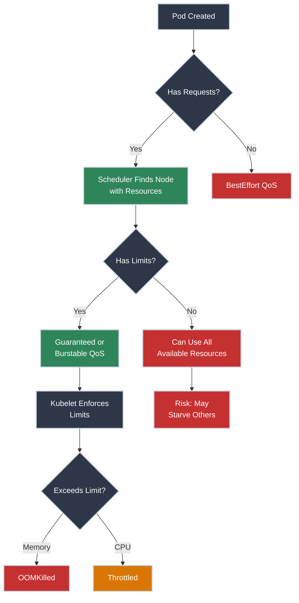

# Resource Requests and Limits

!!! tip "Part of Level 5: Advanced Scheduling & Security"
    This is the first article in [Level 5: Advanced Scheduling & Security](overview.md). Master resource management before moving to node scheduling.

Your application is running in production. So are 50 other applications. One of them starts consuming all available CPU. Suddenly, nothing works—including your app.

This is the nightmare scenario that resource requests and limits prevent. As a platform engineer, you need to ensure fair resource allocation across all workloads while preventing resource starvation and cluster instability.

Think of it like apartment building management: everyone gets space, but you enforce limits so one tenant can't consume the entire building.

!!! info "What You'll Learn"

    By the end of this article, you'll know how to:

    - **Define resource requests** - Reserve CPU and memory for pods
    - **Set resource limits** - Cap maximum resource consumption
    - **Understand QoS classes** - Guaranteed, Burstable, and BestEffort scheduling
    - **Implement resource quotas** - Control resource usage per namespace
    - **Configure LimitRanges** - Set default and max resources
    - **Troubleshoot OOMKilled pods** - Handle out-of-memory scenarios

## The Resource Management Flow



---

## Understanding Requests and Limits

<div class="grid cards" markdown>

-   :material-hand-extended: **Resource Requests**

    ---

    **Why it matters:** Requests guarantee minimum resources for your pod. The scheduler only places pods on nodes with available resources matching the request.

    ``` yaml title="deployment-with-requests.yaml" linenums="1"
    apiVersion: apps/v1
    kind: Deployment
    metadata:
      name: web-app
    spec:
      replicas: 3
      selector:
        matchLabels:
          app: web
      template:
        metadata:
          labels:
            app: web
        spec:
          containers:
          - name: nginx
            image: nginx:1.21
            resources:
              requests:
                cpu: "250m"        # (1)!
                memory: "256Mi"    # (2)!
    ```

    1. 250 millicores (0.25 CPU cores) - minimum guaranteed CPU
    2. 256 mebibytes (268 MB) - minimum guaranteed memory

    **Key insight:** Requests affect **scheduling**. A pod won't run if no node has enough resources.

-   :material-speedometer: **Resource Limits**

    ---

    **Why it matters:** Limits cap maximum resource consumption. Prevents one pod from consuming all node resources and starving others.

    ``` yaml title="deployment-with-limits.yaml" linenums="1"
    apiVersion: apps/v1
    kind: Deployment
    metadata:
      name: web-app
    spec:
      replicas: 3
      selector:
        matchLabels:
          app: web
      template:
        metadata:
          labels:
            app: web
        spec:
          containers:
          - name: nginx
            image: nginx:1.21
            resources:
              requests:
                cpu: "250m"
                memory: "256Mi"
              limits:
                cpu: "500m"        # (1)!
                memory: "512Mi"    # (2)!
    ```

    1. Maximum 500 millicores (0.5 CPU cores) - pod throttled if exceeded
    2. Maximum 512 mebibytes - pod OOMKilled if exceeded

    **Key insight:** Limits affect **runtime**. CPU is throttled, memory violations kill the pod.

</div>

### Resource Units Explained

=== "CPU Units"
    **CPU is measured in cores:**

    - `1` or `1000m` = 1 full CPU core
    - `500m` = 0.5 CPU cores (50% of one core)
    - `250m` = 0.25 CPU cores (25% of one core)
    - `100m` = 0.1 CPU cores (10% of one core)

    **"m" stands for millicores** (1/1000th of a core).

    **Examples:**

    - Web server: `250m` request, `500m` limit
    - Background worker: `100m` request, `200m` limit
    - CPU-intensive job: `2000m` (2 cores) request, `4000m` (4 cores) limit

    **CPU is compressible:** If a pod exceeds its CPU limit, it gets throttled (slowed down), not killed.

=== "Memory Units"
    **Memory is measured in bytes:**

    - `Mi` = mebibytes (1024-based, recommended)
    - `Gi` = gibibytes (1024-based, recommended)
    - `MB` = megabytes (1000-based)
    - `GB` = gigabytes (1000-based)

    **Common sizes:**

    - `128Mi` = 134 MB
    - `256Mi` = 268 MB
    - `512Mi` = 536 MB
    - `1Gi` = 1.07 GB
    - `2Gi` = 2.15 GB

    **Examples:**

    - Microservice: `256Mi` request, `512Mi` limit
    - API server: `512Mi` request, `1Gi` limit
    - Database: `2Gi` request, `4Gi` limit

    **Memory is incompressible:** If a pod exceeds its memory limit, it gets killed (OOMKilled).

---

## Quality of Service (QoS) Classes

Kubernetes assigns every pod a **QoS class** based on requests and limits. This determines eviction priority when nodes run out of resources.

<div class="grid cards" markdown>

-   :material-shield-check: **Guaranteed** (Best)

    ---

    **When:** Requests equal limits for ALL containers.

    ``` yaml title="guaranteed-pod.yaml" linenums="1"
    resources:
      requests:
        cpu: "500m"
        memory: "512Mi"
      limits:
        cpu: "500m"      # (1)!
        memory: "512Mi"  # (2)!
    ```

    1. CPU request = CPU limit
    2. Memory request = memory limit

    **Priority:** Highest - last to be evicted.

    **Use for:** Critical production services, databases, stateful apps.

-   :material-chart-line: **Burstable** (Middle)

    ---

    **When:** Requests < limits OR only requests defined.

    ``` yaml title="burstable-pod.yaml" linenums="1"
    resources:
      requests:
        cpu: "250m"
        memory: "256Mi"
      limits:
        cpu: "1000m"     # (1)!
        memory: "1Gi"    # (2)!
    ```

    1. Can burst up to 1 full CPU core
    2. Can burst up to 1 GB memory

    **Priority:** Medium - evicted after BestEffort.

    **Use for:** Most applications - balance between guaranteed resources and bursting.

-   :material-alert: **BestEffort** (Worst)

    ---

    **When:** No requests or limits defined.

    ``` yaml title="besteffort-pod.yaml" linenums="1"
    resources: {}  # (1)!
    # No requests, no limits
    ```

    1. No resource constraints - uses whatever is available

    **Priority:** Lowest - first to be evicted.

    **Use for:** Non-critical batch jobs, experimental workloads.

</div>

!!! warning "QoS Classes Affect Eviction"
    When a node runs out of resources, Kubernetes evicts pods in this order:

    1. **BestEffort** pods (no resources defined)
    2. **Burstable** pods (exceeding requests)
    3. **Guaranteed** pods (only if critical system resources needed)

    **Production recommendation:** All production pods should be Guaranteed or Burstable.

### Checking QoS Class

✅ **Safe (Read-Only):**

```bash title="Check Pod QoS Class"
kubectl get pod web-app-7c5ddbdf54-2xkqn -o jsonpath='{.status.qosClass}'
# Burstable
```

```bash title="Describe Pod for Full Details"
kubectl describe pod web-app-7c5ddbdf54-2xkqn | grep -i qos
# QoS Class:       Burstable
```

---

## Resource Quotas: Namespace-Level Limits

Resource quotas limit total resource consumption **per namespace**. Essential for multi-tenancy.

=== "CPU and Memory Quotas"
    **Goal:** Limit total resources a namespace can consume.

    ``` yaml title="namespace-quota.yaml" linenums="1"
    apiVersion: v1
    kind: ResourceQuota
    metadata:
      name: dev-quota
      namespace: dev  # (1)!
    spec:
      hard:
        requests.cpu: "10"       # (2)!
        requests.memory: "20Gi"  # (3)!
        limits.cpu: "20"         # (4)!
        limits.memory: "40Gi"    # (5)!
    ```

    1. Apply quota to the `dev` namespace
    2. Total CPU requests cannot exceed 10 cores
    3. Total memory requests cannot exceed 20 GB
    4. Total CPU limits cannot exceed 20 cores
    5. Total memory limits cannot exceed 40 GB

    ⚠️ **Caution (Modifies Resources):**

    ```bash title="Apply Resource Quota"
    kubectl apply -f namespace-quota.yaml
    # resourcequota/dev-quota created
    ```

    ✅ **Safe (Read-Only):**

    ```bash title="Check Quota Usage"
    kubectl get resourcequota -n dev
    # NAME        AGE   REQUEST                                      LIMIT
    # dev-quota   1m    requests.cpu: 2/10, requests.memory: 4Gi/20Gi   limits.cpu: 4/20, limits.memory: 8Gi/40Gi
    ```

=== "Object Count Quotas"
    **Goal:** Limit number of resources (pods, services, etc.) per namespace.

    ``` yaml title="object-count-quota.yaml" linenums="1"
    apiVersion: v1
    kind: ResourceQuota
    metadata:
      name: object-quota
      namespace: dev
    spec:
      hard:
        pods: "50"                    # (1)!
        services: "10"                # (2)!
        persistentvolumeclaims: "20"  # (3)!
        configmaps: "50"              # (4)!
        secrets: "50"                 # (5)!
    ```

    1. Maximum 50 pods
    2. Maximum 10 services
    3. Maximum 20 PVCs
    4. Maximum 50 ConfigMaps
    5. Maximum 50 Secrets

    **Why this matters:** Prevents namespace sprawl and resource exhaustion from too many objects.

!!! warning "Quota Enforcement"
    If a namespace has resource quotas:

    - **All pods MUST define requests and limits** (or use LimitRanges for defaults)
    - Creating pods without resources will fail: `Error: failed quota: dev-quota: must specify requests.cpu, requests.memory`

    This is intentional—forces teams to be explicit about resource needs.

---

## LimitRanges: Default and Max Resources

LimitRanges set **defaults** and **max/min** values for containers in a namespace. Saves teams from defining resources for every pod.

<div class="grid cards" markdown>

-   :material-cog-outline: **Default Requests and Limits**

    ---

    **Why it matters:** Automatically applies resources to pods that don't specify them.

    ``` yaml title="default-limits.yaml" linenums="1"
    apiVersion: v1
    kind: LimitRange
    metadata:
      name: default-limits
      namespace: dev
    spec:
      limits:
      - default:           # (1)!
          cpu: "500m"
          memory: "512Mi"
        defaultRequest:    # (2)!
          cpu: "250m"
          memory: "256Mi"
        type: Container
    ```

    1. Default **limits** if not specified
    2. Default **requests** if not specified

    **Result:** Pods without resources automatically get these values.

-   :material-speedometer-slow: **Max and Min Constraints**

    ---

    **Why it matters:** Prevents pods from requesting too much or too little.

    ``` yaml title="min-max-limits.yaml" linenums="1"
    apiVersion: v1
    kind: LimitRange
    metadata:
      name: min-max-limits
      namespace: dev
    spec:
      limits:
      - max:               # (1)!
          cpu: "2"
          memory: "4Gi"
        min:               # (2)!
          cpu: "100m"
          memory: "128Mi"
        type: Container
    ```

    1. Maximum resources a container can request
    2. Minimum resources a container must request

    **Result:** Pods requesting outside this range are rejected.

</div>

⚠️ **Caution (Modifies Resources):**

```bash title="Apply LimitRange"
kubectl apply -f default-limits.yaml
# limitrange/default-limits created
```

✅ **Safe (Read-Only):**

```bash title="Check LimitRanges"
kubectl describe limitrange default-limits -n dev
# Resource          Default   DefaultRequest  Max  Min
# --------          -------   --------------  ---  ---
# cpu (Container)   500m      250m            2    100m
# memory (Container) 512Mi    256Mi           4Gi  128Mi
```

!!! tip "LimitRanges + ResourceQuotas = Complete Control"
    Use both together:

    - **LimitRange:** Sets defaults for individual pods
    - **ResourceQuota:** Caps total namespace consumption

    Example: LimitRange gives each pod `250m` CPU by default. ResourceQuota limits namespace to `10` CPU total. Result: ~40 pods max.

---

## Troubleshooting OOMKilled Pods

When a pod exceeds its memory limit, Kubernetes kills it. This is called **OOMKilled** (Out Of Memory Killed).

### Identifying OOMKilled Pods

✅ **Safe (Read-Only):**

```bash title="Check Pod Status"
kubectl get pods
# NAME                      READY   STATUS      RESTARTS   AGE
# web-app-7c5ddbdf54-2xkqn  0/1     OOMKilled   3          5m
```

```bash title="Describe Pod for Details"
kubectl describe pod web-app-7c5ddbdf54-2xkqn
# Last State:     Terminated
#   Reason:       OOMKilled
#   Exit Code:    137
```

**Exit Code 137 = OOMKilled** (128 + 9 SIGKILL).

### Common Causes and Solutions

=== "Memory Leak"
    **Problem:** Application gradually consumes more memory until it hits the limit.

    **Symptoms:**

    - Pod restarts repeatedly
    - Restart count increases
    - Each restart happens after roughly the same uptime

    **Check memory usage over time:**

    ```bash title="View Current Memory Usage"
    kubectl top pod web-app-7c5ddbdf54-2xkqn
    # NAME                      CPU(cores)   MEMORY(bytes)
    # web-app-7c5ddbdf54-2xkqn  50m          480Mi
    ```

    **Solution:**

    - Fix the memory leak in application code
    - Increase memory limit as temporary workaround
    - Add liveness probe to restart before hitting limit

=== "Limit Too Low"
    **Problem:** Application legitimately needs more memory than limit allows.

    **Symptoms:**

    - OOMKilled during peak traffic
    - OOMKilled during specific operations (large file processing, report generation)
    - Logs show successful operations before crash

    **Solution:**

    Increase memory limit:

    ``` yaml
    resources:
      requests:
        memory: "512Mi"  # Increase request
      limits:
        memory: "1Gi"    # Increase limit
    ```

=== "Spike During Startup"
    **Problem:** Application uses more memory during initialization than during normal operation.

    **Symptoms:**

    - OOMKilled shortly after pod starts
    - Works fine after several restarts (lucky timing)

    **Solution:**

    Adjust requests and limits to accommodate startup spike, or use startup probes:

    ``` yaml
    resources:
      requests:
        memory: "256Mi"
      limits:
        memory: "1Gi"     # (1)!
    livenessProbe:
      httpGet:
        path: /health
        port: 8080
      initialDelaySeconds: 60  # (2)!
    ```

    1. Higher limit to handle startup memory spike
    2. Wait 60 seconds before checking health (give time to initialize)

!!! tip "Pro Debugging: Check Logs Before Crash"
    Get logs from the previous container instance (before OOMKill):

    ```bash
    kubectl logs web-app-7c5ddbdf54-2xkqn --previous
    ```

    Look for memory allocation patterns, large object creation, or cache growth.

---

## Production Best Practices

<div class="grid cards" markdown>

-   :material-check-circle: **Always Define Resources**

    ---

    **Every production pod should have:**

    - Requests (for scheduling)
    - Limits (for protection)

    **Exception:** BestEffort acceptable only for non-critical batch jobs.

-   :material-chart-bell-curve: **Right-Size Requests and Limits**

    ---

    **Process:**

    1. Monitor actual usage with `kubectl top`
    2. Set requests to **average usage**
    3. Set limits to **peak usage + 20% buffer**

    **Example:** App averages 300Mi, peaks at 450Mi:

    - Request: `256Mi` (slightly under average)
    - Limit: `512Mi` (above peak + buffer)

-   :material-scale-balance: **Burstable for Most Workloads**

    ---

    **Why:** Allows apps to burst above requests when resources are available, but guarantees minimum.

    **Pattern:**

    - Request: What you need
    - Limit: 2x request (allows bursting)

-   :material-security: **Guaranteed for Critical Services**

    ---

    **Use Guaranteed QoS for:**

    - Databases
    - Stateful services
    - Core infrastructure components
    - Services that must never be evicted

    **Pattern:**

    - Request = Limit (no bursting)

-   :material-namespace: **Use ResourceQuotas + LimitRanges**

    ---

    **In every namespace:**

    - ResourceQuota: Total cap
    - LimitRange: Per-pod defaults

    **Result:** Automatic enforcement without manual oversight.

-   :material-chart-timeline-variant: **Monitor Resource Usage**

    ---

    **Essential metrics:**

    - CPU throttling
    - Memory consumption
    - OOMKill count
    - Pod restarts

    **Tools:** Prometheus + Grafana (covered in Level 6).

</div>

---

## Practice Exercises

??? question "Exercise 1: Deploy App with Resources"
    **Goal:** Deploy a web app with defined requests and limits, verify QoS class.

    **Steps:**

    1. Create deployment with 250m CPU request, 500m limit
    2. Apply deployment
    3. Check QoS class
    4. Scale to 10 replicas—does scheduler find nodes?

    ??? tip "Solution"
        **Create deployment:**

        ``` yaml title="web-app-resources.yaml" linenums="1"
        apiVersion: apps/v1
        kind: Deployment
        metadata:
          name: web-app
        spec:
          replicas: 3
          selector:
            matchLabels:
              app: web
          template:
            metadata:
              labels:
                app: web
            spec:
              containers:
              - name: nginx
                image: nginx:1.21
                resources:
                  requests:
                    cpu: "250m"
                    memory: "256Mi"
                  limits:
                    cpu: "500m"
                    memory: "512Mi"
        ```

        **Apply and verify:**

        ```bash
        kubectl apply -f web-app-resources.yaml
        # deployment.apps/web-app created

        kubectl get pods
        # Should see 3 pods running

        kubectl get pod <pod-name> -o jsonpath='{.status.qosClass}'
        # Burstable
        ```

        **Scale and observe:**

        ```bash
        kubectl scale deployment web-app --replicas=10
        # deployment.apps/web-app scaled

        kubectl get pods
        # Watch if all 10 pods schedule successfully
        # If some are Pending, check node resources
        ```

        **What you learned:** Requests determine schedulability. If nodes lack resources, pods stay Pending.

??? question "Exercise 2: Configure Namespace ResourceQuota"
    **Goal:** Create a namespace with resource quotas, deploy pods until quota is reached.

    **Steps:**

    1. Create namespace `quota-test`
    2. Apply ResourceQuota: 2 CPU requests, 4 CPU limits
    3. Deploy 2 replicas with 1 CPU request each
    4. Try to scale to 3 replicas—what happens?

    ??? tip "Solution"
        **Create namespace:**

        ```bash
        kubectl create namespace quota-test
        # namespace/quota-test created
        ```

        **Create ResourceQuota:**

        ``` yaml title="quota-test-quota.yaml" linenums="1"
        apiVersion: v1
        kind: ResourceQuota
        metadata:
          name: cpu-quota
          namespace: quota-test
        spec:
          hard:
            requests.cpu: "2"
            limits.cpu: "4"
        ```

        ```bash
        kubectl apply -f quota-test-quota.yaml
        # resourcequota/cpu-quota created
        ```

        **Deploy app:**

        ``` yaml title="quota-app.yaml" linenums="1"
        apiVersion: apps/v1
        kind: Deployment
        metadata:
          name: quota-app
          namespace: quota-test
        spec:
          replicas: 2
          selector:
            matchLabels:
              app: quota-test
          template:
            metadata:
              labels:
                app: quota-test
            spec:
              containers:
              - name: nginx
                image: nginx:1.21
                resources:
                  requests:
                    cpu: "1"
                  limits:
                    cpu: "2"
        ```

        ```bash
        kubectl apply -f quota-app.yaml
        # deployment.apps/quota-app created

        kubectl get pods -n quota-test
        # Should see 2 pods running (2 x 1 CPU = 2 CPU total)
        ```

        **Try to scale beyond quota:**

        ```bash
        kubectl scale deployment quota-app --replicas=3 -n quota-test
        # deployment.apps/quota-app scaled

        kubectl get pods -n quota-test
        # Still only 2 pods running

        kubectl get events -n quota-test --sort-by='.lastTimestamp'
        # Error: exceeded quota: cpu-quota, requested: requests.cpu=1, used: requests.cpu=2, limited: requests.cpu=2
        ```

        **What you learned:** ResourceQuotas enforce hard limits at namespace level. Third pod can't be created because it would exceed quota.

??? question "Exercise 3: Set Up LimitRange Defaults"
    **Goal:** Create namespace with LimitRange, deploy pod without resources, verify defaults applied.

    **Steps:**

    1. Create namespace `limitrange-test`
    2. Apply LimitRange with defaults
    3. Deploy pod without resources defined
    4. Check if defaults were applied

    ??? tip "Solution"
        **Create namespace:**

        ```bash
        kubectl create namespace limitrange-test
        # namespace/limitrange-test created
        ```

        **Create LimitRange:**

        ``` yaml title="default-limits.yaml" linenums="1"
        apiVersion: v1
        kind: LimitRange
        metadata:
          name: default-limits
          namespace: limitrange-test
        spec:
          limits:
          - default:
              cpu: "500m"
              memory: "512Mi"
            defaultRequest:
              cpu: "250m"
              memory: "256Mi"
            type: Container
        ```

        ```bash
        kubectl apply -f default-limits.yaml
        # limitrange/default-limits created
        ```

        **Deploy pod WITHOUT resources:**

        ``` yaml title="no-resources-pod.yaml" linenums="1"
        apiVersion: v1
        kind: Pod
        metadata:
          name: test-pod
          namespace: limitrange-test
        spec:
          containers:
          - name: nginx
            image: nginx:1.21
            # No resources defined!
        ```

        ```bash
        kubectl apply -f no-resources-pod.yaml
        # pod/test-pod created
        ```

        **Verify defaults applied:**

        ```bash
        kubectl get pod test-pod -n limitrange-test -o yaml | grep -A 10 resources
        # resources:
        #   limits:
        #     cpu: 500m
        #     memory: 512Mi
        #   requests:
        #     cpu: 250m
        #     memory: 256Mi
        ```

        **What you learned:** LimitRanges automatically inject defaults into pods. Essential for enforcing resource management without manual overhead.

---

## Quick Recap

| Concept | Purpose | Command |
|---------|---------|---------|
| **Resource Requests** | Guarantee minimum resources, affect scheduling | Define in `resources.requests` |
| **Resource Limits** | Cap maximum usage, prevent resource hogging | Define in `resources.limits` |
| **QoS Classes** | Determine eviction priority (Guaranteed > Burstable > BestEffort) | Check with `kubectl get pod -o jsonpath` |
| **ResourceQuota** | Limit total namespace consumption | `kubectl get resourcequota` |
| **LimitRange** | Set defaults and constraints per pod | `kubectl describe limitrange` |
| **OOMKilled** | Pod killed for exceeding memory limit | Check `kubectl describe pod` |

---

## Further Reading

### Official Documentation

- [Kubernetes Docs: Managing Resources](https://kubernetes.io/docs/concepts/configuration/manage-resources-containers/) - Comprehensive guide to requests and limits
- [Kubernetes Docs: Resource Quotas](https://kubernetes.io/docs/concepts/policy/resource-quotas/) - Namespace-level resource management
- [Kubernetes Docs: Limit Ranges](https://kubernetes.io/docs/concepts/policy/limit-range/) - Default and max/min constraints
- [Kubernetes Docs: Pod QoS Classes](https://kubernetes.io/docs/tasks/configure-pod-container/quality-service-pod/) - Understanding eviction priority

### Deep Dives

- [Vertical Pod Autoscaler](https://github.com/kubernetes/autoscaler/tree/master/vertical-pod-autoscaler) - Automatically right-size requests and limits
- [Memory Management in Kubernetes](https://kubernetes.io/blog/2021/11/26/qos-memory-resources/) - How Kubernetes manages memory and OOMKills
- [CPU Management in Kubernetes](https://kubernetes.io/docs/tasks/administer-cluster/cpu-management-policies/) - CPU pinning and isolation

### Related Articles

- [Level 5 Overview](overview.md) - See all Level 5 articles
- [Taints and Tolerations](taints_tolerations.md) - Control which nodes pods can schedule on
- [Node Affinity and Pod Affinity](affinity.md) - Advanced scheduling rules

---

## What's Next?

You've mastered resource management! Next up in Level 5:

- **[Taints and Tolerations](taints_tolerations.md)** - Dedicate nodes to specific workloads (GPUs, high-memory, etc.)
- **[Node Affinity and Pod Affinity](affinity.md)** - Advanced scheduling: co-location, anti-affinity, topology constraints

Resource management is the foundation. Node scheduling builds on top.
