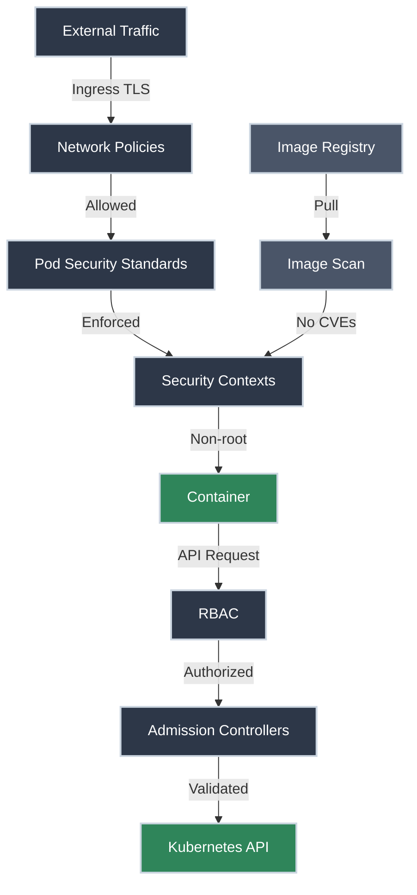
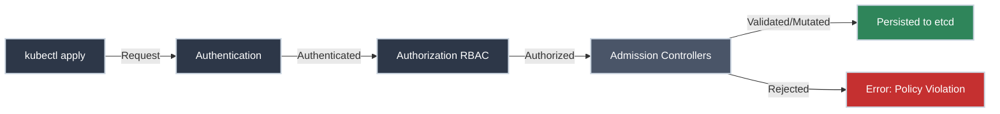

# Security Best Practices

!!! tip "Part of Level 5: Advanced Scheduling & Security"
    This article is part of [Level 5: Advanced Scheduling & Security](overview.md). You're now entering platform engineering territory—securing clusters for production.

Your cluster is running workloads. You've implemented RBAC. But is your cluster actually secure?

Security in Kubernetes isn't a single checkbox—it's a layered defense strategy. Think of it like securing a building: you need locks on the doors (RBAC), cameras (audit logging), security guards (admission controllers), and building codes (security policies).

**The harsh reality:** A single misconfigured Pod running as root with access to the host network can compromise your entire cluster. Security isn't optional—it's survival.

By the end of this article, you'll understand how to implement **defense-in-depth security** for production Kubernetes clusters.

!!! info "What You'll Learn"

    By the end of this article, you'll know how to:

    - **Apply Pod Security Standards** - Restrict privileged containers
    - **Configure security contexts** - Run containers as non-root, drop capabilities
    - **Implement Network Policies** - Control pod-to-pod communication
    - **Manage secrets securely** - Encryption, access control, external secret stores
    - **Scan container images** - Detect vulnerabilities before deployment
    - **Use admission controllers** - Enforce policies automatically
    - **Apply security checklists** - Production-ready hardening

## The Security Layers



---

## Pod Security Standards

**Pod Security Standards (PSS)** define three security profiles that restrict what Pods can do. Think of them as building codes—minimum safety requirements.

<div class="grid cards" markdown>

-   :material-lock-open: **Privileged**

    ---

    **Why it matters:** Unrestricted—allows everything, including dangerous operations.

    **Use case:** Trusted infrastructure components (CNI plugins, storage drivers).

    **Risk:** Pods can escape containers, access host resources, compromise cluster.

    **Recommendation:** Avoid unless absolutely necessary.

-   :material-lock: **Baseline**

    ---

    **Why it matters:** Minimally restrictive—prevents known privilege escalations.

    **Use case:** Default for most applications that don't need host access.

    **Restrictions:**

    - No host namespaces (network, PID, IPC)
    - No privileged containers
    - No host path volumes

    **Recommendation:** Minimum standard for production.

-   :material-lock-check: **Restricted**

    ---

    **Why it matters:** Heavily restricted—follows Pod hardening best practices.

    **Use case:** Security-sensitive workloads, multi-tenant clusters.

    **Restrictions (beyond Baseline):**

    - Must run as non-root
    - Must drop all capabilities
    - Read-only root filesystem
    - No privilege escalation

    **Recommendation:** Target for production applications.

</div>

### Enforcing Pod Security Standards

Kubernetes enforces PSS at the **namespace level** using labels:

``` yaml title="namespace-with-restricted-pss.yaml" linenums="1"
apiVersion: v1
kind: Namespace
metadata:
  name: production
  labels:
    pod-security.kubernetes.io/enforce: restricted  # (1)!
    pod-security.kubernetes.io/audit: restricted  # (2)!
    pod-security.kubernetes.io/warn: restricted  # (3)!
```

1. **Enforce:** Blocks Pods that violate the policy
2. **Audit:** Logs violations to audit logs (doesn't block)
3. **Warn:** Shows warnings to users (doesn't block)

**Apply it:**

⚠️ **Caution (Modifies Resources):**

```bash title="Create Namespace with Restricted PSS"
kubectl apply -f namespace-with-restricted-pss.yaml
# namespace/production created
```

**Test it by trying to deploy a privileged Pod:**

``` yaml title="privileged-pod.yaml" linenums="1"
apiVersion: v1
kind: Pod
metadata:
  name: privileged-test
  namespace: production
spec:
  containers:
  - name: nginx
    image: nginx:1.21
    securityContext:
      privileged: true  # (1)!
```

1. Tries to run in privileged mode (violates restricted policy)

```bash title="Try to Deploy Privileged Pod"
kubectl apply -f privileged-pod.yaml
# Error: pods "privileged-test" is forbidden: violates PodSecurity "restricted:latest":
# privileged (container "nginx" must not set securityContext.privileged=true)
```

**Blocked!** The namespace's restricted policy rejected the Pod.

### Compliant Restricted Pod

``` yaml title="secure-pod.yaml" linenums="1"
apiVersion: v1
kind: Pod
metadata:
  name: secure-app
  namespace: production
spec:
  securityContext:
    runAsNonRoot: true  # (1)!
    runAsUser: 1000  # (2)!
    seccompProfile:
      type: RuntimeDefault  # (3)!
  containers:
  - name: nginx
    image: nginx:1.21
    securityContext:
      allowPrivilegeEscalation: false  # (4)!
      capabilities:
        drop:
        - ALL  # (5)!
      readOnlyRootFilesystem: true  # (6)!
    volumeMounts:
    - name: cache
      mountPath: /var/cache/nginx  # (7)!
    - name: run
      mountPath: /var/run
  volumes:
  - name: cache
    emptyDir: {}
  - name: run
    emptyDir: {}
```

1. Must not run as root (UID 0)
2. Explicitly run as user 1000
3. Apply default seccomp profile (restricts syscalls)
4. Cannot escalate to root
5. Drop all Linux capabilities
6. Filesystem is read-only (prevents tampering)
7. Use emptyDir for writable directories (nginx needs cache and run)

**Deploy it:**

```bash title="Deploy Secure Pod"
kubectl apply -f secure-pod.yaml
# pod/secure-app created
```

**SUCCESS!** This Pod complies with the restricted policy.

---

## Security Contexts

**Security contexts** define privilege and access control settings for Pods and containers.

### Pod-Level Security Context

``` yaml title="pod-security-context.yaml" linenums="1"
apiVersion: v1
kind: Pod
metadata:
  name: pod-security-example
spec:
  securityContext:  # (1)!
    runAsUser: 1000  # (2)!
    runAsGroup: 3000  # (3)!
    fsGroup: 2000  # (4)!
    runAsNonRoot: true  # (5)!
    seccompProfile:
      type: RuntimeDefault  # (6)!
  containers:
  - name: app
    image: busybox
    command: ["sh", "-c", "sleep 3600"]
```

1. Pod-level security context (applies to all containers)
2. Run as user ID 1000
3. Run as group ID 3000
4. Volume ownership set to group 2000
5. Enforce non-root requirement
6. Apply seccomp to filter dangerous syscalls

### Container-Level Security Context

``` yaml title="container-security-context.yaml" linenums="1"
apiVersion: v1
kind: Pod
metadata:
  name: container-security-example
spec:
  containers:
  - name: app
    image: nginx:1.21
    securityContext:  # (1)!
      runAsUser: 101  # (2)!
      runAsNonRoot: true
      allowPrivilegeEscalation: false  # (3)!
      readOnlyRootFilesystem: true  # (4)!
      capabilities:
        drop:
        - ALL  # (5)!
        add:
        - NET_BIND_SERVICE  # (6)!
    volumeMounts:
    - name: cache
      mountPath: /var/cache/nginx
  volumes:
  - name: cache
    emptyDir: {}
```

1. Container-level security context (overrides Pod-level)
2. Run as nginx user (UID 101 in nginx image)
3. Cannot gain more privileges than parent process
4. Root filesystem is read-only (immutable)
5. Drop all Linux capabilities
6. Add back only NET_BIND_SERVICE (bind to ports < 1024)

!!! warning "Container Context Overrides Pod Context"
    If both Pod and Container security contexts set the same field, the Container value wins.

### Understanding Linux Capabilities

**Linux capabilities** break root privileges into distinct units. Instead of "all or nothing," you can grant specific capabilities:

| Capability | Allows | Example Use Case |
|------------|--------|------------------|
| **NET_BIND_SERVICE** | Bind to ports < 1024 | Web servers listening on port 80/443 |
| **CHOWN** | Change file ownership | File management tools |
| **DAC_OVERRIDE** | Bypass file permission checks | Backup tools |
| **SYS_TIME** | Set system clock | NTP daemons |
| **NET_ADMIN** | Network configuration | CNI plugins |

**Best practice:** Drop ALL capabilities, then add back only what's needed.

```yaml
securityContext:
  capabilities:
    drop:
    - ALL  # Drop everything first
    add:
    - NET_BIND_SERVICE  # Add back only what's needed
```

---

## Network Policies: Pod-to-Pod Firewall

**Network Policies** control traffic between Pods. By default, Kubernetes allows all pod-to-pod communication. Network Policies implement **zero-trust networking**.

!!! info "CNI Requirement"
    Network Policies require a CNI plugin that supports them (Calico, Cilium, Weave). Default `kubenet` does NOT support Network Policies.

### Default Deny All Traffic

Start with **deny-all**, then explicitly allow what's needed:

``` yaml title="deny-all-network-policy.yaml" linenums="1"
apiVersion: networking.k8s.io/v1
kind: NetworkPolicy
metadata:
  name: deny-all
  namespace: production
spec:
  podSelector: {}  # (1)!
  policyTypes:
  - Ingress  # (2)!
  - Egress  # (3)!
```

1. Empty selector = applies to all Pods in namespace
2. Deny all incoming traffic
3. Deny all outgoing traffic

**Result:** All Pods in `production` namespace are isolated—no traffic in or out.

!!! danger "Apply Deny-All Carefully"
    This breaks all communication. Apply allow rules IMMEDIATELY after, or your apps will fail.

### Allow Frontend to Backend

``` yaml title="allow-frontend-to-backend.yaml" linenums="1"
apiVersion: networking.k8s.io/v1
kind: NetworkPolicy
metadata:
  name: allow-frontend-to-backend
  namespace: production
spec:
  podSelector:
    matchLabels:
      app: backend  # (1)!
  policyTypes:
  - Ingress
  ingress:
  - from:
    - podSelector:
        matchLabels:
          app: frontend  # (2)!
    ports:
    - protocol: TCP
      port: 8080  # (3)!
```

1. Apply to Pods labeled `app: backend`
2. Allow traffic from Pods labeled `app: frontend`
3. Only on port 8080

**Result:** Frontend Pods can reach Backend Pods on port 8080. All other traffic to Backend is blocked.

### Allow Egress to DNS and External API

``` yaml title="allow-egress-dns-api.yaml" linenums="1"
apiVersion: networking.k8s.io/v1
kind: NetworkPolicy
metadata:
  name: allow-egress
  namespace: production
spec:
  podSelector:
    matchLabels:
      app: frontend
  policyTypes:
  - Egress
  egress:
  - to:  # (1)!
    - namespaceSelector:
        matchLabels:
          name: kube-system
    - podSelector:
        matchLabels:
          k8s-app: kube-dns
    ports:
    - protocol: UDP
      port: 53  # (2)!
  - to:  # (3)!
    - podSelector: {}
    ports:
    - protocol: TCP
      port: 8080
  - to:  # (4)!
    ports:
    - protocol: TCP
      port: 443
```

1. Allow DNS queries
2. UDP port 53 (DNS)
3. Allow traffic to any Pod in same namespace on port 8080
4. Allow HTTPS to external IPs (e.g., public APIs)

### Network Policy Best Practices

**For multi-tier applications:**


**Network Policies:**

1. **Default deny-all** in every namespace
2. **Allow Ingress → Frontend** (from Ingress controller)
3. **Allow Frontend → Backend** (port 8080 only)
4. **Allow Backend → Database** (port 5432 only)
5. **Allow all → DNS** (UDP 53 to kube-system)
6. **Allow all → Internet** (if needed—restrict by IP range if possible)

---

## Secrets Management

**Kubernetes Secrets** store sensitive data (passwords, tokens, certificates). By default, Secrets are **NOT encrypted at rest**—they're base64-encoded (easily reversible).

!!! danger "Default Secrets Are Not Secure"
    - Base64 encoding is NOT encryption
    - Secrets are stored in etcd as plaintext (unless etcd encryption is enabled)
    - Anyone with etcd access can read all Secrets
    - RBAC is critical—restrict who can get/list Secrets

### Encrypting Secrets at Rest

Enable etcd encryption with an `EncryptionConfiguration`:

``` yaml title="encryption-config.yaml" linenums="1"
apiVersion: apiserver.config.k8s.io/v1
kind: EncryptionConfiguration
resources:
  - resources:
    - secrets  # (1)!
    providers:
    - aescbc:  # (2)!
        keys:
        - name: key1
          secret: <base64-encoded-32-byte-key>  # (3)!
    - identity: {}  # (4)!
```

1. Encrypt Secrets resource type
2. AES-CBC encryption algorithm
3. Generate with: `head -c 32 /dev/urandom | base64`
4. Fallback for reading old unencrypted secrets

**Enable encryption:**

1. Place `encryption-config.yaml` on control plane node
2. Update kube-apiserver manifest to reference it:
   ```yaml
   --encryption-provider-config=/etc/kubernetes/encryption-config.yaml
   ```
3. Restart kube-apiserver
4. Re-encrypt existing secrets:
   ```bash
   kubectl get secrets --all-namespaces -o json | kubectl replace -f -
   ```

!!! warning "Managed Kubernetes"
    If using EKS, AKS, GKE—etcd encryption is usually enabled by default or available as a cluster setting. Check your provider's documentation.

### Creating Secrets Securely

**DON'T store secrets in YAML files:**

```yaml
# BAD: Secret value in plain text
apiVersion: v1
kind: Secret
metadata:
  name: db-password
stringData:
  password: SuperSecret123  # Visible in version control!
```

**DO use `kubectl create secret`:**

```bash title="Create Secret from Literal"
kubectl create secret generic db-password \
  --from-literal=password=SuperSecret123 \
  -n production
# secret/db-password created
```

```bash title="Create Secret from File"
kubectl create secret generic ssh-key \
  --from-file=ssh-privatekey=~/.ssh/id_rsa \
  -n production
# secret/ssh-key created
```

### Using Secrets in Pods

=== "Environment Variable"
    ``` yaml title="pod-secret-env.yaml" linenums="1"
    apiVersion: v1
    kind: Pod
    metadata:
      name: app
    spec:
      containers:
      - name: app
        image: myapp:1.0
        env:
        - name: DB_PASSWORD  # (1)!
          valueFrom:
            secretKeyRef:
              name: db-password
              key: password
    ```

    1. Environment variable from Secret

    **Risk:** Environment variables can leak in logs, crash dumps, or child processes.

=== "Volume Mount (Safer)"
    ``` yaml title="pod-secret-volume.yaml" linenums="1"
    apiVersion: v1
    kind: Pod
    metadata:
      name: app
    spec:
      containers:
      - name: app
        image: myapp:1.0
        volumeMounts:
        - name: secret-volume
          mountPath: /etc/secrets  # (1)!
          readOnly: true
      volumes:
      - name: secret-volume
        secret:
          secretName: db-password
    ```

    1. Secret appears as file: `/etc/secrets/password`

    **Safer:** App reads from file, not environment.

### External Secret Stores

**Production-grade secret management** uses external secret stores:

- **HashiCorp Vault** - Centralized secret management
- **AWS Secrets Manager / Parameter Store** - Cloud-native
- **Azure Key Vault** - For AKS clusters
- **Google Secret Manager** - For GKE clusters

**Tools to integrate external stores with Kubernetes:**

- **External Secrets Operator** - Syncs secrets from external stores to Kubernetes Secrets
- **Secrets Store CSI Driver** - Mounts secrets directly from external stores as volumes

**Why external stores?**

- ✅ Centralized secret management
- ✅ Automatic rotation
- ✅ Audit logging
- ✅ Fine-grained access control
- ✅ Secrets never stored in etcd

---

## Container Image Security

**Vulnerable container images** are the #1 attack vector. Scanning images before deployment is critical.

### Image Scanning Tools

| Tool | Type | Use Case |
|------|------|----------|
| **Trivy** | Open-source | CLI scanner, CI/CD integration |
| **Snyk** | SaaS | Continuous monitoring, IDE integration |
| **Anchore** | Open-source | Policy-based scanning |
| **Aqua Security** | Commercial | Runtime protection + scanning |
| **Clair** | Open-source | Used by Quay, Harbor registries |

### Scanning with Trivy

✅ **Safe (Read-Only):**

```bash title="Install Trivy"
# macOS
brew install trivy

# Linux
wget -qO - https://aquasecurity.github.io/trivy-repo/deb/public.key | sudo apt-key add -
echo "deb https://aquasecurity.github.io/trivy-repo/deb $(lsb_release -sc) main" | sudo tee -a /etc/apt/sources.list.d/trivy.list
sudo apt-get update
sudo apt-get install trivy
```

```bash title="Scan Local Image"
trivy image nginx:1.21
# Shows vulnerabilities grouped by severity: CRITICAL, HIGH, MEDIUM, LOW
```

```bash title="Scan with Severity Filter"
trivy image --severity HIGH,CRITICAL nginx:1.21
# Only show HIGH and CRITICAL vulnerabilities
```

```bash title="Fail CI/CD on Vulnerabilities"
trivy image --exit-code 1 --severity CRITICAL myapp:latest
# Exits with code 1 if CRITICAL vulnerabilities found (fails CI pipeline)
```

### Image Security Best Practices

<div class="grid cards" markdown>

-   :material-shield-check: **Use Trusted Registries**

    ---

    **Why it matters:** Public images can be compromised. Use verified sources.

    - ✅ Official images from Docker Hub (verified publisher)
    - ✅ Your company's private registry
    - ✅ Cloud provider registries (ECR, ACR, GCR)
    - ❌ Random Docker Hub images from unknown authors

-   :material-tag-multiple: **Pin Image Versions**

    ---

    **Why it matters:** `:latest` tag can pull different images over time.

    **DON'T:**
    ```yaml
    image: nginx:latest  # Can change without warning
    ```

    **DO:**
    ```yaml
    image: nginx:1.21.6  # Immutable, reproducible
    ```

    **Even better:**
    ```yaml
    image: nginx@sha256:abc123...  # Content-addressed, tamper-proof
    ```

-   :material-delete-sweep: **Use Minimal Base Images**

    ---

    **Why it matters:** Smaller images = fewer packages = smaller attack surface.

    **Preferred base images:**

    - `scratch` (empty image, statically linked binaries)
    - `distroless` (no shell, no package manager)
    - `alpine` (small, but has shell and package manager)

    **Avoid:**

    - `ubuntu`, `debian`, `centos` (large, many packages)

-   :material-update: **Automate Image Updates**

    ---

    **Why it matters:** New vulnerabilities are discovered daily. Stay current.

    **Tools:**

    - **Renovate** - Automated dependency updates
    - **Dependabot** - GitHub-native updates
    - **ArgoCD Image Updater** - GitOps image updates

</div>

### Admission Controller: Block Vulnerable Images

Use **admission controllers** to enforce image policies:

**Example: ImagePolicyWebhook**

Rejects Pods with HIGH/CRITICAL vulnerabilities before they're created.

**Example: OPA Gatekeeper Policy**

``` yaml title="allowed-registries-policy.yaml" linenums="1"
apiVersion: constraints.gatekeeper.sh/v1beta1
kind: K8sAllowedRepos
metadata:
  name: allowed-repositories
spec:
  match:
    kinds:
    - apiGroups: [""]
      kinds: ["Pod"]
  parameters:
    repos:
    - "docker.io/library"  # (1)!
    - "gcr.io/my-company"  # (2)!
```

1. Allow official Docker Hub images
2. Allow your company's private registry

**Result:** Pods using images from other registries are rejected.

---

## Admission Controllers

**Admission controllers** intercept Kubernetes API requests BEFORE objects are persisted. They can **validate** (allow/deny) or **mutate** (modify) requests.



### Built-In Admission Controllers

Enabled by default in most clusters:

| Admission Controller | Purpose |
|---------------------|---------|
| **PodSecurity** | Enforces Pod Security Standards |
| **LimitRanger** | Enforces resource limits from LimitRange objects |
| **ResourceQuota** | Enforces namespace resource quotas |
| **DefaultStorageClass** | Assigns default StorageClass to PVCs |
| **ServiceAccount** | Automatically adds ServiceAccount to Pods |
| **NamespaceLifecycle** | Prevents creating objects in terminating namespaces |

✅ **Safe (Read-Only):**

```bash title="List Enabled Admission Controllers"
kubectl -n kube-system get pods -l component=kube-apiserver -o yaml | grep enable-admission-plugins
# Shows admission plugins enabled on kube-apiserver
```

### Dynamic Admission Controllers

**Validating Webhooks** and **Mutating Webhooks** allow you to write custom admission logic:

**Example: OPA Gatekeeper (Policy Engine)**

- Define policies in Rego language
- Enforce policies cluster-wide
- Common policies: required labels, allowed registries, resource limits

**Example: Kyverno (Kubernetes-Native Policies)**

- Policies written in YAML (no new language)
- Validate, mutate, generate resources
- Easier learning curve than OPA

**Example: Istio Sidecar Injection**

- Mutating webhook automatically injects Envoy sidecar into Pods
- Enables service mesh without changing Deployment YAML

---

## Audit Logging

**Audit logs** record all API requests for compliance and forensics.

### Enabling Audit Logging

Create an audit policy:

``` yaml title="audit-policy.yaml" linenums="1"
apiVersion: audit.k8s.io/v1
kind: Policy
rules:
- level: Metadata  # (1)!
  verbs: ["get", "list", "watch"]
- level: RequestResponse  # (2)!
  resources:
  - group: ""
    resources: ["secrets", "configmaps"]
- level: Request  # (3)!
  omitStages:
  - RequestReceived
```

1. Log metadata only for read operations (reduces log volume)
2. Log full request/response for secrets and configmaps
3. Log request body for all other operations

**Enable on kube-apiserver:**

```yaml
--audit-policy-file=/etc/kubernetes/audit-policy.yaml
--audit-log-path=/var/log/kubernetes/audit.log
--audit-log-maxage=30
--audit-log-maxbackup=10
--audit-log-maxsize=100
```

**What's logged:**

- Who (user, ServiceAccount, IP)
- What (verb, resource, namespace)
- When (timestamp)
- Result (success, failure, error)

**Use cases:**

- Compliance audits (who accessed production secrets?)
- Security investigations (unauthorized access attempts)
- Debugging RBAC issues

---

## Security Checklist

### Cluster Hardening

- [ ] Enable etcd encryption at rest
- [ ] Enable audit logging
- [ ] Restrict API server access (firewall, VPN)
- [ ] Disable anonymous authentication (`--anonymous-auth=false`)
- [ ] Use RBAC (not ABAC or AlwaysAllow)
- [ ] Rotate certificates regularly
- [ ] Keep Kubernetes version up to date (patch CVEs)

### Namespace Security

- [ ] Apply Pod Security Standards (restricted or baseline)
- [ ] Apply default deny-all Network Policy
- [ ] Configure ResourceQuotas to prevent resource exhaustion
- [ ] Configure LimitRanges for default resource limits
- [ ] Restrict RBAC—use least privilege

### Pod Security

- [ ] Run as non-root (`runAsNonRoot: true`)
- [ ] Use read-only root filesystem (`readOnlyRootFilesystem: true`)
- [ ] Drop all capabilities, add back only what's needed
- [ ] Disable privilege escalation (`allowPrivilegeEscalation: false`)
- [ ] Use seccomp profile (`type: RuntimeDefault`)
- [ ] Don't mount ServiceAccount token unless needed (`automountServiceAccountToken: false`)

### Image Security

- [ ] Scan images for vulnerabilities (Trivy, Snyk)
- [ ] Use trusted registries only
- [ ] Pin image versions (never `:latest`)
- [ ] Use minimal base images (distroless, alpine, scratch)
- [ ] Sign images (Sigstore, Notary)
- [ ] Implement admission controller to block vulnerable images

### Network Security

- [ ] Apply Network Policies (zero-trust networking)
- [ ] Use TLS for all external traffic (Ingress)
- [ ] Use mTLS for internal traffic (service mesh)
- [ ] Restrict egress traffic (prevent data exfiltration)
- [ ] Monitor network traffic (anomaly detection)

### Secrets Management

- [ ] Enable etcd encryption
- [ ] Use external secret store (Vault, Cloud provider)
- [ ] Rotate secrets regularly
- [ ] Restrict RBAC for secrets (least privilege)
- [ ] Never commit secrets to version control
- [ ] Use volume mounts instead of environment variables

---

## Practice Exercises

??? question "Exercise 1: Deploy Secure Pod with Restricted PSS"
    **Goal:** Create a namespace with restricted Pod Security Standard and deploy a compliant Pod.

    **Steps:**

    1. Create namespace with `restricted` PSS
    2. Try to deploy a privileged Pod (should fail)
    3. Deploy a compliant Pod with security context

    ??? tip "Solution"
        **Step 1: Create Namespace**

        Create `restricted-namespace.yaml`:

        ``` yaml title="restricted-namespace.yaml" linenums="1"
        apiVersion: v1
        kind: Namespace
        metadata:
          name: secure-apps
          labels:
            pod-security.kubernetes.io/enforce: restricted
            pod-security.kubernetes.io/audit: restricted
            pod-security.kubernetes.io/warn: restricted
        ```

        Apply it:

        ```bash
        kubectl apply -f restricted-namespace.yaml
        # namespace/secure-apps created
        ```

        **Step 2: Try Privileged Pod (Should Fail)**

        Create `bad-pod.yaml`:

        ``` yaml title="bad-pod.yaml" linenums="1"
        apiVersion: v1
        kind: Pod
        metadata:
          name: bad-pod
          namespace: secure-apps
        spec:
          containers:
          - name: nginx
            image: nginx:1.21
            securityContext:
              privileged: true
        ```

        Try to apply:

        ```bash
        kubectl apply -f bad-pod.yaml
        # Error: pods "bad-pod" is forbidden: violates PodSecurity "restricted:latest"
        ```

        **SUCCESS!** The policy blocked the privileged Pod.

        **Step 3: Deploy Compliant Pod**

        Create `good-pod.yaml`:

        ``` yaml title="good-pod.yaml" linenums="1"
        apiVersion: v1
        kind: Pod
        metadata:
          name: good-pod
          namespace: secure-apps
        spec:
          securityContext:
            runAsNonRoot: true
            runAsUser: 1000
            seccompProfile:
              type: RuntimeDefault
          containers:
          - name: app
            image: busybox:1.36
            command: ["sh", "-c", "sleep 3600"]
            securityContext:
              allowPrivilegeEscalation: false
              capabilities:
                drop:
                - ALL
              readOnlyRootFilesystem: true
        ```

        Apply it:

        ```bash
        kubectl apply -f good-pod.yaml
        # pod/good-pod created

        kubectl get pod good-pod -n secure-apps
        # NAME       READY   STATUS    RESTARTS   AGE
        # good-pod   1/1     Running   0          10s
        ```

        **What you learned:**

        - Enforcing Pod Security Standards at namespace level
        - Creating compliant security contexts
        - Restricted policy requirements

??? question "Exercise 2: Implement Network Policy for 3-Tier App"
    **Goal:** Deploy frontend, backend, database with Network Policies enforcing least-privilege communication.

    **Steps:**

    1. Create Deployments for frontend, backend, database
    2. Apply deny-all Network Policy
    3. Allow frontend → backend (port 8080)
    4. Allow backend → database (port 5432)
    5. Verify isolation

    ??? tip "Solution"
        **Step 1: Deploy Applications**

        Create `3-tier-app.yaml`:

        ``` yaml title="3-tier-app.yaml" linenums="1"
        apiVersion: apps/v1
        kind: Deployment
        metadata:
          name: frontend
          namespace: production
        spec:
          replicas: 2
          selector:
            matchLabels:
              app: frontend
              tier: frontend
          template:
            metadata:
              labels:
                app: frontend
                tier: frontend
            spec:
              containers:
              - name: nginx
                image: nginx:1.21
        ---
        apiVersion: apps/v1
        kind: Deployment
        metadata:
          name: backend
          namespace: production
        spec:
          replicas: 2
          selector:
            matchLabels:
              app: backend
              tier: backend
          template:
            metadata:
              labels:
                app: backend
                tier: backend
            spec:
              containers:
              - name: app
                image: httpd:2.4
        ---
        apiVersion: apps/v1
        kind: Deployment
        metadata:
          name: database
          namespace: production
        spec:
          replicas: 1
          selector:
            matchLabels:
              app: database
              tier: database
          template:
            metadata:
              labels:
                app: database
                tier: database
            spec:
              containers:
              - name: postgres
                image: postgres:13
                env:
                - name: POSTGRES_PASSWORD
                  value: example
        ```

        Apply:

        ```bash
        kubectl apply -f 3-tier-app.yaml
        ```

        **Step 2: Deny All Traffic**

        Create `deny-all.yaml`:

        ``` yaml title="deny-all.yaml" linenums="1"
        apiVersion: networking.k8s.io/v1
        kind: NetworkPolicy
        metadata:
          name: deny-all
          namespace: production
        spec:
          podSelector: {}
          policyTypes:
          - Ingress
          - Egress
        ```

        Apply:

        ```bash
        kubectl apply -f deny-all.yaml
        ```

        **Step 3: Allow Frontend → Backend**

        Create `allow-frontend-to-backend.yaml`:

        ``` yaml title="allow-frontend-to-backend.yaml" linenums="1"
        apiVersion: networking.k8s.io/v1
        kind: NetworkPolicy
        metadata:
          name: allow-frontend-to-backend
          namespace: production
        spec:
          podSelector:
            matchLabels:
              tier: backend
          policyTypes:
          - Ingress
          ingress:
          - from:
            - podSelector:
                matchLabels:
                  tier: frontend
            ports:
            - protocol: TCP
              port: 80
        ```

        Apply:

        ```bash
        kubectl apply -f allow-frontend-to-backend.yaml
        ```

        **Step 4: Allow Backend → Database**

        Create `allow-backend-to-database.yaml`:

        ``` yaml title="allow-backend-to-database.yaml" linenums="1"
        apiVersion: networking.k8s.io/v1
        kind: NetworkPolicy
        metadata:
          name: allow-backend-to-database
          namespace: production
        spec:
          podSelector:
            matchLabels:
              tier: database
          policyTypes:
          - Ingress
          ingress:
          - from:
            - podSelector:
                matchLabels:
                  tier: backend
            ports:
            - protocol: TCP
              port: 5432
        ```

        Apply:

        ```bash
        kubectl apply -f allow-backend-to-database.yaml
        ```

        **Step 5: Allow Egress for DNS**

        Create `allow-dns.yaml`:

        ``` yaml title="allow-dns.yaml" linenums="1"
        apiVersion: networking.k8s.io/v1
        kind: NetworkPolicy
        metadata:
          name: allow-dns
          namespace: production
        spec:
          podSelector: {}
          policyTypes:
          - Egress
          egress:
          - to:
            - namespaceSelector:
                matchLabels:
                  name: kube-system
            ports:
            - protocol: UDP
              port: 53
        ```

        Apply:

        ```bash
        kubectl apply -f allow-dns.yaml
        ```

        **What you learned:**

        - Default deny-all Network Policy
        - Selective ingress rules
        - Label-based traffic control
        - Multi-policy composition

??? question "Exercise 3: Scan Image and Fix Vulnerabilities"
    **Goal:** Scan a container image, find vulnerabilities, and upgrade to a patched version.

    **Steps:**

    1. Scan `nginx:1.18` with Trivy
    2. Identify HIGH/CRITICAL vulnerabilities
    3. Scan newer version (`nginx:1.21`)
    4. Compare vulnerability counts

    ??? tip "Solution"
        **Step 1: Scan nginx:1.18**

        ```bash
        trivy image --severity HIGH,CRITICAL nginx:1.18
        # Shows vulnerabilities in nginx:1.18
        ```

        Example output:

        ```
        nginx:1.18 (debian 10.8)
        ========================
        Total: 47 (HIGH: 35, CRITICAL: 12)
        ```

        **Step 2: Scan nginx:1.21**

        ```bash
        trivy image --severity HIGH,CRITICAL nginx:1.21
        # Shows vulnerabilities in nginx:1.21
        ```

        Example output:

        ```
        nginx:1.21 (debian 11.2)
        ========================
        Total: 5 (HIGH: 4, CRITICAL: 1)
        ```

        **Significantly fewer vulnerabilities!**

        **Step 3: Update Deployment**

        Update your Deployment YAML:

        ```yaml
        containers:
        - name: nginx
          image: nginx:1.21  # Upgraded from 1.18
        ```

        Apply:

        ```bash
        kubectl apply -f deployment.yaml
        # Pods will roll out with patched image
        ```

        **What you learned:**

        - Scanning images with Trivy
        - Identifying vulnerable versions
        - Upgrading to patched versions
        - Reducing attack surface

---

## Quick Recap

| Security Layer | Tool/Feature | Purpose |
|----------------|--------------|---------|
| **Pod Security Standards** | Namespace labels | Restrict privileged containers |
| **Security Contexts** | YAML securityContext | Run as non-root, drop capabilities |
| **Network Policies** | NetworkPolicy resource | Pod-to-pod firewall |
| **Secrets Encryption** | EncryptionConfiguration | Encrypt secrets in etcd |
| **Image Scanning** | Trivy, Snyk | Detect vulnerabilities |
| **Admission Controllers** | OPA, Kyverno | Enforce policies |
| **RBAC** | Role, RoleBinding | Access control |
| **Audit Logging** | kube-apiserver flags | Compliance and forensics |

---

## Further Reading

### Official Documentation

- [Kubernetes Security Best Practices](https://kubernetes.io/docs/concepts/security/security-checklist/) - Official security checklist
- [Pod Security Standards](https://kubernetes.io/docs/concepts/security/pod-security-standards/) - PSS reference
- [Network Policies](https://kubernetes.io/docs/concepts/services-networking/network-policies/) - Complete network policy guide
- [Secrets Management](https://kubernetes.io/docs/concepts/configuration/secret/) - Secrets best practices

### Deep Dives

- [CIS Kubernetes Benchmark](https://www.cisecurity.org/benchmark/kubernetes) - Industry-standard security configuration
- [NSA/CISA Kubernetes Hardening Guide](https://media.defense.gov/2022/Aug/29/2003066362/-1/-1/0/CTR_KUBERNETES_HARDENING_GUIDANCE_1.2_20220829.PDF) - Government security guidelines
- [OWASP Kubernetes Security Cheat Sheet](https://cheatsheetseries.owasp.org/cheatsheets/Kubernetes_Security_Cheat_Sheet.html) - Security quick reference

### Tools

- [Trivy](https://aquasecurity.github.io/trivy/) - Vulnerability scanner
- [OPA Gatekeeper](https://open-policy-agent.github.io/gatekeeper/) - Policy enforcement
- [Kyverno](https://kyverno.io/) - Kubernetes-native policies
- [Falco](https://falco.org/) - Runtime security monitoring
- [kube-bench](https://github.com/aquasecurity/kube-bench) - CIS benchmark checker

### Related Articles

- [Level 5 Overview](overview.md) - See all Level 5 articles
- [RBAC](rbac.md) - Access control (companion article)

---

## What's Next?

You've now completed **Level 5: Advanced Scheduling & Security**. Your cluster is production-ready from a security perspective.

Next up: **Level 6: Production Operations**—learn about logging, monitoring, health checks, Helm, and operators.

Check the [Level 5 Overview](overview.md) for the complete learning path.

---

**Security is not a feature—it's a foundation.** You've built that foundation. Now maintain it.
