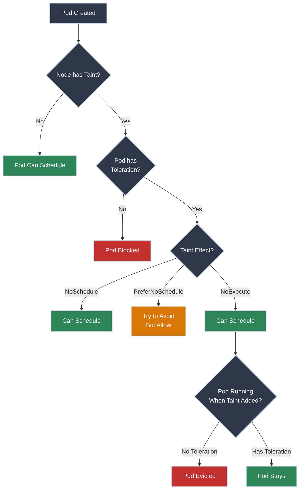

# Taints and Tolerations

!!! tip "Part of Level 5: Advanced Scheduling & Security"
    This is the second article in [Level 5: Advanced Scheduling & Security](overview.md). Make sure you understand [Resource Requests and Limits](resources.md) first.

You have 100 nodes in your cluster. 10 of them have expensive GPUs. You need to ensure only machine learning workloads run on those GPU nodes—not random web servers.

Or you have nodes with high-memory specs reserved for databases. You can't let every pod schedule there, or you'll waste expensive hardware.

This is the problem **taints and tolerations** solve: **node specialization**. You "taint" nodes to repel pods, and only pods with matching "tolerations" can schedule there.

Think of it like VIP sections at a concert: most people can't enter, only those with special passes.

!!! info "What You'll Learn"

    By the end of this article, you'll know how to:

    - **Taint nodes** - Mark nodes as specialized (GPU, SSD, high-memory)
    - **Add tolerations to pods** - Allow specific pods to schedule on tainted nodes
    - **Understand taint effects** - NoSchedule, PreferNoSchedule, NoExecute
    - **Handle system taints** - Node conditions and automatic taints
    - **Evict pods** - NoExecute effect removes running pods
    - **Dedicate nodes** - Combine taints with node affinity for exclusivity

## The Taint and Toleration Flow



---

## Understanding Taints

A **taint** is a property of a node that repels pods unless they have a matching toleration.

### Taint Structure

A taint has three parts:

1. **Key** - Identifies the taint (e.g., `gpu`, `disk-type`, `dedicated`)
2. **Value** - Optional detail (e.g., `nvidia-tesla`, `ssd`, `ml-workloads`)
3. **Effect** - What happens to pods without tolerations

**Format:** `key=value:effect` or `key:effect` (value optional)

**Example:**

- `gpu=nvidia:NoSchedule` - Node has NVIDIA GPU, don't schedule pods without toleration
- `dedicated=database:NoSchedule` - Node dedicated to databases
- `disk=ssd:PreferNoSchedule` - Node has SSD, prefer but allow others if needed

### Taint Effects

<div class="grid cards" markdown>

-   :material-close-circle: **NoSchedule** (Strict)

    ---

    **Behavior:** Pods **cannot** schedule on this node unless they have a matching toleration.

    **Existing pods:** Not affected—they keep running.

    **Use for:** Hard requirements (GPU workloads, dedicated nodes).

    ⚠️ **Caution (Modifies Node):**

    ``` bash title="Taint Node with NoSchedule"
    kubectl taint nodes worker-1 gpu=nvidia:NoSchedule
    # node/worker-1 tainted
    ```

-   :material-alert-circle-outline: **PreferNoSchedule** (Soft)

    ---

    **Behavior:** Scheduler **tries to avoid** scheduling pods on this node, but allows it if no other nodes available.

    **Existing pods:** Not affected—they keep running.

    **Use for:** Preferences, not hard requirements.

    ⚠️ **Caution (Modifies Node):**

    ``` bash title="Taint Node with PreferNoSchedule"
    kubectl taint nodes worker-2 disk=ssd:PreferNoSchedule
    # node/worker-2 tainted
    ```

-   🚨 **NoExecute** (Eviction)

    ---

    **Behavior:** Pods without tolerations **cannot schedule** on this node, **AND** existing pods without tolerations are **evicted**.

    **Existing pods:** Removed immediately (or after `tolerationSeconds`).

    **Use for:** Node maintenance, draining, emergency evacuations.

    🚨 **DANGER (Evicts Running Pods):**

    ``` bash title="Taint Node with NoExecute"
    kubectl taint nodes worker-3 maintenance=true:NoExecute
    # node/worker-3 tainted
    # Pods without toleration will be evicted!
    ```

</div>

!!! warning "NoExecute is Destructive"
    `NoExecute` will **immediately evict** running pods that don't tolerate the taint. Use with caution.

    **Before applying NoExecute:**

    - Check which pods will be evicted
    - Ensure pods are managed by Deployments/StatefulSets (will be rescheduled)
    - Consider draining node instead (`kubectl drain`) for safer eviction

### Tainting Nodes

✅ **Safe (Read-Only):**

```bash title="List Node Taints"
kubectl describe node worker-1 | grep Taints
# Taints:             gpu=nvidia:NoSchedule
```

```bash title="View All Node Taints"
kubectl get nodes -o json | jq '.items[] | {name: .metadata.name, taints: .spec.taints}'
```

⚠️ **Caution (Modifies Node):**

```bash title="Add Taint to Node"
kubectl taint nodes worker-1 gpu=nvidia:NoSchedule
# node/worker-1 tainted
```

```bash title="Add Multiple Taints"
kubectl taint nodes worker-1 gpu=nvidia:NoSchedule disk=ssd:NoSchedule
# node/worker-1 tainted
```

🚨 **DANGER (Removes Taint):**

```bash title="Remove Taint (Note the Minus Sign)"
kubectl taint nodes worker-1 gpu=nvidia:NoSchedule-
# node/worker-1 untainted
```

**Key syntax:** The **minus sign** (`-`) at the end removes the taint.

---

## Understanding Tolerations

A **toleration** allows a pod to schedule on a tainted node.

### Toleration Structure

``` yaml title="deployment-with-toleration.yaml" linenums="1"
apiVersion: apps/v1
kind: Deployment
metadata:
  name: ml-app
spec:
  replicas: 2
  selector:
    matchLabels:
      app: ml
  template:
    metadata:
      labels:
        app: ml
    spec:
      tolerations:  # (1)!
      - key: "gpu"           # (2)!
        operator: "Equal"    # (3)!
        value: "nvidia"      # (4)!
        effect: "NoSchedule" # (5)!
      containers:
      - name: ml-workload
        image: ml-app:1.0
```

1. Tolerations defined at pod spec level
2. Must match taint key
3. Operator: `Equal` (match value) or `Exists` (ignore value)
4. Must match taint value (if operator is Equal)
5. Must match taint effect

**This pod can now schedule on nodes tainted with `gpu=nvidia:NoSchedule`.**

### Toleration Operators

=== "Equal (Exact Match)"
    **Match exact key, value, and effect:**

    ``` yaml
    tolerations:
    - key: "gpu"
      operator: "Equal"
      value: "nvidia"
      effect: "NoSchedule"
    ```

    **Matches:** `gpu=nvidia:NoSchedule`

    **Does NOT match:** `gpu=amd:NoSchedule` or `gpu=nvidia:PreferNoSchedule`

=== "Exists (Wildcard)"
    **Match key and effect, ignore value:**

    ``` yaml
    tolerations:
    - key: "gpu"
      operator: "Exists"
      effect: "NoSchedule"
    ```

    **Matches:** `gpu=nvidia:NoSchedule`, `gpu=amd:NoSchedule`, `gpu=tesla:NoSchedule`

    **Use when:** Value doesn't matter, only that the taint exists.

=== "Tolerate Everything"
    **Tolerate ALL taints on a node:**

    ``` yaml
    tolerations:
    - operator: "Exists"
    ```

    **Matches:** Every taint with any key, value, or effect.

    **Use for:** DaemonSets that must run everywhere (monitoring, logging agents).

### Toleration for NoExecute with Grace Period

When using `NoExecute` taints, you can specify how long a pod should remain after taint is added:

``` yaml title="toleration-with-grace-period.yaml" linenums="1"
tolerations:
- key: "maintenance"
  operator: "Equal"
  value: "true"
  effect: "NoExecute"
  tolerationSeconds: 3600  # (1)!
```

1. Pod will be evicted 3600 seconds (1 hour) after taint is added

**Use case:** Node maintenance—give pods time to finish work before eviction.

---

## Common Use Cases

<div class="grid cards" markdown>

-   :material-gpu: **GPU Nodes**

    ---

    **Scenario:** 10 nodes with GPUs, 90 without. Reserve GPU nodes for ML workloads.

    **Taint GPU nodes:**

    ``` bash title="Taint All GPU Nodes"
    kubectl taint nodes gpu-node-1 gpu=nvidia:NoSchedule
    kubectl taint nodes gpu-node-2 gpu=nvidia:NoSchedule
    # ... repeat for all GPU nodes
    ```

    **ML deployment with toleration:**

    ``` yaml title="ml-deployment.yaml" linenums="1"
    apiVersion: apps/v1
    kind: Deployment
    metadata:
      name: ml-training
    spec:
      replicas: 5
      selector:
        matchLabels:
          app: ml
      template:
        metadata:
          labels:
            app: ml
        spec:
          tolerations:
          - key: "gpu"
            operator: "Equal"
            value: "nvidia"
            effect: "NoSchedule"
          containers:
          - name: ml-workload
            image: tensorflow/tensorflow:latest-gpu
            resources:
              limits:
                nvidia.com/gpu: 1  # Request GPU
    ```

    **Result:** ML pods can schedule on GPU nodes. Other pods cannot.

-   :material-database: **Dedicated Database Nodes**

    ---

    **Scenario:** High-memory nodes reserved for databases.

    **Taint database nodes:**

    ``` bash title="Taint High-Memory Nodes"
    kubectl taint nodes db-node-1 dedicated=database:NoSchedule
    kubectl taint nodes db-node-2 dedicated=database:NoSchedule
    ```

    **Database deployment:**

    ``` yaml title="database-deployment.yaml" linenums="1"
    apiVersion: apps/v1
    kind: StatefulSet
    metadata:
      name: postgres
    spec:
      serviceName: postgres
      replicas: 3
      selector:
        matchLabels:
          app: postgres
      template:
        metadata:
          labels:
            app: postgres
        spec:
          tolerations:
          - key: "dedicated"
            operator: "Equal"
            value: "database"
            effect: "NoSchedule"
          containers:
          - name: postgres
            image: postgres:14
            resources:
              requests:
                memory: "8Gi"
              limits:
                memory: "16Gi"
    ```

    **Result:** Databases run on dedicated nodes. Other workloads don't.

-   :material-tools: **Node Maintenance**

    ---

    **Scenario:** Need to perform maintenance on a node. Evict all non-critical pods.

    **Add NoExecute taint:**

    🚨 **DANGER (Evicts Running Pods):**

    ``` bash title="Taint Node for Maintenance"
    kubectl taint nodes worker-5 maintenance=true:NoExecute
    # node/worker-5 tainted
    # Pods without toleration will be evicted immediately
    ```

    **Critical DaemonSets tolerate maintenance:**

    ``` yaml title="daemonset-with-toleration.yaml" linenums="1"
    apiVersion: apps/v1
    kind: DaemonSet
    metadata:
      name: node-exporter
    spec:
      selector:
        matchLabels:
          app: node-exporter
      template:
        metadata:
          labels:
            app: node-exporter
        spec:
          tolerations:
          - key: "maintenance"
            operator: "Exists"
            effect: "NoExecute"  # (1)!
          containers:
          - name: node-exporter
            image: prom/node-exporter:latest
    ```

    1. Monitoring stays running even during maintenance

    **Result:** All pods evicted except those with maintenance toleration (monitoring, logging).

-   :material-harddisk: **SSD Nodes for Performance**

    ---

    **Scenario:** Some nodes have SSDs, others HDDs. Prefer SSD for high-throughput workloads but allow fallback.

    **Taint SSD nodes with PreferNoSchedule:**

    ⚠️ **Caution (Modifies Node):**

    ``` bash title="Soft Taint for SSD Nodes"
    kubectl taint nodes ssd-node-1 disk=ssd:PreferNoSchedule
    kubectl taint nodes ssd-node-2 disk=ssd:PreferNoSchedule
    ```

    **High-throughput app with toleration:**

    ``` yaml title="high-throughput-app.yaml" linenums="1"
    apiVersion: apps/v1
    kind: Deployment
    metadata:
      name: high-io-app
    spec:
      replicas: 3
      selector:
        matchLabels:
          app: high-io
      template:
        metadata:
          labels:
            app: high-io
        spec:
          tolerations:
          - key: "disk"
            operator: "Equal"
            value: "ssd"
            effect: "PreferNoSchedule"
          containers:
          - name: app
            image: high-io-app:1.0
    ```

    **Result:** App prefers SSD nodes but can run on HDD nodes if SSDs are full.

</div>

---

## System Taints and Node Conditions

Kubernetes **automatically taints nodes** based on conditions like disk pressure, memory pressure, or network unavailability.

### Automatic Node Condition Taints

| Condition | Taint Key | Effect | Meaning |
|-----------|-----------|--------|---------|
| **NotReady** | `node.kubernetes.io/not-ready` | NoExecute | Node is not ready (kubelet stopped, network down) |
| **Unreachable** | `node.kubernetes.io/unreachable` | NoExecute | Node unreachable from control plane |
| **OutOfDisk** | `node.kubernetes.io/out-of-disk` | NoSchedule | Node has no disk space |
| **MemoryPressure** | `node.kubernetes.io/memory-pressure` | NoSchedule | Node is low on memory |
| **DiskPressure** | `node.kubernetes.io/disk-pressure` | NoSchedule | Node is low on disk space |
| **NetworkUnavailable** | `node.kubernetes.io/network-unavailable` | NoSchedule | Node network is not configured |
| **Unschedulable** | `node.kubernetes.io/unschedulable` | NoSchedule | Node marked unschedulable (`kubectl cordon`) |

✅ **Safe (Read-Only):**

```bash title="Check Node Conditions and Taints"
kubectl describe node worker-1
# Taints:             node.kubernetes.io/disk-pressure:NoSchedule
# Conditions:
#   Type             Status
#   ----             ------
#   DiskPressure     True
```

### Default Tolerations

**Most pods automatically tolerate short-term node issues:**

Kubernetes adds these tolerations by default:

``` yaml
tolerations:
- key: "node.kubernetes.io/not-ready"
  operator: "Exists"
  effect: "NoExecute"
  tolerationSeconds: 300  # (1)!
- key: "node.kubernetes.io/unreachable"
  operator: "Exists"
  effect: "NoExecute"
  tolerationSeconds: 300  # (2)!
```

1. Wait 5 minutes before evicting if node becomes NotReady
2. Wait 5 minutes before evicting if node becomes Unreachable

**Why:** Prevents immediate pod eviction for transient issues (network blip, kubelet restart).

!!! tip "DaemonSets Tolerate Everything"
    DaemonSets automatically tolerate **all** node condition taints so they run everywhere:

    ```yaml
    tolerations:
    - operator: "Exists"
    ```

    This ensures monitoring, logging, and network agents run on every node, even unhealthy ones.

---

## Combining Taints with Node Affinity

**Problem:** Taints prevent unwanted pods from scheduling on specialized nodes. But they don't guarantee specialized pods ONLY run there.

**Example:** GPU node tainted with `gpu=nvidia:NoSchedule`. ML pod tolerates it. But ML pod could still schedule on non-GPU nodes (wasting the toleration).

**Solution:** Combine taints with **node affinity** to enforce exclusivity.

``` yaml title="ml-deployment-exclusive.yaml" linenums="1"
apiVersion: apps/v1
kind: Deployment
metadata:
  name: ml-training
spec:
  replicas: 3
  selector:
    matchLabels:
      app: ml
  template:
    metadata:
      labels:
        app: ml
    spec:
      tolerations:  # (1)!
      - key: "gpu"
        operator: "Equal"
        value: "nvidia"
        effect: "NoSchedule"
      affinity:
        nodeAffinity:  # (2)!
          requiredDuringSchedulingIgnoredDuringExecution:
            nodeSelectorTerms:
            - matchExpressions:
              - key: gpu
                operator: In
                values:
                - nvidia
      containers:
      - name: ml-workload
        image: tensorflow/tensorflow:latest-gpu
        resources:
          limits:
            nvidia.com/gpu: 1
```

1. Toleration: Allows scheduling on GPU nodes
2. Node affinity: Requires GPU nodes (won't schedule elsewhere)

**Result:**

- Taint prevents non-ML pods from using GPU nodes
- Node affinity ensures ML pods ONLY run on GPU nodes

**This is the production pattern for dedicated nodes.**

---

## Troubleshooting Taints and Tolerations

### Pods Stuck in Pending

✅ **Safe (Read-Only):**

```bash title="Check Why Pod is Pending"
kubectl describe pod ml-app-7c5ddbdf54-2xkqn
# Events:
#   Type     Reason            Message
#   ----     ------            -------
#   Warning  FailedScheduling  0/10 nodes are available: 3 node(s) had taint {gpu: nvidia}, that the pod didn't tolerate.
```

**Cause:** Node has taint, pod lacks matching toleration.

**Solution:** Add toleration to pod spec.

### Pod Not Scheduling on Desired Node

**Problem:** Pod has toleration but schedules elsewhere.

**Cause:** Toleration allows scheduling on tainted nodes but doesn't require it. Other nodes are valid too.

**Solution:** Add node affinity to require specific nodes.

### Pod Evicted Unexpectedly

```bash title="Check Recent Events"
kubectl get events --sort-by='.lastTimestamp' | grep Evicted
# Pod ml-app-7c5ddbdf54-2xkqn evicted due to node taint
```

**Cause:** Node tainted with `NoExecute`, pod lacks toleration.

**Common scenarios:**

- Node went into maintenance mode
- Node condition changed (MemoryPressure, DiskPressure)
- Manual taint added

**Solution:**

- Check node conditions: `kubectl describe node`
- Add appropriate tolerations for expected conditions

### Verifying Tolerations

✅ **Safe (Read-Only):**

```bash title="Check Pod Tolerations"
kubectl get pod ml-app-7c5ddbdf54-2xkqn -o jsonpath='{.spec.tolerations}' | jq
# [
#   {
#     "effect": "NoSchedule",
#     "key": "gpu",
#     "operator": "Equal",
#     "value": "nvidia"
#   }
# ]
```

---

## Production Best Practices

<div class="grid cards" markdown>

-   :material-tag-multiple: **Use Descriptive Taint Keys**

    ---

    **Good:**

    - `gpu=nvidia:NoSchedule`
    - `dedicated=database:NoSchedule`
    - `disk=ssd:PreferNoSchedule`

    **Bad:**

    - `special=true:NoSchedule` (vague)
    - `node1:NoSchedule` (not descriptive)

-   :material-lock: **Combine Taints with Node Affinity**

    ---

    **For dedicated nodes:**

    - Taint: Blocks unwanted pods
    - Node affinity: Ensures specialized pods run there

    **Result:** True exclusivity.

-   :material-clock-outline: **Use PreferNoSchedule for Soft Preferences**

    ---

    **When:** You prefer certain pods on certain nodes but allow exceptions.

    **Example:** SSD nodes prefer high-IO workloads but accept others if needed.

-   :material-timer-sand: **Set tolerationSeconds for Graceful Eviction**

    ---

    **For NoExecute taints:**

    - Give pods time to finish work
    - Typical: 300-3600 seconds
    - Critical services: longer grace periods

-   :material-monitor: **Monitor Node Conditions**

    ---

    **Watch for automatic taints:**

    - MemoryPressure
    - DiskPressure
    - NotReady

    **Alert when:** Taints persist (indicates node issues).

-   :material-test-tube: **Test Taints in Staging First**

    ---

    **Before production:**

    - Apply taints to staging nodes
    - Verify pod scheduling behavior
    - Test eviction scenarios (NoExecute)

</div>

---

## Practice Exercises

??? question "Exercise 1: Taint Node and Deploy with Toleration"
    **Goal:** Taint a node, deploy a pod without toleration (fails), then with toleration (succeeds).

    **Steps:**

    1. Taint a node with `environment=staging:NoSchedule`
    2. Deploy pod without toleration—observe it stays Pending
    3. Add toleration to pod, redeploy—observe it schedules

    ??? tip "Solution"
        **Step 1: Taint node**

        ```bash
        kubectl taint nodes worker-1 environment=staging:NoSchedule
        # node/worker-1 tainted

        kubectl describe node worker-1 | grep Taints
        # Taints:             environment=staging:NoSchedule
        ```

        **Step 2: Deploy without toleration**

        ``` yaml title="pod-no-toleration.yaml" linenums="1"
        apiVersion: v1
        kind: Pod
        metadata:
          name: test-pod
        spec:
          containers:
          - name: nginx
            image: nginx:1.21
        ```

        ```bash
        kubectl apply -f pod-no-toleration.yaml
        # pod/test-pod created

        kubectl get pod test-pod
        # NAME       READY   STATUS    RESTARTS   AGE
        # test-pod   0/1     Pending   0          10s

        kubectl describe pod test-pod
        # Events:
        #   Warning  FailedScheduling  node(s) had taint {environment: staging}, that the pod didn't tolerate
        ```

        **Step 3: Add toleration and redeploy**

        ```bash
        kubectl delete pod test-pod
        # pod "test-pod" deleted
        ```

        ``` yaml title="pod-with-toleration.yaml" linenums="1"
        apiVersion: v1
        kind: Pod
        metadata:
          name: test-pod
        spec:
          tolerations:
          - key: "environment"
            operator: "Equal"
            value: "staging"
            effect: "NoSchedule"
          containers:
          - name: nginx
            image: nginx:1.21
        ```

        ```bash
        kubectl apply -f pod-with-toleration.yaml
        # pod/test-pod created

        kubectl get pod test-pod
        # NAME       READY   STATUS    RESTARTS   AGE
        # test-pod   1/1     Running   0          5s
        ```

        **Cleanup:**

        ```bash
        kubectl delete pod test-pod
        kubectl taint nodes worker-1 environment=staging:NoSchedule-
        # node/worker-1 untainted
        ```

        **What you learned:** Taints block pods without matching tolerations. Tolerations allow scheduling.

??? question "Exercise 2: NoExecute Eviction Test"
    **Goal:** Taint a node with NoExecute, observe running pods get evicted.

    **Steps:**

    1. Deploy 3-replica deployment
    2. Verify pods are running
    3. Taint the node where pods are running with `maintenance=true:NoExecute`
    4. Observe pods get evicted and rescheduled

    ??? tip "Solution"
        **Step 1: Deploy app**

        ``` yaml title="test-deployment.yaml" linenums="1"
        apiVersion: apps/v1
        kind: Deployment
        metadata:
          name: test-app
        spec:
          replicas: 3
          selector:
            matchLabels:
              app: test
          template:
            metadata:
              labels:
                app: test
            spec:
              containers:
              - name: nginx
                image: nginx:1.21
        ```

        ```bash
        kubectl apply -f test-deployment.yaml
        # deployment.apps/test-app created

        kubectl get pods -o wide
        # NAME                        READY   STATUS    RESTARTS   AGE   NODE
        # test-app-7c5ddbdf54-2xkqn   1/1     Running   0          10s   worker-1
        # test-app-7c5ddbdf54-8mz4p   1/1     Running   0          10s   worker-1
        # test-app-7c5ddbdf54-kx9qw   1/1     Running   0          10s   worker-2
        ```

        **Step 2: Note which node has pods (e.g., worker-1)**

        **Step 3: Taint node with NoExecute**

        🚨 **DANGER (Evicts Running Pods):**

        ```bash
        kubectl taint nodes worker-1 maintenance=true:NoExecute
        # node/worker-1 tainted
        ```

        **Step 4: Watch eviction**

        ```bash
        kubectl get pods -o wide --watch
        # test-app-7c5ddbdf54-2xkqn   1/1     Terminating   0          1m    worker-1
        # test-app-7c5ddbdf54-8mz4p   1/1     Terminating   0          1m    worker-1
        # test-app-7c5ddbdf54-new1    0/1     Pending       0          0s    <none>
        # test-app-7c5ddbdf54-new2    0/1     Pending       0          0s    <none>
        # test-app-7c5ddbdf54-new1    1/1     Running       0          5s    worker-2
        # test-app-7c5ddbdf54-new2    1/1     Running       0          5s    worker-3
        ```

        **Cleanup:**

        ```bash
        kubectl delete deployment test-app
        kubectl taint nodes worker-1 maintenance=true:NoExecute-
        # node/worker-1 untainted
        ```

        **What you learned:** NoExecute evicts running pods immediately. Deployment controller automatically reschedules them.

??? question "Exercise 3: Dedicated Nodes with Taint + Affinity"
    **Goal:** Create truly dedicated nodes—pods with toleration must run there, pods without toleration cannot.

    **Steps:**

    1. Label and taint a node for databases
    2. Deploy database with toleration + node affinity
    3. Deploy regular app—verify it doesn't schedule on database node
    4. Verify database only runs on dedicated node

    ??? tip "Solution"
        **Step 1: Label and taint node**

        ```bash
        kubectl label nodes worker-1 workload=database
        # node/worker-1 labeled

        kubectl taint nodes worker-1 dedicated=database:NoSchedule
        # node/worker-1 tainted
        ```

        **Step 2: Deploy database with toleration + affinity**

        ``` yaml title="database-dedicated.yaml" linenums="1"
        apiVersion: apps/v1
        kind: StatefulSet
        metadata:
          name: postgres
        spec:
          serviceName: postgres
          replicas: 1
          selector:
            matchLabels:
              app: postgres
          template:
            metadata:
              labels:
                app: postgres
            spec:
              tolerations:
              - key: "dedicated"
                operator: "Equal"
                value: "database"
                effect: "NoSchedule"
              affinity:
                nodeAffinity:
                  requiredDuringSchedulingIgnoredDuringExecution:
                    nodeSelectorTerms:
                    - matchExpressions:
                      - key: workload
                        operator: In
                        values:
                        - database
              containers:
              - name: postgres
                image: postgres:14
                env:
                - name: POSTGRES_PASSWORD
                  value: example
        ```

        ```bash
        kubectl apply -f database-dedicated.yaml
        # statefulset.apps/postgres created

        kubectl get pods -o wide
        # NAME         READY   STATUS    RESTARTS   AGE   NODE
        # postgres-0   1/1     Running   0          10s   worker-1
        ```

        **Step 3: Deploy regular app (no toleration)**

        ``` yaml title="regular-app.yaml" linenums="1"
        apiVersion: apps/v1
        kind: Deployment
        metadata:
          name: web-app
        spec:
          replicas: 3
          selector:
            matchLabels:
              app: web
          template:
            metadata:
              labels:
                app: web
            spec:
              containers:
              - name: nginx
                image: nginx:1.21
        ```

        ```bash
        kubectl apply -f regular-app.yaml
        # deployment.apps/web-app created

        kubectl get pods -o wide
        # NAME                       READY   STATUS    RESTARTS   AGE   NODE
        # postgres-0                 1/1     Running   0          1m    worker-1
        # web-app-7c5ddbdf54-2xkqn   1/1     Running   0          10s   worker-2
        # web-app-7c5ddbdf54-8mz4p   1/1     Running   0          10s   worker-3
        # web-app-7c5ddbdf54-kx9qw   1/1     Running   0          10s   worker-4
        ```

        **Verify:** Database on `worker-1`, web app on other nodes.

        **Cleanup:**

        ```bash
        kubectl delete statefulset postgres
        kubectl delete deployment web-app
        kubectl taint nodes worker-1 dedicated=database:NoSchedule-
        kubectl label nodes worker-1 workload-
        ```

        **What you learned:** Taint blocks unwanted pods. Node affinity ensures specialized pods only run there. Together: true exclusivity.

---

## Quick Recap

| Concept | Purpose | Command |
|---------|---------|---------|
| **Taint** | Mark node to repel pods | `kubectl taint nodes <node> key=value:effect` |
| **Toleration** | Allow pod to schedule on tainted node | Define in `spec.tolerations` |
| **NoSchedule** | Block new pods without toleration | Effect type (strict) |
| **PreferNoSchedule** | Avoid scheduling but allow if needed | Effect type (soft) |
| **NoExecute** | Block and evict running pods | Effect type (eviction) |
| **Remove Taint** | Untaint node | `kubectl taint nodes <node> key:effect-` |
| **System Taints** | Automatic taints for node conditions | `node.kubernetes.io/*` keys |

---

## Further Reading

### Official Documentation

- [Kubernetes Docs: Taints and Tolerations](https://kubernetes.io/docs/concepts/scheduling-eviction/taint-and-toleration/) - Complete reference with examples
- [Kubernetes Docs: Node Conditions](https://kubernetes.io/docs/concepts/architecture/nodes/#condition) - Understanding automatic taints
- [kubectl Reference: taint](https://kubernetes.io/docs/reference/generated/kubectl/kubectl-commands#taint) - Command syntax and options

### Deep Dives

- [Eviction Policies](https://kubernetes.io/docs/concepts/scheduling-eviction/node-pressure-eviction/) - How Kubernetes handles node pressure
- [Pod Priority and Preemption](https://kubernetes.io/docs/concepts/scheduling-eviction/pod-priority-preemption/) - Advanced scheduling with priorities

### Related Articles

- [Level 5 Overview](overview.md) - See all Level 5 articles
- [Resource Requests and Limits](resources.md) - Foundation for scheduling decisions
- [Node Affinity and Pod Affinity](affinity.md) - Complementary scheduling controls

---

## What's Next?

You've mastered taints and tolerations! Next up in Level 5:

- **[Node Affinity and Pod Affinity](affinity.md)** - Advanced scheduling rules for co-location, anti-affinity, and topology constraints

Taints are the "stick" (repel pods). Affinity is the "carrot" (attract pods). Use them together for complete scheduling control.
