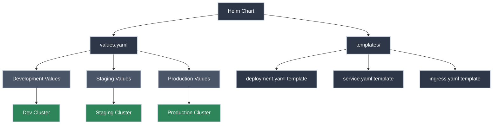

# Helm Package Manager

!!! tip "Part of Level 6: Production Operations"
    This article is part of [Level 6: Production Operations](overview.md), focusing on tools and practices for running Kubernetes at scale.

You've been writing YAML files by hand. You've deployed applications, updated configurations, and rolled back changes. It works, but every environment needs slightly different values. Your development cluster uses different image tags than staging. Production has different replica counts. Each namespace has its own secrets.

You're managing dozens of nearly-identical YAML files across environments, and every deployment requires careful find-and-replace editing. There has to be a better way.

**That's exactly what Helm solves.**

Helm is the package manager for Kubernetes—like `apt` for Ubuntu, `brew` for macOS, or `npm` for Node.js. Instead of managing individual YAML files, you work with **charts** that bundle related resources together with templating and configuration management built in.

!!! info "What You'll Learn"

    By the end of this article, you'll know how to:

    - **Understand Helm's purpose** - Why package management matters for Kubernetes
    - **Install Helm** - Set up the Helm CLI
    - **Use Helm charts** - Deploy applications from repositories
    - **Customize with values** - Override defaults for your environment
    - **Manage releases** - Install, upgrade, rollback, and delete
    - **Create custom charts** - Package your own applications
    - **Follow best practices** - Production-ready Helm patterns

## Why Helm Matters



---

## Core Concepts

<div class="grid cards" markdown>

-   :material-package-variant: **Charts**

    ---

    **What it is:** A packaged collection of Kubernetes resources.

    Think of a chart like a `.deb` package or a Docker image—it bundles everything needed to run an application: Deployments, Services, ConfigMaps, Ingress rules, and more.

    **Why it matters:** Instead of managing 10+ YAML files, you manage one chart. Install `nginx-ingress` with a single command instead of applying dozens of manifests.

-   :material-rocket-launch: **Releases**

    ---

    **What it is:** A specific installation of a chart in your cluster.

    You can install the same chart multiple times with different names and configurations. Each installation is a **release** with its own lifecycle.

    **Why it matters:** Deploy the same application to multiple namespaces or multiple times in the same namespace with different configurations.

-   :material-database: **Repositories**

    ---

    **What it is:** A collection of charts hosted at a URL.

    Like Docker registries or package repositories, Helm repos host charts you can download and install. The most popular is Artifact Hub (artifacthub.io).

    **Why it matters:** Access thousands of pre-built charts for common applications (databases, monitoring tools, ingress controllers) instead of writing YAML from scratch.

-   :material-file-cog: **Values**

    ---

    **What it is:** Configuration parameters that customize chart behavior.

    Charts define templates with variables. You provide values to fill those variables. Same chart, different values = different configurations.

    **Why it matters:** Deploy the same chart to dev (2 replicas, small resources) and prod (10 replicas, large resources) by changing only the values file.

</div>

---

## Installing Helm

Helm is a client-side CLI tool that talks to your Kubernetes cluster via `kubectl` context.

=== "macOS"

    ```bash title="Install with Homebrew"
    brew install helm
    ```

=== "Linux"

    ```bash title="Install from script"
    curl https://raw.githubusercontent.com/helm/helm/main/scripts/get-helm-3 | bash
    ```

    Or download the binary directly:

    ```bash title="Manual installation"
    wget https://get.helm.sh/helm-v3.14.0-linux-amd64.tar.gz
    tar -zxvf helm-v3.14.0-linux-amd64.tar.gz
    sudo mv linux-amd64/helm /usr/local/bin/helm
    ```

=== "Windows"

    ```powershell title="Install with Chocolatey"
    choco install kubernetes-helm
    ```

    Or download from the [official releases page](https://github.com/helm/helm/releases).

**Verify installation:**

✅ **Safe (Read-Only):**

```bash title="Check Helm version"
helm version
# version.BuildInfo{Version:"v3.14.0", GitCommit:"...", GitTreeState:"clean", GoVersion:"go1.21.5"}
```

!!! tip "Helm 3 vs Helm 2"
    **Always use Helm 3.** Helm 2 (released 2016) required a server-side component called Tiller, which had security issues. Helm 3 (released 2019) removed Tiller entirely—it's client-only and uses your existing kubeconfig for authentication.

---

## Using Helm Charts

### Adding a Repository

Before installing charts, add a repository:

⚠️ **Caution (Modifies Local Config):**

```bash title="Add Bitnami repository"
helm repo add bitnami https://charts.bitnami.com/bitnami
# "bitnami" has been added to your repositories
```

✅ **Safe (Read-Only):**

```bash title="List repositories"
helm repo list
# NAME      URL
# bitnami   https://charts.bitnami.com/bitnami
```

**Update repository indices:**

⚠️ **Caution (Fetches Latest Chart Info):**

```bash title="Update repository metadata"
helm repo update
# Hang tight while we grab the latest from your chart repositories...
# ...Successfully got an update from the "bitnami" chart repository
# Update Complete. ⎈Happy Helming!⎈
```

!!! warning "Repository Trust"
    Only add repositories from trusted sources. Charts have access to your cluster with your permissions. Popular trusted repos:

    - **Bitnami** - `https://charts.bitnami.com/bitnami`
    - **Prometheus Community** - `https://prometheus-community.github.io/helm-charts`
    - **Jetstack** (cert-manager) - `https://charts.jetstack.io`
    - **Artifact Hub** - Search at [artifacthub.io](https://artifacthub.io)

### Searching for Charts

✅ **Safe (Read-Only):**

```bash title="Search repositories for nginx"
helm search repo nginx
# NAME                    CHART VERSION   APP VERSION     DESCRIPTION
# bitnami/nginx           15.4.4          1.25.3          NGINX Open Source is a web server that can be a...
# bitnami/nginx-ingress   9.10.0          1.9.5           NGINX Ingress Controller is an Ingress control...
```

```bash title="Search Artifact Hub"
helm search hub wordpress
# URL                                                 CHART VERSION   APP VERSION     DESCRIPTION
# https://artifacthub.io/packages/helm/bitnami/wo...  19.0.5          6.4.2           WordPress is the world's most popular blogging...
```

### Installing a Chart

Let's install **nginx**:

⚠️ **Caution (Creates Kubernetes Resources):**

```bash title="Install nginx chart"
helm install my-nginx bitnami/nginx
# NAME: my-nginx
# LAST DEPLOYED: Tue Feb 11 14:23:00 2026
# NAMESPACE: default
# STATUS: deployed
# REVISION: 1
# NOTES:
# ...instructions for accessing your nginx installation...
```

**What just happened?**

- Helm created a **release** named `my-nginx`
- It deployed all resources from the `bitnami/nginx` chart
- Resources are tagged with release labels for tracking

✅ **Safe (Read-Only):**

```bash title="List releases"
helm list
# NAME        NAMESPACE   REVISION    UPDATED                                 STATUS      CHART           APP VERSION
# my-nginx    default     1           2026-02-11 14:23:00.123456 -0700 MST    deployed    nginx-15.4.4    1.25.3
```

```bash title="See what Helm created"
kubectl get all -l app.kubernetes.io/instance=my-nginx
# Shows: deployments, services, pods created by this release
```

---

## Customizing with Values

Every chart defines default values. You override them to customize behavior.

### Viewing Default Values

✅ **Safe (Read-Only):**

```bash title="Show chart's default values"
helm show values bitnami/nginx
# ## @param replicaCount Number of NGINX replicas to deploy
# replicaCount: 1
#
# ## @param image.registry NGINX image registry
# ## @param image.repository NGINX image repository
# image:
#   registry: docker.io
#   repository: bitnami/nginx
#   tag: 1.25.3-debian-11-r0
# ...hundreds of lines...
```

This shows **every configurable option** with documentation.

### Overriding Values

=== "Command Line (Simple Changes)"

    **Goal:** Quick overrides for one or two values.

    ⚠️ **Caution (Creates Resources):**

    ```bash title="Install with custom values"
    helm install my-nginx bitnami/nginx \
      --set replicaCount=3 \
      --set service.type=LoadBalancer
    # Creates deployment with 3 replicas and LoadBalancer service
    ```

    Multiple `--set` flags are cumulative.

=== "Values File (Production Approach)"

    **Goal:** Manage configuration in version control.

    Create `values-production.yaml`:

    ```yaml title="values-production.yaml" linenums="1"
    replicaCount: 5  # (1)!

    resources:
      limits:
        cpu: 500m
        memory: 512Mi
      requests:
        cpu: 250m
        memory: 256Mi

    service:
      type: LoadBalancer  # (2)!
      annotations:
        service.beta.kubernetes.io/aws-load-balancer-type: nlb

    ingress:
      enabled: true  # (3)!
      hostname: nginx.example.com
      tls: true

    autoscaling:
      enabled: true
      minReplicas: 5
      maxReplicas: 20
      targetCPU: 70
    ```

    1. Production runs 5 replicas minimum
    2. LoadBalancer for external access (cloud provider creates one)
    3. Enable Ingress for HTTP/HTTPS routing with TLS

    ⚠️ **Caution (Creates Resources):**

    ```bash title="Install with values file"
    helm install my-nginx bitnami/nginx -f values-production.yaml
    # Uses your custom values, falls back to chart defaults for unspecified values
    ```

    !!! tip "Version Control Your Values"
        Store `values-dev.yaml`, `values-staging.yaml`, and `values-production.yaml` in git. This is your **environment-specific configuration as code**.

---

## Managing Releases

### Upgrading a Release

When you change values or update the chart version:

⚠️ **Caution (Modifies Resources):**

```bash title="Upgrade with new values"
helm upgrade my-nginx bitnami/nginx -f values-production.yaml
# Release "my-nginx" has been upgraded. Happy Helming!
# NAME: my-nginx
# REVISION: 2
```

Notice **REVISION: 2**. Helm tracks every upgrade as a new revision.

**Upgrade to a specific chart version:**

```bash title="Upgrade to specific version"
helm upgrade my-nginx bitnami/nginx --version 15.4.0
# Pins to chart version 15.4.0 (not necessarily app version)
```

!!! tip "Always Pin Versions in Production"
    ```bash
    # ❌ BAD: Uses latest chart version
    helm upgrade my-nginx bitnami/nginx

    # ✅ GOOD: Explicit version control
    helm upgrade my-nginx bitnami/nginx --version 15.4.4
    ```

### Rolling Back a Release

Something broke? Roll back to a previous revision:

✅ **Safe (Read-Only):**

```bash title="Show release history"
helm history my-nginx
# REVISION    UPDATED                     STATUS      CHART           APP VERSION     DESCRIPTION
# 1           Tue Feb 11 14:23:00 2026    superseded  nginx-15.4.4    1.25.3          Install complete
# 2           Tue Feb 11 15:10:30 2026    deployed    nginx-15.4.5    1.25.4          Upgrade complete
```

⚠️ **Caution (Modifies Resources):**

```bash title="Rollback to revision 1"
helm rollback my-nginx 1
# Rollback was a success! Happy Helming!
```

Or rollback to the previous revision:

```bash title="Rollback to previous"
helm rollback my-nginx
# Defaults to previous revision
```

!!! tip "Rollbacks Are Instant"
    Helm doesn't wait for pods to be ready. It applies the old manifests and returns. Use `kubectl rollout status` to watch the rollback complete:

    ```bash
    kubectl rollout status deployment/my-nginx
    ```

### Uninstalling a Release

🚨 **DANGER (Deletes Resources):**

```bash title="Remove release and all resources"
helm uninstall my-nginx
# release "my-nginx" uninstalled
```

This deletes **all Kubernetes resources** created by the release: Deployments, Services, ConfigMaps, Secrets, PVCs, everything.

**Keep release history:**

```bash title="Uninstall but keep history"
helm uninstall my-nginx --keep-history
# Can still see history and rollback
```

---

## Understanding Helm Templating

Helm uses **Go templates** to generate Kubernetes manifests from values.

### Template Basics

Here's a simplified Deployment template:

```yaml title="templates/deployment.yaml" linenums="1"
apiVersion: apps/v1
kind: Deployment
metadata:
  name: {{ .Release.Name }}  # (1)!
  labels:
    app: {{ .Chart.Name }}  # (2)!
spec:
  replicas: {{ .Values.replicaCount }}  # (3)!
  selector:
    matchLabels:
      app: {{ .Chart.Name }}
  template:
    metadata:
      labels:
        app: {{ .Chart.Name }}
    spec:
      containers:
      - name: {{ .Chart.Name }}
        image: "{{ .Values.image.repository }}:{{ .Values.image.tag }}"  # (4)!
        ports:
        - containerPort: {{ .Values.service.port }}
        resources:
          {{- toYaml .Values.resources | nindent 10 }}  # (5)!
```

1. `.Release.Name` is the name you give during `helm install`
2. `.Chart.Name` comes from `Chart.yaml`
3. `.Values.replicaCount` comes from `values.yaml` (or your override)
4. Interpolate multiple values to build image reference
5. `toYaml` function converts nested YAML structure; `nindent` indents it correctly

**Built-in objects:**

- `{{ .Release.Name }}` - Your release name (`my-nginx`)
- `{{ .Release.Namespace }}` - Target namespace
- `{{ .Chart.Name }}` - Chart name from `Chart.yaml`
- `{{ .Chart.Version }}` - Chart version
- `{{ .Values.* }}` - Values from `values.yaml` or overrides

### Seeing Generated Manifests

✅ **Safe (Doesn't Apply to Cluster):**

```bash title="Render templates locally"
helm template my-nginx bitnami/nginx -f values-production.yaml > rendered.yaml
# Generates all YAML with your values interpolated
# Review rendered.yaml to see what will be applied
```

This is invaluable for debugging templates or reviewing changes before applying.

---

## Creating a Custom Chart

Let's package your own application as a Helm chart.

### Creating Chart Structure

⚠️ **Caution (Creates Local Files):**

```bash title="Create new chart"
helm create my-app
# Creating my-app
```

This generates:

```
my-app/
├── Chart.yaml         # Chart metadata
├── values.yaml        # Default configuration values
├── charts/            # Dependency charts (subcharts)
├── templates/         # Kubernetes manifest templates
│   ├── deployment.yaml
│   ├── service.yaml
│   ├── ingress.yaml
│   ├── _helpers.tpl   # Template helpers/partials
│   └── NOTES.txt      # Post-install instructions
└── .helmignore        # Files to ignore when packaging
```

### Chart Metadata

```yaml title="Chart.yaml" linenums="1"
apiVersion: v2  # (1)!
name: my-app
description: My production application
type: application  # (2)!
version: 1.0.0  # (3)!
appVersion: "2.5.0"  # (4)!

maintainers:
  - name: Platform Team
    email: platform@example.com

keywords:
  - web
  - api

home: https://github.com/example/my-app
sources:
  - https://github.com/example/my-app
```

1. Helm 3 chart format
2. `application` (for apps) or `library` (for reusable templates)
3. Chart version—increment on template changes
4. Your application's version—users see this in `helm list`

### Default Values

```yaml title="values.yaml" linenums="1"
replicaCount: 2

image:
  repository: myregistry.io/my-app
  tag: "2.5.0"
  pullPolicy: IfNotPresent

service:
  type: ClusterIP
  port: 8080

ingress:
  enabled: false
  className: nginx
  hosts:
    - host: my-app.example.com
      paths:
        - path: /
          pathType: Prefix

resources:
  limits:
    cpu: 200m
    memory: 256Mi
  requests:
    cpu: 100m
    memory: 128Mi

autoscaling:
  enabled: false
  minReplicas: 2
  maxReplicas: 10
  targetCPUUtilizationPercentage: 80

env:
  - name: LOG_LEVEL
    value: "info"
  - name: DATABASE_URL
    valueFrom:
      secretKeyRef:
        name: my-app-secrets
        key: database-url
```

These are **sensible defaults**. Users override what they need.

### Testing Your Chart

✅ **Safe (Validates Without Installing):**

```bash title="Lint chart for issues"
helm lint my-app
# ==> Linting my-app
# [INFO] Chart.yaml: icon is recommended
# 1 chart(s) linted, 0 chart(s) failed
```

```bash title="Dry run to see what would be created"
helm install my-app ./my-app --dry-run --debug
# Shows all rendered manifests without applying
```

### Installing Your Chart

⚠️ **Caution (Creates Resources):**

```bash title="Install from local directory"
helm install my-app ./my-app
# Release deployed
```

```bash title="Install with custom values"
helm install my-app ./my-app -f values-production.yaml
```

### Packaging and Distribution

⚠️ **Caution (Creates Package File):**

```bash title="Package chart into tarball"
helm package my-app
# Successfully packaged chart and saved it to: /path/to/my-app-1.0.0.tgz
```

**Distribute via:**

- **Chart repository** - Host on GitHub Pages, S3, or dedicated chart repos
- **OCI registry** - Push to Docker registries as OCI artifacts (Helm 3.8+)
- **Git repository** - Store chart source; users install with `helm install my-app ./path`

---

## Helm Best Practices

<div class="grid cards" markdown>

-   :material-lock: **Pin Versions**

    ---

    **Always specify chart and image versions.**

    ```yaml
    # values-production.yaml
    image:
      tag: "2.5.0"  # NOT "latest"
    ```

    ```bash
    # Install command
    helm install my-app bitnami/nginx --version 15.4.4
    ```

    **Why:** Prevents unexpected changes when charts or images update.

-   :material-git: **Version Control Values**

    ---

    **Store environment-specific values in git.**

    ```
    helm/
    ├── charts/
    │   └── my-app/
    ├── values-dev.yaml
    ├── values-staging.yaml
    └── values-production.yaml
    ```

    Deploy with:

    ```bash
    helm upgrade my-app ./charts/my-app -f values-production.yaml
    ```

    **Why:** Configuration as code. Audit trail. Easy rollbacks.

-   :material-shield-check: **Use `--wait` in CI/CD**

    ---

    **Block until rollout completes.**

    ```bash
    helm upgrade my-app ./charts/my-app \
      --wait \
      --timeout 5m \
      -f values-production.yaml
    ```

    **Why:** Catches deployment failures immediately. CI/CD pipeline fails if pods don't start.

-   :material-test-tube: **Dry Run Before Production**

    ---

    **Review changes before applying.**

    ```bash
    helm upgrade my-app ./charts/my-app \
      --dry-run \
      --debug \
      -f values-production.yaml | less
    ```

    **Why:** Catch template errors, verify values interpolation, review resource changes.

-   :material-eye: **Monitor Release Status**

    ---

    **Check health after deployment.**

    ```bash
    helm status my-app
    # Shows: notes, resources, status
    ```

    ```bash
    kubectl get all -l app.kubernetes.io/instance=my-app
    # Verify pods are running
    ```

    **Why:** Helm marks release as "deployed" even if pods fail. Verify manually.

-   :material-backup-restore: **Keep History for Rollbacks**

    ---

    **Set history limit in Chart.yaml.**

    ```yaml
    # Chart.yaml
    annotations:
      "helm.sh/revision-history": "10"
    ```

    Or use Helm's `--history-max` flag:

    ```bash
    helm upgrade my-app ./charts/my-app --history-max 10
    ```

    **Why:** Limits ConfigMap/Secret clutter. Balance rollback capability with resource usage.

-   :material-security: **Secrets Management**

    ---

    **Never commit secrets to values files.**

    ❌ **WRONG:**

    ```yaml
    # values-production.yaml
    database:
      password: "my-secret-password"  # Committed to git!
    ```

    ✅ **RIGHT:**

    Use external secrets or sealed secrets:

    ```yaml
    # values-production.yaml
    database:
      existingSecret: my-app-db-secret  # Created outside Helm
    ```

    Or use `--set` with secrets from CI/CD:

    ```bash
    helm upgrade my-app ./charts/my-app \
      --set database.password="${DB_PASSWORD}"  # From environment variable
    ```

    **Why:** Secrets in git = security breach waiting to happen.

-   :material-link: **Use Subcharts for Dependencies**

    ---

    **Example: Your app needs Redis.**

    ```yaml
    # Chart.yaml
    dependencies:
      - name: redis
        version: 17.11.3
        repository: https://charts.bitnami.com/bitnami
        condition: redis.enabled  # Can disable in values
    ```

    Update dependencies:

    ```bash
    helm dependency update my-app
    # Downloads redis chart to charts/redis
    ```

    **Why:** Bundle dependencies. One `helm install` deploys app + redis.

</div>

---

## Common Pitfalls

??? question "Upgrades Fail with 'resource already exists'"

    **Problem:** Resource exists outside Helm's control.

    **Cause:** You created a resource manually, then Helm tries to create it.

    **Check it:**

    ```bash
    kubectl get deployment my-app -o yaml | grep -A5 metadata
    # Check for "managed-by: Helm" annotation
    ```

    **Fix options:**

    1. **Delete the resource** - Let Helm recreate it
    2. **Adopt the resource** - Add Helm annotations manually (advanced)
    3. **Rename in Helm chart** - Avoid collision

    **Prevention:** Let Helm manage all resources for a release.

??? question "Values Not Applying"

    **Problem:** Changed values but pods still use old config.

    **Common causes:**

    - **Forgot `-f` flag** - Must specify values file on every `helm upgrade`
    - **ConfigMap/Secret not reloaded** - Pods don't auto-restart on config changes
    - **Typo in values path** - Check `.Values.my.setting` in templates matches `my.setting` in values

    **Verify values:**

    ```bash
    helm get values my-app
    # Shows user-supplied values (what you passed)
    ```

    ```bash
    helm get values my-app --all
    # Shows all values (user + defaults merged)
    ```

    **Force pod restart:**

    ```bash
    kubectl rollout restart deployment my-app
    ```

    Or use Helm hooks to auto-restart (advanced).

??? question "Chart Dependencies Not Found"

    **Problem:** `helm install` fails with "dependency not found".

    **Cause:** Subcharts not downloaded.

    **Fix:**

    ```bash
    helm dependency update ./my-app
    # Downloads all dependencies from Chart.yaml
    ```

    **Check:**

    ```bash
    ls my-app/charts/
    # Should show .tgz files for each dependency
    ```

??? question "Template Errors During Install"

    **Problem:** `helm install` fails with template rendering errors.

    **Debug it:**

    ```bash
    helm template my-app ./my-app -f values.yaml --debug
    # Shows line-by-line template rendering
    # Error will point to specific template and line
    ```

    **Common causes:**

    - Missing required values (`.Values.something` is nil)
    - Syntax errors in `{{ }}` blocks
    - Incorrect indentation in YAML (use `nindent`)

    **Add default values:**

    ```yaml
    {{ .Values.optional | default "default-value" }}
    ```

??? question "Release Stuck in 'pending-install' or 'pending-upgrade'"

    **Problem:** `helm list` shows release stuck in pending state.

    **Cause:** Previous operation was interrupted (Ctrl+C, network failure, etc.).

    **Check:**

    ```bash
    helm list --all
    # Shows releases in all states
    ```

    **Fix:**

    ```bash
    helm rollback my-app 0
    # Rollback to last successful revision
    ```

    Or if it's truly stuck:

    ```bash
    helm uninstall my-app
    # Then reinstall
    ```

---

## Practice Exercises

??? question "Exercise 1: Install and Customize a Chart"

    **Goal:** Install Redis using Helm with custom configuration.

    **Steps:**

    1. Add the Bitnami repository
    2. Install Redis with custom values (password, persistence)
    3. Verify it's running
    4. Connect to Redis and test
    5. Clean up

    ??? tip "Solution"

        **Step 1: Add repository**

        ```bash
        helm repo add bitnami https://charts.bitnami.com/bitnami
        helm repo update
        ```

        **Step 2: Create custom values**

        Create `redis-values.yaml`:

        ```yaml
        auth:
          password: "my-redis-password"

        master:
          persistence:
            enabled: true
            size: 8Gi

        replica:
          replicaCount: 2
          persistence:
            enabled: true
            size: 8Gi
        ```

        **Step 3: Install Redis**

        ```bash
        helm install my-redis bitnami/redis -f redis-values.yaml
        # NAME: my-redis
        # NAMESPACE: default
        # STATUS: deployed
        ```

        **Step 4: Verify running**

        ```bash
        kubectl get pods -l app.kubernetes.io/instance=my-redis
        # Should show master and 2 replicas
        ```

        **Step 5: Test connection**

        ```bash
        # Get password
        export REDIS_PASSWORD=$(kubectl get secret my-redis -o jsonpath="{.data.redis-password}" | base64 -d)

        # Port forward to Redis
        kubectl port-forward svc/my-redis-master 6379:6379 &

        # Connect with redis-cli
        redis-cli -a $REDIS_PASSWORD
        # 127.0.0.1:6379> PING
        # PONG
        # 127.0.0.1:6379> SET test "Hello from Helm"
        # OK
        # 127.0.0.1:6379> GET test
        # "Hello from Helm"
        # 127.0.0.1:6379> exit

        # Stop port forward
        pkill -f "port-forward"
        ```

        **Step 6: Clean up**

        ```bash
        helm uninstall my-redis
        # Also delete PVCs if needed:
        kubectl delete pvc -l app.kubernetes.io/instance=my-redis
        ```

        **What you learned:**

        - Adding Helm repositories
        - Customizing charts with values files
        - Installing charts with custom configuration
        - Verifying Helm releases
        - Cleaning up Helm releases and resources

??? question "Exercise 2: Create a Custom Chart"

    **Goal:** Create a Helm chart for a simple web application.

    **Scenario:** Package a Node.js app that needs:

    - Deployment with 3 replicas
    - Service (ClusterIP)
    - ConfigMap for environment variables
    - Optional Ingress (disabled by default)

    ??? tip "Solution"

        **Step 1: Create chart structure**

        ```bash
        helm create node-app
        cd node-app
        ```

        **Step 2: Update Chart.yaml**

        ```yaml
        apiVersion: v2
        name: node-app
        description: Node.js web application
        type: application
        version: 1.0.0
        appVersion: "3.2.1"
        ```

        **Step 3: Define values.yaml**

        ```yaml
        replicaCount: 3

        image:
          repository: myregistry.io/node-app
          tag: "3.2.1"
          pullPolicy: IfNotPresent

        service:
          type: ClusterIP
          port: 3000

        ingress:
          enabled: false
          className: nginx
          hosts:
            - host: node-app.example.com
              paths:
                - path: /
                  pathType: Prefix

        env:
          NODE_ENV: production
          LOG_LEVEL: info

        resources:
          limits:
            cpu: 200m
            memory: 256Mi
          requests:
            cpu: 100m
            memory: 128Mi
        ```

        **Step 4: Create ConfigMap template**

        Create `templates/configmap.yaml`:

        ```yaml
        apiVersion: v1
        kind: ConfigMap
        metadata:
          name: {{ include "node-app.fullname" . }}
          labels:
            {{- include "node-app.labels" . | nindent 4 }}
        data:
          {{- range $key, $value := .Values.env }}
          {{ $key }}: {{ $value | quote }}
          {{- end }}
        ```

        **Step 5: Update Deployment template**

        Edit `templates/deployment.yaml` to use ConfigMap:

        ```yaml
        # Add to container spec:
        envFrom:
          - configMapRef:
              name: {{ include "node-app.fullname" . }}
        ```

        **Step 6: Lint and test**

        ```bash
        helm lint .
        # Should pass

        helm template node-app . --debug
        # Review generated manifests
        ```

        **Step 7: Install locally**

        ```bash
        helm install node-app . --dry-run --debug
        # Review output

        # If looks good:
        helm install node-app .
        ```

        **Step 8: Package**

        ```bash
        cd ..
        helm package node-app
        # Successfully packaged chart and saved it to: node-app-1.0.0.tgz
        ```

        **What you learned:**

        - Creating custom Helm charts from scratch
        - Defining default values
        - Creating ConfigMap templates
        - Using template functions and helpers
        - Packaging charts for distribution

??? question "Exercise 3: Upgrade and Rollback"

    **Goal:** Practice upgrading a release and rolling back on failure.

    **Scenario:** Deploy nginx, upgrade to newer version, then rollback.

    ??? tip "Solution"

        **Step 1: Install nginx v1.21**

        ```bash
        helm install my-nginx bitnami/nginx \
          --set image.tag=1.21.6-debian-11-r0 \
          --set replicaCount=2
        ```

        **Step 2: Check initial state**

        ```bash
        helm list
        # REVISION: 1

        kubectl get pods -l app.kubernetes.io/instance=my-nginx
        # 2 pods running
        ```

        **Step 3: Upgrade to v1.25**

        ```bash
        helm upgrade my-nginx bitnami/nginx \
          --set image.tag=1.25.3-debian-11-r0 \
          --set replicaCount=4
        # REVISION: 2
        ```

        **Step 4: Verify upgrade**

        ```bash
        helm history my-nginx
        # REVISION 1: superseded
        # REVISION 2: deployed

        kubectl get pods -l app.kubernetes.io/instance=my-nginx
        # 4 pods running with new image
        ```

        **Step 5: Simulate failure - intentionally break it**

        ```bash
        helm upgrade my-nginx bitnami/nginx \
          --set image.tag=nonexistent-tag \
          --set replicaCount=4
        # Deploys but pods will fail ImagePullBackOff
        ```

        **Step 6: Check failed state**

        ```bash
        kubectl get pods -l app.kubernetes.io/instance=my-nginx
        # Some pods in ImagePullBackOff

        helm history my-nginx
        # REVISION 3: deployed (but broken)
        ```

        **Step 7: Rollback to revision 2**

        ```bash
        helm rollback my-nginx 2
        # Rollback was a success!

        kubectl get pods -l app.kubernetes.io/instance=my-nginx
        # Pods return to v1.25 with correct image
        ```

        **Step 8: Verify rollback**

        ```bash
        helm history my-nginx
        # REVISION 1: superseded
        # REVISION 2: superseded
        # REVISION 3: superseded
        # REVISION 4: deployed (rollback to revision 2)

        helm get values my-nginx
        # Shows values from revision 2
        ```

        **Step 9: Clean up**

        ```bash
        helm uninstall my-nginx
        ```

        **What you learned:**

        - Upgrading releases with new values
        - Viewing release history
        - Detecting failed upgrades
        - Rolling back to specific revisions
        - Understanding revision numbering (rollback creates new revision)

---

## Quick Recap

| Task | Command |
|------|---------|
| **Add repository** | `helm repo add <name> <url>` |
| **Search charts** | `helm search repo <keyword>` |
| **Install chart** | `helm install <name> <chart>` |
| **Install with values** | `helm install <name> <chart> -f values.yaml` |
| **List releases** | `helm list` |
| **Get release status** | `helm status <name>` |
| **Upgrade release** | `helm upgrade <name> <chart>` |
| **Rollback release** | `helm rollback <name> [revision]` |
| **Uninstall release** | `helm uninstall <name>` |
| **Show values** | `helm show values <chart>` |
| **Get user values** | `helm get values <name>` |
| **View history** | `helm history <name>` |
| **Create new chart** | `helm create <name>` |
| **Lint chart** | `helm lint <path>` |
| **Package chart** | `helm package <path>` |
| **Dry run** | `helm install <name> <chart> --dry-run` |
| **Render templates** | `helm template <name> <chart>` |

---

## Further Reading

### Official Documentation

- [Helm Documentation](https://helm.sh/docs/) - Official Helm docs with guides and references
- [Helm Charts Best Practices](https://helm.sh/docs/chart_best_practices/) - Authoritative guide to writing high-quality charts
- [Helm Template Function Reference](https://helm.sh/docs/chart_template_guide/function_list/) - All built-in template functions
- [Artifact Hub](https://artifacthub.io) - Central repository for discovering Helm charts

### Deep Dives

- [Helm Architecture](https://helm.sh/docs/topics/architecture/) - How Helm works internally
- [Chart Hooks](https://helm.sh/docs/topics/charts_hooks/) - Running jobs during release lifecycle (pre-install, post-upgrade, etc.)
- [Library Charts](https://helm.sh/docs/topics/library_charts/) - Creating reusable template libraries
- [Helm OCI Support](https://helm.sh/docs/topics/registries/) - Storing charts in container registries

### Related Articles

- [Level 6: Production Operations](overview.md) - Overview of Level 6 topics
- [Operators and Custom Resources](operators.md) - When to use operators vs Helm

---

## What's Next?

Now that you understand Helm package management, explore:

- **[Operators and Custom Resources](operators.md)** - Extending Kubernetes with custom automation
- **GitOps with ArgoCD or Flux** - Automated Helm deployments from git repositories
- **Helmfile** - Manage multiple Helm releases declaratively
- **Chart Testing (ct)** - Automated testing for Helm charts

Helm is the foundation of Kubernetes package management. Combined with GitOps, it enables production-grade application delivery at scale.

---

**You now have production-ready Kubernetes package management skills.**
