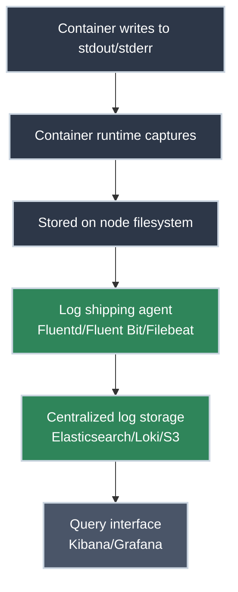

# Logging Architecture

!!! tip "Part of Level 6: Production Operations"
    This article is part of [Level 6: Production Operations](overview.md). At this level, you're running production Kubernetes and need observability into what's happening across thousands of pods.

Your production cluster is running. Applications are deployed. Services are routing traffic. Everything seems fine—until someone asks, "Why did that API call fail at 3 AM?" or "Which pod threw that error?"

You reach for the logs. But with 500 pods spread across 20 nodes, each generating thousands of log lines per minute, running `kubectl logs` on individual pods feels like trying to find a specific grain of sand on a beach.

**This is the logging problem at scale.** You need architecture, not just commands.

!!! info "What You'll Learn"

    By the end of this article, you'll understand:

    - **Container logging fundamentals** - Where logs go in Kubernetes
    - **Logging patterns** - Structured logging, JSON, and best practices
    - **Log aggregation architecture** - Centralized logging at scale
    - **Common solutions** - Fluentd, Fluent Bit, ELK/EFK stack, Loki
    - **Log retention and rotation** - Managing log volume
    - **Troubleshooting workflows** - Finding what you need fast
    - **Production logging checklist** - What to implement for production

## The Logging Journey



---

## Container Logging Fundamentals

### How Kubernetes Handles Logs

Kubernetes has a simple but powerful logging design: **containers write to stdout/stderr, and Kubernetes captures it.**

<div class="grid cards" markdown>

-   :material-file-document: **The Container Log Contract**

    ---

    **Why it matters:** Kubernetes expects containerized applications to write logs to standard output (`stdout`) and standard error (`stderr`), not to files inside the container.

    ``` yaml title="Application logs to stdout" linenums="1"
    apiVersion: v1
    kind: Pod
    metadata:
      name: log-example
    spec:
      containers:
      - name: app
        image: myapp:1.0
        # Application should log to stdout/stderr
        # Kubernetes captures these streams automatically
    ```

    **Key insight:** This is the 12-factor app logging pattern. No log files to manage inside containers—just write to stdout/stderr and let the platform handle it.

-   :material-folder: **Where Logs Are Stored**

    ---

    **Why it matters:** Understanding the log path helps you troubleshoot when aggregation systems fail.

    **On each node:**

    ``` bash title="Node filesystem log location"
    /var/log/pods/<namespace>_<pod-name>_<pod-uid>/<container-name>/*.log
    ```

    **Or symlinked from container runtime:**

    ``` bash title="Container runtime logs (containerd)"
    /var/log/containers/<pod-name>_<namespace>_<container-name>-<container-id>.log
    ```

    **Key insight:** Logs are stored on the node where the pod runs. If the node dies, logs stored only there are lost (hence the need for centralized logging).

-   :material-cloud-upload: **Log Lifecycle**

    ---

    **Why it matters:** Logs on nodes are automatically rotated to prevent disk exhaustion, but this means you lose old logs unless you ship them elsewhere.

    **Default kubelet log rotation:**

    - Maximum log file size: 10 MB
    - Maximum files per container: 5
    - Total log retention per container: ~50 MB

    **After rotation:** Old logs are deleted. Without log aggregation, you lose historical logs.

    **Key insight:** Node-local logs are ephemeral and space-limited. Production clusters MUST ship logs to centralized storage.

</div>

### Reading Logs with kubectl

✅ **Safe (Read-Only):**

``` bash title="View logs from a specific pod"
kubectl logs nginx-deployment-7c5ddbdf54-x8f9p
# [2026-02-11 14:23:45] 10.244.1.5 - "GET / HTTP/1.1" 200 612
# [2026-02-11 14:23:46] 10.244.1.7 - "GET /api/users HTTP/1.1" 200 1823
```

``` bash title="Follow logs in real-time"
kubectl logs -f nginx-deployment-7c5ddbdf54-x8f9p
# Streams logs continuously (Ctrl+C to stop)
```

``` bash title="View logs from all containers in a pod"
kubectl logs nginx-deployment-7c5ddbdf54-x8f9p --all-containers=true
```

``` bash title="View logs from previous container (after restart)"
kubectl logs nginx-deployment-7c5ddbdf54-x8f9p --previous
# Shows logs from crashed container before restart
```

``` bash title="View recent logs (last 100 lines)"
kubectl logs nginx-deployment-7c5ddbdf54-x8f9p --tail=100
```

``` bash title="View logs since timestamp"
kubectl logs nginx-deployment-7c5ddbdf54-x8f9p --since-time=2026-02-11T14:00:00Z
```

!!! warning "kubectl logs Limitations"
    `kubectl logs` works for debugging individual pods, but breaks down at scale:

    - Only shows logs from ONE pod at a time
    - Can't search across multiple pods
    - Can't aggregate logs by deployment or service
    - Limited to kubelet's log retention (rotated after 50 MB)
    - Requires knowing the exact pod name

    **For production troubleshooting, you need centralized logging.**

---

## Logging Patterns and Best Practices

### Structured Logging

=== "JSON Structured Logs (Recommended)"
    **Goal:** Make logs machine-parseable for filtering, searching, and alerting.

    ``` json title="Application outputs structured JSON"
    {
      "timestamp": "2026-02-11T14:23:45.123Z",
      "level": "ERROR",
      "message": "Database connection timeout",
      "service": "user-api",
      "trace_id": "abc123def456",
      "user_id": "user_42",
      "duration_ms": 5000,
      "error": {
        "type": "TimeoutError",
        "stack": "..."
      }
    }
    ```

    **Benefits:**

    - Filter by any field: `level:ERROR AND service:user-api`
    - Track requests across services with `trace_id`
    - Aggregate metrics from logs (e.g., average duration_ms)
    - Parse automatically in log aggregation tools

=== "Plain Text Logs (Avoid)"
    **Problem:** Hard to parse, hard to search, hard to alert on.

    ```
    [ERROR] 2026-02-11 14:23:45 - Database connection timeout for user user_42 took 5000ms
    ```

    **Issues:**

    - Can't easily filter by user_id
    - Can't aggregate duration values
    - Requires complex regex parsing
    - Different formats across services

    **When it's acceptable:** Local development, very simple applications, legacy apps you can't change.

=== "Kubernetes-Enriched Logs (Best)"
    **Goal:** Your log aggregation system automatically adds Kubernetes metadata to every log line.

    ``` json title="Fluentd/Fluent Bit adds Kubernetes context"
    {
      "timestamp": "2026-02-11T14:23:45.123Z",
      "level": "ERROR",
      "message": "Database connection timeout",
      "kubernetes": {
        "namespace_name": "production",
        "pod_name": "user-api-7c5ddbdf54-x8f9p",
        "container_name": "api",
        "labels": {
          "app": "user-api",
          "version": "v2.3.1"
        },
        "node_name": "node-03"
      },
      "trace_id": "abc123def456"
    }
    ```

    **Now you can query:**

    - All logs from `namespace: production`
    - All logs from pods with label `app: user-api`
    - All logs from `node-03` (useful when troubleshooting node issues)

### Logging Levels

Use appropriate log levels to control verbosity and enable troubleshooting:

| Level | Use For | Example |
|-------|---------|---------|
| **ERROR** | Something failed, requires attention | Database connection lost, API returned 500 |
| **WARN** | Degraded state, not failing yet | Retry attempt 3/5, cache miss rate high |
| **INFO** | Significant events in normal operation | Request received, job completed, pod started |
| **DEBUG** | Detailed diagnostic info | SQL query text, cache key lookups, algorithm steps |
| **TRACE** | Extremely verbose, every execution step | Variable values at each function call |

!!! tip "Production Log Level Strategy"
    **Default in production:** INFO

    **Enable DEBUG temporarily:** When troubleshooting specific issues, enable DEBUG for a single deployment or namespace, not cluster-wide.

    **Use environment variables or ConfigMaps** to change log levels without rebuilding containers:

    ``` yaml title="Configure log level via environment variable"
    env:
    - name: LOG_LEVEL
      value: "INFO"  # Change to DEBUG when troubleshooting
    ```

### What to Log

<div class="grid cards" markdown>

-   :material-check-circle: **DO Log**

    ---

    - **Request/response metadata:** Method, path, status code, duration
    - **Errors and exceptions:** Full stack traces, error context
    - **State changes:** Pod started, config reloaded, database migration ran
    - **External calls:** API calls, database queries, cache operations
    - **Security events:** Authentication failures, authorization denials
    - **Trace IDs:** Correlation IDs to track requests across services

-   :material-close-circle: **DON'T Log**

    ---

    - **Secrets or credentials:** API keys, passwords, tokens, private keys
    - **PII (Personally Identifiable Information):** Social Security numbers, credit cards, full addresses (unless required and secured)
    - **Excessive volume:** Per-byte data transfer, every cache hit
    - **Unstructured noise:** Debug prints left behind during development

</div>

---

## Log Aggregation Architecture

### Why You Need Centralized Logging

**The problem:** In production, you have:

- 500 pods across 20 nodes
- Pods that restart, scale up/down, or move between nodes
- Logs rotated off nodes after 50 MB per container
- No way to query "show me all errors from user-api service in the last hour"

**The solution:** Ship all logs from all pods to a centralized system where you can search, filter, and analyze.

### Common Log Aggregation Stacks

=== "EFK Stack (Elasticsearch, Fluentd, Kibana)"
    **Most popular for Kubernetes logging.**

    **Architecture:**

    ```mermaid
    graph LR
        A[Pods write to stdout] --> B[Fluentd DaemonSet<br/>on each node]
        B --> C[Elasticsearch cluster]
        C --> D[Kibana UI]

        style A fill:#2d3748,stroke:#cbd5e0,stroke-width:2px,color:#fff
        style B fill:#2f855a,stroke:#cbd5e0,stroke-width:2px,color:#fff
        style C fill:#2f855a,stroke:#cbd5e0,stroke-width:2px,color:#fff
        style D fill:#4a5568,stroke:#cbd5e0,stroke-width:2px,color:#fff
    ```

    **Components:**

    - **Fluentd:** Log collector running as DaemonSet (one pod per node), reads logs from node filesystem, enriches with Kubernetes metadata, sends to Elasticsearch
    - **Elasticsearch:** Stores and indexes logs for fast search
    - **Kibana:** Web UI for searching, visualizing, and creating dashboards

    **Pros:**

    - Mature, widely adopted, excellent search capabilities
    - Rich Kibana ecosystem (dashboards, visualizations, alerting)
    - Strong community and support

    **Cons:**

    - Resource-heavy (Elasticsearch cluster requires significant memory/CPU)
    - Complex to operate at scale (index management, shard optimization)
    - High disk I/O and storage costs

    **When to use:** Established organizations with resources to run Elasticsearch, need powerful search, already using Elastic stack.

=== "Fluent Bit + Loki + Grafana (PLG Stack)"
    **Lightweight alternative to EFK, designed for Kubernetes.**

    **Architecture:**

    ```mermaid
    graph LR
        A[Pods write to stdout] --> B[Fluent Bit DaemonSet<br/>lightweight collector]
        B --> C[Loki<br/>log aggregation]
        C --> D[Grafana UI]

        style A fill:#2d3748,stroke:#cbd5e0,stroke-width:2px,color:#fff
        style B fill:#2f855a,stroke:#cbd5e0,stroke-width:2px,color:#fff
        style C fill:#2f855a,stroke:#cbd5e0,stroke-width:2px,color:#fff
        style D fill:#4a5568,stroke:#cbd5e0,stroke-width:2px,color:#fff
    ```

    **Components:**

    - **Fluent Bit:** Lightweight log forwarder (10-20 MB memory vs Fluentd's 100+ MB)
    - **Loki:** Log aggregation designed by Grafana Labs, optimized for Kubernetes
    - **Grafana:** Unified UI for logs and metrics (if you're already using Grafana for monitoring)

    **Pros:**

    - Much lighter resource footprint than Elasticsearch
    - Designed specifically for Kubernetes (label-based indexing matches K8s labels)
    - Lower cost (less compute/storage required)
    - Unified UI if using Grafana for metrics

    **Cons:**

    - Less powerful search than Elasticsearch (optimized for label-based queries)
    - Smaller ecosystem, fewer pre-built dashboards
    - Relatively newer (less battle-tested)

    **When to use:** Resource-constrained environments, already using Grafana for monitoring, prefer lightweight solutions, label-based queries sufficient.

=== "Cloud-Native Solutions"
    **Managed services from cloud providers.**

    **Options:**

    - **AWS:** CloudWatch Logs (via Fluent Bit or Fluentd)
    - **GCP:** Cloud Logging (formerly Stackdriver)
    - **Azure:** Azure Monitor Logs

    **Architecture:**

    ```mermaid
    graph LR
        A[Pods write to stdout] --> B[Log forwarder<br/>Fluent Bit/Fluentd]
        B --> C[Cloud provider<br/>managed service]
        C --> D[Cloud UI]

        style A fill:#2d3748,stroke:#cbd5e0,stroke-width:2px,color:#fff
        style B fill:#2f855a,stroke:#cbd5e0,stroke-width:2px,color:#fff
        style C fill:#2f855a,stroke:#cbd5e0,stroke-width:2px,color:#fff
        style D fill:#4a5568,stroke:#cbd5e0,stroke-width:2px,color:#fff
    ```

    **Pros:**

    - Fully managed (no Elasticsearch or Loki cluster to operate)
    - Integrated with cloud platform (IAM, billing, etc.)
    - Automatic scaling and retention management

    **Cons:**

    - Vendor lock-in
    - Costs scale with log volume (can get expensive)
    - Less flexibility for custom pipelines

    **When to use:** Running managed Kubernetes (EKS/GKE/AKS), want fully managed solution, willing to pay for convenience.

---

## Implementing Centralized Logging

### Deploying Fluentd as a DaemonSet

Fluentd runs as a **DaemonSet**—one pod per node—to collect logs from all containers on that node.

``` yaml title="fluentd-daemonset.yaml" linenums="1"
apiVersion: apps/v1
kind: DaemonSet  # (1)!
metadata:
  name: fluentd
  namespace: kube-system  # (2)!
  labels:
    app: fluentd
spec:
  selector:
    matchLabels:
      app: fluentd
  template:
    metadata:
      labels:
        app: fluentd
    spec:
      serviceAccountName: fluentd  # (3)!
      containers:
      - name: fluentd
        image: fluent/fluentd-kubernetes-daemonset:v1-debian-elasticsearch  # (4)!
        env:
        - name: FLUENT_ELASTICSEARCH_HOST
          value: "elasticsearch.logging.svc.cluster.local"  # (5)!
        - name: FLUENT_ELASTICSEARCH_PORT
          value: "9200"
        - name: FLUENT_ELASTICSEARCH_SCHEME
          value: "http"
        resources:  # (6)!
          limits:
            memory: 200Mi
          requests:
            cpu: 100m
            memory: 200Mi
        volumeMounts:
        - name: varlog
          mountPath: /var/log  # (7)!
        - name: varlibdockercontainers
          mountPath: /var/lib/docker/containers  # (8)!
          readOnly: true
      terminationGracePeriodSeconds: 30
      volumes:
      - name: varlog
        hostPath:
          path: /var/log
      - name: varlibdockercontainers
        hostPath:
          path: /var/lib/docker/containers
```

1. DaemonSet ensures one Fluentd pod per node
2. kube-system namespace for cluster infrastructure components
3. ServiceAccount with RBAC permissions to read pod metadata
4. Pre-built Fluentd image with Kubernetes and Elasticsearch plugins
5. Elasticsearch service DNS name (assumes Elasticsearch deployed in cluster)
6. Resource limits prevent log collector from consuming too many node resources
7. Mount node's /var/log to read container logs
8. Mount Docker/containerd log directory (read-only)

!!! warning "RBAC Required"
    Fluentd needs permissions to read Kubernetes API for pod metadata (namespace, labels, annotations). Create a ServiceAccount with appropriate ClusterRole:

    ``` yaml title="fluentd-rbac.yaml" linenums="1"
    apiVersion: v1
    kind: ServiceAccount
    metadata:
      name: fluentd
      namespace: kube-system
    ---
    apiVersion: rbac.authorization.k8s.io/v1
    kind: ClusterRole
    metadata:
      name: fluentd
    rules:
    - apiGroups: [""]
      resources:
      - namespaces
      - pods
      verbs: ["get", "list", "watch"]
    ---
    apiVersion: rbac.authorization.k8s.io/v1
    kind: ClusterRoleBinding
    metadata:
      name: fluentd
    roleRef:
      apiGroup: rbac.authorization.k8s.io
      kind: ClusterRole
      name: fluentd
    subjects:
    - kind: ServiceAccount
      name: fluentd
      namespace: kube-system
    ```

### Deploying the Stack

⚠️ **Caution (Modifies Resources):**

``` bash title="Deploy Elasticsearch and Kibana (example, simplified)"
# In production, use Helm charts or operators
kubectl create namespace logging

# Apply Elasticsearch StatefulSet (simplified - production needs tuning)
kubectl apply -f elasticsearch-statefulset.yaml -n logging

# Apply Kibana Deployment
kubectl apply -f kibana-deployment.yaml -n logging

# Apply Fluentd RBAC and DaemonSet
kubectl apply -f fluentd-rbac.yaml
kubectl apply -f fluentd-daemonset.yaml
```

✅ **Safe (Read-Only):**

``` bash title="Verify logging stack deployed"
kubectl get daemonset fluentd -n kube-system
# NAME       DESIRED   CURRENT   READY   UP-TO-DATE   AVAILABLE   NODE SELECTOR   AGE
# fluentd    3         3         3       3            3           <none>          2m

kubectl get pods -n logging
# NAME                      READY   STATUS    RESTARTS   AGE
# elasticsearch-0           1/1     Running   0          5m
# kibana-7c5ddbdf54-x8f9p   1/1     Running   0          5m
```

``` bash title="Access Kibana UI"
kubectl port-forward -n logging service/kibana 5601:5601
# Open browser: http://localhost:5601
```

!!! tip "Use Helm for Production"
    The YAML examples above are simplified. For production deployments, use Helm charts:

    - **Elastic stack:** [elastic/helm-charts](https://github.com/elastic/helm-charts)
    - **Loki stack:** [grafana/helm-charts](https://github.com/grafana/helm-charts)

    These handle complexities like StatefulSet scaling, persistent storage, resource tuning, and upgrades.

---

## Log Retention and Rotation

### Managing Log Volume

**The problem:** Logs grow indefinitely. Elasticsearch/Loki disk fills up. Costs explode.

**The solution:** Define retention policies based on log age and importance.

<div class="grid cards" markdown>

-   :material-calendar-clock: **Time-Based Retention**

    ---

    **Strategy:** Delete logs older than X days.

    **Typical retention periods:**

    - **Hot storage (fast search):** 7-14 days
    - **Warm storage (slower, cheaper):** 30-90 days
    - **Cold storage (archive):** 365 days or longer (S3/Glacier)

    **Implementation in Elasticsearch:**

    Use Index Lifecycle Management (ILM) policies:

    ```json
    {
      "policy": {
        "phases": {
          "hot": {
            "min_age": "0ms",
            "actions": {
              "rollover": {
                "max_age": "1d",
                "max_size": "50gb"
              }
            }
          },
          "delete": {
            "min_age": "14d",
            "actions": {
              "delete": {}
            }
          }
        }
      }
    }
    ```

    **Implementation in Loki:**

    Configure retention in Loki config:

    ```yaml
    limits_config:
      retention_period: 168h  # 7 days
    ```

-   :material-filter: **Importance-Based Retention**

    ---

    **Strategy:** Keep ERROR logs longer than INFO logs.

    **Example retention by severity:**

    - ERROR/FATAL: 90 days
    - WARN: 30 days
    - INFO: 14 days
    - DEBUG: 7 days (or don't store at all)

    **Implementation:** Configure Fluentd/Fluent Bit to route logs to different indices/streams based on log level, then apply different retention policies.

-   :material-database-arrow-down: **Archival to Object Storage**

    ---

    **Strategy:** Move old logs from Elasticsearch/Loki to cheap object storage (S3, GCS, Azure Blob).

    **Benefits:**

    - Much cheaper per GB ($0.023/GB/month for S3 vs Elasticsearch disk costs)
    - Still accessible for compliance or forensic analysis
    - Searchable with tools like Athena (AWS) or BigQuery (GCP)

    **Implementation:**

    - **Elasticsearch:** Use snapshot/restore to S3
    - **Loki:** Configure object storage backend
    - **Fluentd:** Directly archive to S3 after processing

</div>

### Cost Optimization

**Log volume directly impacts infrastructure costs.** Strategies to control costs:

1. **Filter unnecessary logs at collection time** - Don't ship DEBUG logs from non-critical services
2. **Sample high-volume logs** - Keep 1% of successful request logs, 100% of errors
3. **Compress logs** - Fluentd/Fluent Bit support compression before sending
4. **Use tiered storage** - Hot/warm/cold architecture (Elasticsearch ILM, Loki compactor)
5. **Monitor log volume by namespace** - Identify noisy applications and optimize them

!!! warning "Balance Cost vs. Observability"
    Aggressive log filtering saves money but can make troubleshooting impossible. Always keep:

    - All ERROR and WARN logs
    - Request logs with response codes 4xx and 5xx
    - Security-relevant events
    - State changes and deployments

    Consider sampling/filtering only repetitive INFO logs from known-healthy services.

---

## Troubleshooting with Logs

### Production Debugging Workflows

**Scenario: "The API returned 500 errors between 2 AM and 2:15 AM. What happened?"**

=== "Using Kibana (EFK Stack)"
    **Goal:** Find all ERROR logs from the API service during the incident window.

    ✅ **Safe (Read-Only):**

    **Step 1: Time range**

    - Select time range: 2026-02-11 02:00:00 to 02:15:00

    **Step 2: Filter by service**

    ```
    kubernetes.labels.app: "user-api" AND level: "ERROR"
    ```

    **Step 3: Aggregate by error type**

    - Create visualization: "Top 10 error.type values"
    - See: `DatabaseTimeoutError: 147 occurrences`

    **Step 4: Deep dive**

    - Click on DatabaseTimeoutError entries
    - View full log with stack trace and trace_id
    - Correlate with database monitoring (was DB slow during this window?)

    **Step 5: Identify pattern**

    - All errors from pods on node-05
    - Check node metrics: network saturation on node-05 during incident
    - Root cause: network issue on specific node

=== "Using Grafana Loki"
    **Goal:** Query logs using LogQL (Loki's query language).

    ✅ **Safe (Read-Only):**

    **Step 1: Filter by labels**

    ```logql
    {namespace="production", app="user-api"}
      |~ "ERROR"
      | json
      | error_type = "DatabaseTimeoutError"
    ```

    **Step 2: Count occurrences**

    ```logql
    sum(count_over_time({namespace="production", app="user-api"}
      |~ "DatabaseTimeoutError" [15m]))
    ```

    **Step 3: View logs by node**

    ```logql
    {namespace="production", app="user-api", node_name="node-05"}
      | json
      | level="ERROR"
    ```

    **Step 4: Correlate with metrics**

    - In Grafana, overlay logs with metrics (CPU, network) on same dashboard
    - Visually correlate spike in errors with network saturation

=== "Using kubectl (No Aggregation)"
    **Problem:** Without centralized logging, you're stuck.

    **Limitations:**

    - Can't query across all pods at once
    - Can't filter by time range (logs may have rotated off)
    - Can't aggregate error types
    - Must know which pods were running during incident (may have been deleted/restarted)

    **Best you can do:**

    ``` bash title="Manually check each pod (tedious)"
    kubectl get pods -l app=user-api -n production
    # List all pods

    kubectl logs user-api-7c5ddbdf54-x8f9p -n production --since-time=2026-02-11T02:00:00Z | grep ERROR
    # Repeat for each pod...
    ```

    **This doesn't scale.** Centralized logging is essential for production troubleshooting.

### Common Log Queries

<div class="grid cards" markdown>

-   :material-magnify: **Find all errors in last hour**

    ---

    **Kibana:**
    ```
    level: "ERROR" AND @timestamp: [now-1h TO now]
    ```

    **Loki (LogQL):**
    ```logql
    {namespace="production"} | json | level="ERROR" [1h]
    ```

-   :material-account-search: **Find logs for specific user**

    ---

    **Kibana:**
    ```
    user_id: "user_12345"
    ```

    **Loki (LogQL):**
    ```logql
    {namespace="production"} | json | user_id="user_12345"
    ```

-   :material-clock-fast: **Find slow requests (>5 seconds)**

    ---

    **Kibana:**
    ```
    duration_ms: >5000
    ```

    **Loki (LogQL):**
    ```logql
    {namespace="production"} | json | duration_ms > 5000
    ```

-   :material-debug-step-over: **Trace request across services**

    ---

    **Kibana:**
    ```
    trace_id: "abc123def456"
    ```

    **Loki (LogQL):**
    ```logql
    {namespace="production"} | json | trace_id="abc123def456"
    ```

    **This is why trace IDs are critical**—follow a request through multiple microservices.

</div>

---

## Production Logging Checklist

Before going to production, ensure you have:

- [ ] **Centralized log aggregation** - Fluentd/Fluent Bit + Elasticsearch/Loki deployed
- [ ] **Structured logging** - Applications output JSON logs with consistent schema
- [ ] **Kubernetes metadata enrichment** - Logs include namespace, pod, labels, node
- [ ] **Log retention policy** - Time-based or size-based retention configured
- [ ] **Archival strategy** - Old logs moved to object storage (S3/GCS/Blob)
- [ ] **Access control** - RBAC configured for who can view logs
- [ ] **Dashboards and saved searches** - Pre-built queries for common troubleshooting scenarios
- [ ] **Alerting on log patterns** - Alerts for ERROR spikes, specific error types
- [ ] **Cost monitoring** - Track log volume and storage costs per namespace/team
- [ ] **Trace ID propagation** - All services include trace IDs in logs for request correlation
- [ ] **Documentation** - Runbooks for common log queries and troubleshooting workflows

!!! tip "Start Simple, Iterate"
    Don't try to build the perfect logging system on day one:

    1. **Phase 1:** Deploy basic EFK or PLG stack, ship all logs, default retention
    2. **Phase 2:** Add structured logging to critical services, tune retention
    3. **Phase 3:** Build dashboards, optimize costs, add alerting
    4. **Phase 4:** Implement archival, advanced analytics, trace correlation

    The goal is visibility first, optimization second.

---

## Practice Exercises

??? question "Exercise 1: View logs from a deployment"
    **Goal:** Use `kubectl logs` to view logs from all pods in a deployment.

    **Scenario:** You have a deployment named `api-server` with 3 replicas in the `production` namespace. View logs from all pods.

    **Hint:** Use label selectors to target all pods in the deployment.

    ??? tip "Solution"
        **Step 1: Find pods in deployment**

        ``` bash title="List pods with label selector"
        kubectl get pods -l app=api-server -n production
        # NAME                          READY   STATUS    RESTARTS   AGE
        # api-server-7c5ddbdf54-2xkqn   1/1     Running   0          1h
        # api-server-7c5ddbdf54-8mz4p   1/1     Running   0          1h
        # api-server-7c5ddbdf54-kx9qw   1/1     Running   0          1h
        ```

        **Step 2: View logs from specific pod**

        ``` bash title="View logs from one pod"
        kubectl logs api-server-7c5ddbdf54-2xkqn -n production
        ```

        **Step 3: View logs from all pods (recent versions of kubectl)**

        ``` bash title="View logs from all pods in deployment"
        kubectl logs -l app=api-server -n production --tail=50
        # Shows last 50 lines from each pod
        ```

        **Step 4: Follow logs from all pods**

        ``` bash title="Stream logs from all pods"
        kubectl logs -l app=api-server -n production -f
        # Streams logs from all pods (Ctrl+C to stop)
        ```

        **What you learned:**

        - Using label selectors to target multiple pods
        - Viewing logs from deployments without knowing pod names
        - Following live logs across multiple pods

??? question "Exercise 2: Identify why a pod crashed"
    **Goal:** Use logs to diagnose why a pod restarted.

    **Scenario:** You notice a pod has `RESTARTS: 3`. Find out why it crashed.

    ??? tip "Solution"
        **Step 1: Check pod status**

        ``` bash title="See restart count and status"
        kubectl get pods
        # NAME                     READY   STATUS    RESTARTS   AGE
        # myapp-7c5ddbdf54-x8f9p   1/1     Running   3          10m
        ```

        **Step 2: View current logs**

        ``` bash title="View logs from current container"
        kubectl logs myapp-7c5ddbdf54-x8f9p
        # May not show crash reason if container restarted
        ```

        **Step 3: View logs from previous container**

        ``` bash title="View logs from crashed container"
        kubectl logs myapp-7c5ddbdf54-x8f9p --previous
        # [ERROR] Uncaught exception: database connection failed
        # [ERROR] Fatal: cannot start without database
        ```

        **Step 4: View pod events**

        ``` bash title="See crash events"
        kubectl describe pod myapp-7c5ddbdf54-x8f9p
        # Events:
        # ...
        # Back-off restarting failed container
        ```

        **Root cause:** Application crashes if it can't connect to database at startup. Check database connectivity or add retry logic.

        **What you learned:**

        - Using `--previous` flag to view logs from crashed containers
        - Combining logs with `kubectl describe` for full context
        - Diagnosing crash loop scenarios

??? question "Exercise 3: Configure Fluentd to filter out debug logs"
    **Goal:** Modify Fluentd configuration to exclude DEBUG logs from being sent to Elasticsearch.

    **Scenario:** Your Elasticsearch cluster is overwhelmed by DEBUG log volume. Filter out DEBUG logs at collection time.

    ??? tip "Solution"
        **Fluentd uses filters to transform or drop logs before sending.**

        **Add filter to Fluentd ConfigMap:**

        ``` xml title="Fluentd configuration snippet"
        <filter kubernetes.**>
          @type grep
          <exclude>
            key level
            pattern /^DEBUG$/
          </exclude>
        </filter>
        ```

        **Full workflow:**

        **Step 1: Edit Fluentd ConfigMap**

        ``` bash title="Edit ConfigMap"
        kubectl edit configmap fluentd-config -n kube-system
        ```

        Add the filter configuration above to the `fluent.conf` section.

        **Step 2: Restart Fluentd DaemonSet**

        ``` bash title="Restart Fluentd pods"
        kubectl rollout restart daemonset fluentd -n kube-system
        # Pods will restart with new configuration
        ```

        **Step 3: Verify filtering**

        - Check Kibana: DEBUG logs should stop appearing
        - Check Fluentd logs: `kubectl logs -l app=fluentd -n kube-system`

        **Alternative: Filter by namespace or label**

        ``` xml title="Exclude logs from test namespaces"
        <filter kubernetes.**>
          @type grep
          <exclude>
            key $.kubernetes.namespace_name
            pattern /^test-/
          </exclude>
        </filter>
        ```

        **What you learned:**

        - Using Fluentd filters to drop unwanted logs
        - Restarting DaemonSet to apply config changes
        - Reducing log volume at collection time

---

## Quick Recap

| Component | Purpose |
|-----------|---------|
| **stdout/stderr** | Where containers write logs (12-factor app pattern) |
| **kubectl logs** | View logs from individual pods (not scalable) |
| **Fluentd/Fluent Bit** | Collect logs from nodes, enrich with K8s metadata, ship to storage |
| **Elasticsearch/Loki** | Store and index logs for search and analysis |
| **Kibana/Grafana** | Query and visualize logs |
| **Structured logging (JSON)** | Make logs machine-parseable |
| **Log retention** | Delete old logs to control costs |
| **Trace IDs** | Correlate logs across services |

---

## Further Reading

### Official Documentation

- [Kubernetes Docs: Logging Architecture](https://kubernetes.io/docs/concepts/cluster-administration/logging/) - Official logging concepts and patterns
- [kubectl Reference: logs](https://kubernetes.io/docs/reference/generated/kubectl/kubectl-commands#logs) - Full `kubectl logs` command reference
- [12-Factor App: Logs](https://12factor.net/logs) - The logging philosophy behind container logs

### Log Aggregation Tools

- [Fluentd Documentation](https://docs.fluentd.org/) - Comprehensive Fluentd setup and configuration
- [Fluent Bit Documentation](https://docs.fluentbit.io/) - Lightweight log forwarder
- [Grafana Loki Documentation](https://grafana.com/docs/loki/latest/) - Loki setup, LogQL query language
- [Elastic Stack Documentation](https://www.elastic.co/guide/index.html) - Elasticsearch, Kibana, Filebeat

### Deep Dives

- [Elasticsearch ILM (Index Lifecycle Management)](https://www.elastic.co/guide/en/elasticsearch/reference/current/index-lifecycle-management.html) - Managing retention and cost
- [Loki Best Practices](https://grafana.com/docs/loki/latest/best-practices/) - Optimizing Loki for Kubernetes
- [CNCF Observability Whitepaper](https://www.cncf.io/blog/2018/08/21/observability-at-cncf/) - Observability strategy including logging

### Related Articles

- [Monitoring and Metrics](monitoring.md) - How to monitor cluster and application health
- [Health Checks and Probes](probes.md) - Application health and readiness
- [Level 6 Overview](overview.md) - All production operations topics

---

## What's Next?

You understand how to collect, aggregate, and query logs at scale. Next in Level 6:

- **Monitoring and Metrics** - Track cluster health with Prometheus and Grafana
- **Health Checks and Probes** - Configure liveness and readiness probes for applications

Logging tells you **what happened**. Monitoring tells you **what's happening now**. Together, they give you complete observability.

---

**Your production cluster now has eyes and ears.**
