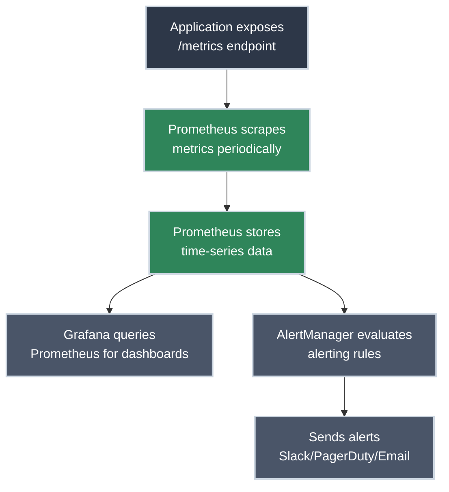
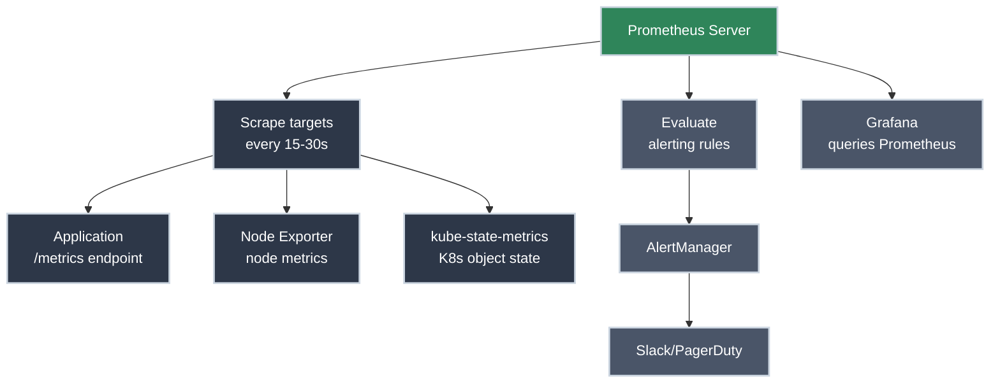

# Monitoring and Metrics

!!! tip "Part of Level 6: Production Operations"
    This article is part of [Level 6: Production Operations](overview.md). At this level, you're running production Kubernetes and need real-time visibility into cluster and application health.

Your production cluster is running. Applications are deployed. Logging is configured. Everything looks good—until your phone buzzes at 2 AM: "Site is down."

You rush to your laptop. What's wrong? Is it the application? The database? The cluster itself? CPU exhausted? Memory leak? Network issue?

**Without monitoring, you're flying blind.** Logs tell you what happened in the past. Metrics tell you what's happening right now—and warn you before things break.

This is the difference between reacting to outages and preventing them.

!!! info "What You'll Learn"

    By the end of this article, you'll understand:

    - **Metrics fundamentals** - What metrics are and why they matter
    - **Metrics Server** - Basic resource metrics (CPU, memory)
    - **Prometheus architecture** - Industry-standard metrics collection
    - **Exporters and ServiceMonitors** - How Prometheus discovers what to scrape
    - **Grafana dashboards** - Visualizing metrics for humans
    - **Key metrics to monitor** - USE method, RED method, SLIs/SLOs
    - **Alerting with AlertManager** - Getting notified before users complain
    - **Production monitoring checklist** - What to implement for production

## The Monitoring Journey



---

## Metrics Fundamentals

### What Are Metrics?

**Metrics are numerical measurements over time.**

Unlike logs (discrete events), metrics are continuous data points that show trends:

- CPU usage: 45%, 52%, 61%, 70%...
- Request rate: 150 req/s, 180 req/s, 200 req/s...
- Error rate: 0.2%, 0.3%, 1.2%, 5.4%...

**Why metrics matter:**

- **Trend analysis:** See patterns (CPU climbing gradually = resource leak)
- **Thresholds and alerting:** Trigger alerts when values exceed limits
- **Capacity planning:** Predict when to scale
- **Dashboards:** Visual real-time status at a glance

### Types of Metrics

<div class="grid cards" markdown>

-   :material-counter: **Counter**

    ---

    **What it is:** A value that only increases (never decreases, except on reset).

    **Examples:**

    - Total HTTP requests served
    - Total errors
    - Total bytes sent

    **When to use:** Counting events that accumulate over time.

    **Key insight:** You typically query the rate of change (requests per second), not the absolute value.

    ``` promql title="Counter query example"
    rate(http_requests_total[5m])
    # Requests per second, averaged over 5 minutes
    ```

-   :material-gauge: **Gauge**

    ---

    **What it is:** A value that can increase or decrease.

    **Examples:**

    - Current CPU usage (%)
    - Current memory usage (bytes)
    - Number of active connections
    - Queue depth

    **When to use:** Measuring current state, not cumulative events.

    **Key insight:** Gauges represent "right now" values. They can spike and drop.

    ``` promql title="Gauge query example"
    node_memory_MemAvailable_bytes / node_memory_MemTotal_bytes * 100
    # Percentage of memory available
    ```

-   :material-chart-histogram: **Histogram**

    ---

    **What it is:** Tracks distribution of values in buckets.

    **Examples:**

    - Request duration (how many requests took <100ms, <500ms, <1s, etc.)
    - Response size distribution

    **When to use:** Analyzing distributions and calculating percentiles.

    **Key insight:** Lets you calculate p50, p95, p99 latency (50th, 95th, 99th percentile).

    ``` promql title="Histogram query example"
    histogram_quantile(0.95, rate(http_request_duration_seconds_bucket[5m]))
    # 95th percentile request duration
    ```

-   :material-sigma: **Summary**

    ---

    **What it is:** Like histogram, but calculates quantiles on the client side.

    **Examples:**

    - Request duration summary (pre-calculated percentiles)

    **When to use:** Similar to histogram, but less flexible (can't aggregate across instances).

    **Key insight:** Histograms are generally preferred in Prometheus. Summaries are used when client-side calculation is needed.

</div>

---

## Metrics Server

### Basic Resource Metrics

**Metrics Server** is a lightweight cluster add-on that provides CPU and memory metrics for nodes and pods.

**What it does:**

- Collects resource metrics from kubelets on each node
- Stores short-term metrics in memory (no persistent storage)
- Powers `kubectl top` commands
- Used by Horizontal Pod Autoscaler (HPA) for scaling decisions

**What it does NOT do:**

- Store historical metrics (data is only kept for a few minutes)
- Provide custom application metrics
- Support alerting

**Think of Metrics Server as:** Basic resource monitoring for autoscaling. For production observability, you need Prometheus.

### Installing Metrics Server

⚠️ **Caution (Modifies Resources):**

``` bash title="Install Metrics Server (official manifest)"
kubectl apply -f https://github.com/kubernetes-sigs/metrics-server/releases/latest/download/components.yaml
```

✅ **Safe (Read-Only):**

``` bash title="Verify Metrics Server running"
kubectl get deployment metrics-server -n kube-system
# NAME             READY   UP-TO-DATE   AVAILABLE   AGE
# metrics-server   1/1     1            1           1m

kubectl top nodes
# NAME       CPU(cores)   CPU%   MEMORY(bytes)   MEMORY%
# node-01    250m         12%    1500Mi          40%
# node-02    180m         9%     1200Mi          32%
# node-03    320m         16%    1800Mi          48%

kubectl top pods -n production
# NAME                       CPU(cores)   MEMORY(bytes)
# api-server-7c5ddbdf54-2x   20m          128Mi
# api-server-7c5ddbdf54-8m   18m          132Mi
```

!!! tip "kubectl top is Your Friend"
    `kubectl top` gives instant visibility into resource usage. Use it daily:

    - `kubectl top nodes` - Which nodes are under pressure?
    - `kubectl top pods -n <namespace>` - Which pods are consuming resources?
    - `kubectl top pods --all-namespaces --sort-by=memory` - Top memory consumers cluster-wide

---

## Prometheus Architecture

### Why Prometheus?

**Prometheus is the industry standard for Kubernetes monitoring.** It's purpose-built for dynamic, cloud-native environments.

**Key features:**

- **Pull-based model:** Prometheus scrapes metrics from targets (vs. push-based systems)
- **Service discovery:** Automatically discovers pods, services, nodes via Kubernetes API
- **Powerful query language (PromQL):** Flexible metric queries and aggregations
- **Multi-dimensional data:** Metrics tagged with labels (pod, namespace, service, etc.)
- **Time-series database:** Efficiently stores metrics over time
- **Alerting:** Built-in alert evaluation and routing

### Prometheus Components



<div class="grid cards" markdown>

-   :material-server: **Prometheus Server**

    ---

    **The core component.**

    - Scrapes metrics from targets
    - Stores time-series data
    - Evaluates PromQL queries
    - Evaluates alerting rules

    **Deployed as:** StatefulSet or Deployment (with persistent storage)

-   :material-target: **Exporters**

    ---

    **Translate metrics into Prometheus format.**

    **Common exporters:**

    - **node-exporter:** Hardware and OS metrics (CPU, memory, disk, network) from each node
    - **kube-state-metrics:** Kubernetes object state (pod status, deployment replicas, resource requests)
    - **Application exporters:** Redis exporter, MySQL exporter, etc.

    **Your application:** Should expose `/metrics` endpoint in Prometheus format

-   :material-bell: **AlertManager**

    ---

    **Handles alerts from Prometheus.**

    - Receives alerts from Prometheus
    - Groups, deduplicates, and routes alerts
    - Sends notifications (Slack, PagerDuty, email, webhooks)
    - Silences and inhibits alerts

-   :material-chart-line: **Grafana**

    ---

    **Visualization and dashboards.**

    - Queries Prometheus for metrics
    - Creates dashboards with graphs, tables, gauges
    - Supports multiple data sources
    - Pre-built dashboards for Kubernetes, applications

</div>

### Installing Prometheus with kube-prometheus-stack

**The easiest way to deploy Prometheus on Kubernetes:** Use the **kube-prometheus-stack** Helm chart.

**What it includes:**

- Prometheus Operator (manages Prometheus instances declaratively)
- Prometheus server
- AlertManager
- Grafana
- node-exporter
- kube-state-metrics
- Pre-configured dashboards and alerts

⚠️ **Caution (Modifies Resources):**

``` bash title="Install kube-prometheus-stack with Helm"
# Add Prometheus Helm repo
helm repo add prometheus-community https://prometheus-community.github.io/helm-charts
helm repo update

# Create monitoring namespace
kubectl create namespace monitoring

# Install kube-prometheus-stack
helm install prometheus prometheus-community/kube-prometheus-stack \
  --namespace monitoring \
  --set prometheus.prometheusSpec.retention=30d \
  --set prometheus.prometheusSpec.storageSpec.volumeClaimTemplate.spec.resources.requests.storage=50Gi
```

✅ **Safe (Read-Only):**

``` bash title="Verify Prometheus stack deployed"
kubectl get pods -n monitoring
# NAME                                                   READY   STATUS    RESTARTS   AGE
# prometheus-kube-prometheus-prometheus-0                2/2     Running   0          2m
# prometheus-grafana-7c5ddbdf54-x8f9p                    3/3     Running   0          2m
# prometheus-kube-state-metrics-6d8f9c5b5d-abc12         1/1     Running   0          2m
# prometheus-prometheus-node-exporter-abcd1              1/1     Running   0          2m
# prometheus-prometheus-node-exporter-efgh2              1/1     Running   0          2m
# alertmanager-prometheus-kube-prometheus-alertmanager-0 2/2     Running   0          2m
```

``` bash title="Access Prometheus UI"
kubectl port-forward -n monitoring svc/prometheus-kube-prometheus-prometheus 9090:9090
# Open browser: http://localhost:9090
```

``` bash title="Access Grafana UI"
kubectl port-forward -n monitoring svc/prometheus-grafana 3000:80
# Open browser: http://localhost:3000
# Default credentials: admin / prom-operator
```

!!! warning "Persistent Storage Required"
    Prometheus stores time-series data. Without persistent storage, you lose all metrics when the pod restarts.

    **Ensure:**

    - PersistentVolumeClaim is bound (check `kubectl get pvc -n monitoring`)
    - Storage class supports dynamic provisioning
    - Retention period and storage size are configured appropriately

---

## Exposing Application Metrics

### The /metrics Endpoint

Prometheus scrapes metrics from HTTP endpoints that return metrics in **Prometheus text format**.

**Example `/metrics` endpoint response:**

```
# HELP http_requests_total Total number of HTTP requests
# TYPE http_requests_total counter
http_requests_total{method="GET",endpoint="/api/users",status="200"} 15234
http_requests_total{method="GET",endpoint="/api/users",status="404"} 42
http_requests_total{method="POST",endpoint="/api/users",status="201"} 523

# HELP http_request_duration_seconds HTTP request duration
# TYPE http_request_duration_seconds histogram
http_request_duration_seconds_bucket{method="GET",endpoint="/api/users",le="0.1"} 12450
http_request_duration_seconds_bucket{method="GET",endpoint="/api/users",le="0.5"} 15100
http_request_duration_seconds_bucket{method="GET",endpoint="/api/users",le="1.0"} 15200
http_request_duration_seconds_bucket{method="GET",endpoint="/api/users",le="+Inf"} 15234
http_request_duration_seconds_sum{method="GET",endpoint="/api/users"} 1523.4
http_request_duration_seconds_count{method="GET",endpoint="/api/users"} 15234
```

### Instrumenting Your Application

**Most languages have Prometheus client libraries:**

=== "Go"
    ``` go title="Example: Instrumenting a Go HTTP handler"
    package main

    import (
        "net/http"
        "github.com/prometheus/client_golang/prometheus"
        "github.com/prometheus/client_golang/prometheus/promhttp"
    )

    var (
        httpRequestsTotal = prometheus.NewCounterVec(
            prometheus.CounterOpts{
                Name: "http_requests_total",
                Help: "Total number of HTTP requests",
            },
            []string{"method", "endpoint", "status"},
        )
        httpRequestDuration = prometheus.NewHistogramVec(
            prometheus.HistogramOpts{
                Name:    "http_request_duration_seconds",
                Help:    "HTTP request duration",
                Buckets: prometheus.DefBuckets,
            },
            []string{"method", "endpoint"},
        )
    )

    func init() {
        prometheus.MustRegister(httpRequestsTotal)
        prometheus.MustRegister(httpRequestDuration)
    }

    func main() {
        http.Handle("/metrics", promhttp.Handler())
        http.HandleFunc("/api/users", usersHandler)
        http.ListenAndServe(":8080", nil)
    }

    func usersHandler(w http.ResponseWriter, r *http.Request) {
        timer := prometheus.NewTimer(httpRequestDuration.WithLabelValues(r.Method, "/api/users"))
        defer timer.ObserveDuration()

        // Your handler logic here
        w.WriteHeader(http.StatusOK)

        httpRequestsTotal.WithLabelValues(r.Method, "/api/users", "200").Inc()
    }
    ```

=== "Python"
    ``` python title="Example: Instrumenting a Python Flask app"
    from flask import Flask
    from prometheus_client import Counter, Histogram, generate_latest

    app = Flask(__name__)

    http_requests_total = Counter(
        'http_requests_total',
        'Total HTTP requests',
        ['method', 'endpoint', 'status']
    )

    http_request_duration_seconds = Histogram(
        'http_request_duration_seconds',
        'HTTP request duration',
        ['method', 'endpoint']
    )

    @app.route('/metrics')
    def metrics():
        return generate_latest()

    @app.route('/api/users')
    @http_request_duration_seconds.labels(method='GET', endpoint='/api/users').time()
    def users():
        # Your handler logic here
        http_requests_total.labels(method='GET', endpoint='/api/users', status='200').inc()
        return {"users": [...]}

    if __name__ == '__main__':
        app.run(port=8080)
    ```

=== "Java (Spring Boot)"
    ``` java title="Example: Spring Boot with Micrometer"
    // Add dependency: io.micrometer:micrometer-registry-prometheus

    @RestController
    public class UsersController {

        private final Counter httpRequestsTotal;
        private final Timer httpRequestDuration;

        public UsersController(MeterRegistry registry) {
            this.httpRequestsTotal = Counter.builder("http.requests.total")
                .tag("endpoint", "/api/users")
                .register(registry);

            this.httpRequestDuration = Timer.builder("http.request.duration.seconds")
                .tag("endpoint", "/api/users")
                .register(registry);
        }

        @GetMapping("/api/users")
        public List<User> getUsers() {
            return httpRequestDuration.record(() -> {
                // Your handler logic here
                httpRequestsTotal.increment();
                return userService.findAll();
            });
        }
    }

    // Metrics exposed automatically at /actuator/prometheus
    ```

**Key principles:**

- Use descriptive metric names (`http_requests_total`, not `requests`)
- Add labels for dimensions (`method`, `endpoint`, `status`)
- Use appropriate metric types (counter for cumulative, gauge for current state)
- Avoid high-cardinality labels (e.g., don't use user_id as a label—millions of unique values)

### ServiceMonitor: Telling Prometheus What to Scrape

**Prometheus Operator uses `ServiceMonitor` CRDs** to define which services to scrape.

``` yaml title="servicemonitor.yaml" linenums="1"
apiVersion: monitoring.coreos.com/v1
kind: ServiceMonitor  # (1)!
metadata:
  name: api-server-metrics
  namespace: production
  labels:
    app: api-server  # (2)!
spec:
  selector:
    matchLabels:
      app: api-server  # (3)!
  endpoints:
  - port: metrics  # (4)!
    path: /metrics  # (5)!
    interval: 30s  # (6)!
```

1. ServiceMonitor is a CRD provided by Prometheus Operator
2. Labels for organizing ServiceMonitors
3. Selects Services with this label—Prometheus will scrape all pods behind this service
4. Port name defined in the Service (not port number)
5. HTTP path where metrics are exposed
6. How often to scrape (default: 30s)

**Corresponding Service:**

``` yaml title="service.yaml" linenums="1"
apiVersion: v1
kind: Service
metadata:
  name: api-server
  namespace: production
  labels:
    app: api-server  # Matches ServiceMonitor selector
spec:
  selector:
    app: api-server
  ports:
  - name: http
    port: 80
    targetPort: 8080
  - name: metrics  # ServiceMonitor references this port name
    port: 9090
    targetPort: 9090  # Application /metrics endpoint
```

⚠️ **Caution (Modifies Resources):**

``` bash title="Apply ServiceMonitor"
kubectl apply -f servicemonitor.yaml
```

✅ **Safe (Read-Only):**

``` bash title="Verify Prometheus discovered targets"
# Access Prometheus UI (port-forward if needed)
# Navigate to Status > Targets
# You should see your service listed with UP status
```

!!! tip "Debugging ServiceMonitor Issues"
    **If your service doesn't appear in Prometheus targets:**

    1. **Check ServiceMonitor labels match Prometheus selector**
       - Prometheus Operator watches for ServiceMonitors with specific labels
       - Default: `release: prometheus` (check your Helm release name)
       - Add label to ServiceMonitor: `release: prometheus`

    2. **Check Service selector matches Pods**
       - `kubectl get endpoints <service-name>` should show pod IPs

    3. **Check port names match**
       - ServiceMonitor `port:` must match Service port `name:`

    4. **Check application is actually exposing /metrics**
       - `kubectl port-forward <pod> 9090:9090`
       - `curl http://localhost:9090/metrics`

---

## Querying Metrics with PromQL

### PromQL Basics

**PromQL (Prometheus Query Language)** is how you query metrics.

<div class="grid cards" markdown>

-   :material-text-search: **Instant Vector**

    ---

    **Returns current value for matching time series.**

    ``` promql title="Get current HTTP request rate"
    rate(http_requests_total[5m])
    # Requests per second, averaged over last 5 minutes
    ```

-   :material-filter: **Label Filtering**

    ---

    **Filter metrics by label values.**

    ``` promql title="Filter by labels"
    http_requests_total{method="GET", status="200"}
    # Only GET requests with 200 status

    http_requests_total{status=~"5.."}
    # All 5xx status codes (regex match)

    http_requests_total{endpoint!="/health"}
    # Exclude /health endpoint
    ```

-   :material-function: **Aggregation**

    ---

    **Combine multiple time series.**

    ``` promql title="Aggregate across pods"
    sum(rate(http_requests_total[5m])) by (endpoint)
    # Total request rate per endpoint (summed across all pods)

    avg(http_request_duration_seconds) by (endpoint)
    # Average request duration per endpoint
    ```

-   :material-calculator: **Math and Operators**

    ---

    **Perform calculations on metrics.**

    ``` promql title="Calculate error rate percentage"
    (
      sum(rate(http_requests_total{status=~"5.."}[5m]))
      /
      sum(rate(http_requests_total[5m]))
    ) * 100
    # Percentage of 5xx errors
    ```

</div>

### Common PromQL Queries

**Node metrics:**

``` promql title="CPU usage per node"
100 - (avg by (instance) (irate(node_cpu_seconds_total{mode="idle"}[5m])) * 100)
```

``` promql title="Memory usage percentage per node"
(1 - (node_memory_MemAvailable_bytes / node_memory_MemTotal_bytes)) * 100
```

``` promql title="Disk usage percentage"
(1 - (node_filesystem_avail_bytes / node_filesystem_size_bytes)) * 100
```

**Pod metrics:**

``` promql title="CPU usage per pod"
sum(rate(container_cpu_usage_seconds_total{pod!=""}[5m])) by (pod, namespace)
```

``` promql title="Memory usage per pod"
sum(container_memory_usage_bytes{pod!=""}) by (pod, namespace)
```

**Application metrics:**

``` promql title="Request rate per service"
sum(rate(http_requests_total[5m])) by (service)
```

``` promql title="95th percentile latency"
histogram_quantile(0.95, sum(rate(http_request_duration_seconds_bucket[5m])) by (le, endpoint))
```

``` promql title="Error rate"
sum(rate(http_requests_total{status=~"5.."}[5m])) by (service)
```

---

## Grafana Dashboards

### Creating Your First Dashboard

Grafana visualizes Prometheus metrics with graphs, gauges, tables, and more.

**Accessing Grafana:**

✅ **Safe (Read-Only):**

``` bash title="Port-forward to Grafana"
kubectl port-forward -n monitoring svc/prometheus-grafana 3000:80
# Open browser: http://localhost:3000
# Login: admin / prom-operator (default)
```

**Pre-built dashboards included in kube-prometheus-stack:**

- **Kubernetes / Compute Resources / Cluster** - Overall cluster resource usage
- **Kubernetes / Compute Resources / Namespace (Pods)** - Per-namespace pod metrics
- **Node Exporter / Nodes** - Detailed node hardware metrics
- **Prometheus / Overview** - Prometheus server health

### Building a Custom Dashboard

=== "Step 1: Create Dashboard"
    **In Grafana UI:**

    1. Click **+ (Create)** → **Dashboard**
    2. Click **Add new panel**

=== "Step 2: Add Query"
    **Select data source:** Prometheus

    **Add PromQL query:**

    ``` promql
    sum(rate(http_requests_total[5m])) by (endpoint)
    ```

    **Legend:** `{{endpoint}}`

=== "Step 3: Configure Visualization"
    **Choose visualization type:**

    - **Time series:** Line graph (default, best for trends over time)
    - **Gauge:** Single current value with thresholds
    - **Stat:** Large number display
    - **Table:** Tabular data

    **Set thresholds (for gauges/stats):**

    - Green: < 100 req/s
    - Yellow: 100-500 req/s
    - Red: > 500 req/s

=== "Step 4: Customize Panel"
    **Panel options:**

    - **Title:** "HTTP Request Rate by Endpoint"
    - **Description:** "Requests per second, 5-minute average"
    - **Unit:** "requests/sec (reqps)"

    **Save dashboard.**

### Dashboard Best Practices

<div class="grid cards" markdown>

-   :material-view-dashboard: **Organize by Audience**

    ---

    **Different teams need different views:**

    - **SRE dashboard:** Cluster health, resource usage, saturation
    - **Application team dashboard:** Request rate, latency, errors
    - **Business dashboard:** Signups, conversions, revenue

    **Create role-specific dashboards**, not one giant dashboard with everything.

-   :material-chart-timeline: **Use Consistent Time Ranges**

    ---

    **Set time range at dashboard level:**

    - **Real-time:** Last 15 minutes (for incident response)
    - **Daily:** Last 24 hours (for trends)
    - **Weekly:** Last 7 days (for capacity planning)

    **Use time range variables** so users can adjust without editing queries.

-   :material-alert: **Highlight What Matters**

    ---

    **Use color to show status:**

    - **Green:** Healthy
    - **Yellow:** Warning threshold
    - **Red:** Critical threshold

    **Place most important metrics at top** of dashboard.

-   :material-information: **Add Context with Annotations**

    ---

    **Grafana annotations mark events on graphs:**

    - Deployments (when new version was deployed)
    - Incidents (when alert fired)
    - Scaling events (when HPA scaled pods)

    **Correlate metrics with events** to understand cause and effect.

</div>

---

## Key Metrics to Monitor

### The USE Method (Infrastructure)

**For every resource, monitor:**

- **Utilization:** % of time resource is busy
- **Saturation:** Amount of work resource cannot service (queued)
- **Errors:** Count of error events

| Resource | Utilization | Saturation | Errors |
|----------|-------------|------------|--------|
| **CPU** | % CPU used | Run queue length | CPU throttling |
| **Memory** | % memory used | Swapping / OOM kills | Allocation failures |
| **Disk** | % disk I/O time | Disk queue depth | I/O errors |
| **Network** | % bandwidth used | Send/receive queue | Packet loss, errors |

**Example queries:**

``` promql title="CPU Utilization"
100 - (avg by (instance) (irate(node_cpu_seconds_total{mode="idle"}[5m])) * 100)
```

``` promql title="Memory Saturation (swap usage)"
node_memory_SwapTotal_bytes - node_memory_SwapFree_bytes
```

### The RED Method (Applications)

**For every service, monitor:**

- **Rate:** Requests per second
- **Errors:** Number of failed requests
- **Duration:** Latency (p50, p95, p99)

**Example queries:**

``` promql title="Request Rate"
sum(rate(http_requests_total[5m])) by (service)
```

``` promql title="Error Rate"
sum(rate(http_requests_total{status=~"5.."}[5m])) by (service)
```

``` promql title="Request Duration (p95)"
histogram_quantile(0.95, sum(rate(http_request_duration_seconds_bucket[5m])) by (le, service))
```

### The Four Golden Signals (Google SRE)

1. **Latency:** Time to service a request
2. **Traffic:** Demand on your system (requests per second)
3. **Errors:** Rate of failed requests
4. **Saturation:** How "full" your service is (CPU, memory, queue depth)

**These overlap with USE and RED—pick the framework that resonates with your team.**

---

## Alerting with AlertManager

### Defining Alerting Rules

Prometheus evaluates alerting rules and fires alerts to AlertManager.

``` yaml title="prometheus-rules.yaml" linenums="1"
apiVersion: monitoring.coreos.com/v1
kind: PrometheusRule  # (1)!
metadata:
  name: api-alerts
  namespace: monitoring
  labels:
    prometheus: kube-prometheus  # (2)!
spec:
  groups:
  - name: api-server-alerts
    interval: 30s  # (3)!
    rules:
    - alert: HighErrorRate  # (4)!
      expr: |  # (5)!
        (
          sum(rate(http_requests_total{status=~"5.."}[5m]))
          /
          sum(rate(http_requests_total[5m]))
        ) * 100 > 5
      for: 5m  # (6)!
      labels:
        severity: critical  # (7)!
      annotations:  # (8)!
        summary: "High error rate detected"
        description: "Error rate is {{ $value }}% (threshold: 5%)"

    - alert: HighLatency
      expr: |
        histogram_quantile(0.95,
          sum(rate(http_request_duration_seconds_bucket[5m])) by (le)
        ) > 1
      for: 10m
      labels:
        severity: warning
      annotations:
        summary: "High latency detected"
        description: "P95 latency is {{ $value }}s (threshold: 1s)"

    - alert: PodCrashLooping
      expr: |
        rate(kube_pod_container_status_restarts_total[15m]) > 0
      for: 5m
      labels:
        severity: warning
      annotations:
        summary: "Pod {{ $labels.pod }} is crash looping"
        description: "Pod has restarted {{ $value }} times in the last 15 minutes"
```

1. PrometheusRule CRD defines alerting rules
2. Label selector—must match Prometheus's `ruleSelector`
3. How often to evaluate rules
4. Alert name (must be unique within group)
5. PromQL expression—alert fires when this is true
6. Alert must be true for this duration before firing (avoids flapping)
7. Labels attached to alert (used for routing in AlertManager)
8. Human-readable alert details (support templating with `{{ }}`)

⚠️ **Caution (Modifies Resources):**

``` bash title="Apply alerting rules"
kubectl apply -f prometheus-rules.yaml
```

✅ **Safe (Read-Only):**

``` bash title="Verify rules loaded"
# In Prometheus UI: Status > Rules
# You should see your alert rules listed
```

### Configuring AlertManager

AlertManager routes alerts to notification channels.

``` yaml title="alertmanager-config.yaml" linenums="1"
apiVersion: v1
kind: Secret
metadata:
  name: alertmanager-prometheus-kube-prometheus-alertmanager
  namespace: monitoring
type: Opaque
stringData:
  alertmanager.yaml: |
    global:
      slack_api_url: 'https://hooks.slack.com/services/YOUR/SLACK/WEBHOOK'

    route:
      receiver: 'default'
      group_by: ['alertname', 'cluster']
      group_wait: 10s  # (1)!
      group_interval: 10s  # (2)!
      repeat_interval: 12h  # (3)!
      routes:
      - match:
          severity: critical  # (4)!
        receiver: 'pagerduty'
      - match:
          severity: warning
        receiver: 'slack'

    receivers:
    - name: 'default'
      slack_configs:
      - channel: '#alerts'
        title: 'Alert: {{ .GroupLabels.alertname }}'
        text: '{{ range .Alerts }}{{ .Annotations.description }}{{ end }}'

    - name: 'slack'
      slack_configs:
      - channel: '#monitoring'
        title: 'Warning: {{ .GroupLabels.alertname }}'

    - name: 'pagerduty'
      pagerduty_configs:
      - service_key: 'YOUR_PAGERDUTY_KEY'
```

1. Wait before sending first notification (to group related alerts)
2. Wait before sending updated notification for grouped alerts
3. Wait before re-sending same alert (prevents spam)
4. Route critical alerts to PagerDuty, warnings to Slack

### Alert Best Practices

<div class="grid cards" markdown>

-   :material-bullseye-arrow: **Alert on Symptoms, Not Causes**

    ---

    **Wrong:** "CPU > 80%"

    **Right:** "Request latency > 1s"

    **Why:** High CPU might be fine if latency is acceptable. Alert on user impact, not internal metrics.

-   :material-timer: **Use `for:` to Avoid Flapping**

    ---

    **Set `for: 5m` on alerts** to ensure condition is sustained before firing.

    **Prevents:** Alerts firing and resolving rapidly during brief spikes.

-   :material-layers: **Use Severity Levels**

    ---

    - **critical:** Page on-call engineer immediately (user-facing outage)
    - **warning:** Notify team, investigate during business hours (degraded performance)
    - **info:** Log for awareness (scheduled maintenance, deployments)

-   :material-file-document: **Write Actionable Annotations**

    ---

    **Bad annotation:** "High error rate"

    **Good annotation:** "Error rate is 8.3% (threshold: 5%). Check logs: kubectl logs -l app=api-server. Check dashboards: http://grafana/dashboards/api"

    **Include:** What's wrong, where to look, how to investigate.

</div>

---

## Production Monitoring Checklist

Before going to production, ensure you have:

- [ ] **Metrics Server installed** - `kubectl top` works
- [ ] **Prometheus deployed** - With persistent storage and appropriate retention (30+ days)
- [ ] **Node exporters running** - One per node for hardware metrics
- [ ] **kube-state-metrics deployed** - For Kubernetes object state
- [ ] **Applications expose /metrics** - Prometheus-format metrics endpoint
- [ ] **ServiceMonitors configured** - Prometheus discovers and scrapes application metrics
- [ ] **Grafana dashboards created** - For cluster, node, and application metrics
- [ ] **USE method metrics** - Monitor utilization, saturation, errors for all resources
- [ ] **RED method metrics** - Monitor rate, errors, duration for all services
- [ ] **Alerting rules defined** - Alerts for critical conditions (high error rate, high latency, pod crashes)
- [ ] **AlertManager configured** - Routes alerts to Slack, PagerDuty, email
- [ ] **Alert annotations tested** - Include runbook links, kubectl commands, dashboard links
- [ ] **On-call playbooks** - Document how to respond to each alert
- [ ] **Capacity planning queries** - Track resource trends over time
- [ ] **Cost monitoring** - Track resource usage by namespace/team for billing

!!! tip "Start with Pre-Built, Customize Later"
    Don't build everything from scratch:

    1. **Use kube-prometheus-stack Helm chart** - Includes Prometheus, Grafana, exporters, dashboards
    2. **Import community dashboards** - Grafana.com has thousands of dashboards (search for "Kubernetes")
    3. **Customize gradually** - Start with defaults, adjust based on what you actually need
    4. **Instrument new services incrementally** - Don't block deployments waiting for perfect metrics

---

## Practice Exercises

??? question "Exercise 1: Check node resource usage"
    **Goal:** Use `kubectl top` to identify which node is using the most CPU.

    ??? tip "Solution"
        ``` bash title="Check node CPU and memory usage"
        kubectl top nodes
        # NAME       CPU(cores)   CPU%   MEMORY(bytes)   MEMORY%
        # node-01    250m         12%    1500Mi          40%
        # node-02    180m         9%     1200Mi          32%
        # node-03    820m         41%    2800Mi          75%  <- Highest CPU
        ```

        **Identify:** node-03 has highest CPU usage (41%)

        **Next steps:**

        ``` bash title="See which pods are on that node"
        kubectl get pods --all-namespaces -o wide --field-selector spec.nodeName=node-03
        ```

        ``` bash title="Check pod resource usage on that node"
        kubectl top pods --all-namespaces --field-selector spec.nodeName=node-03 --sort-by=cpu
        ```

        **What you learned:**

        - Using `kubectl top nodes` to identify resource pressure
        - Filtering pods by node to investigate issues
        - Sorting pods by resource usage

??? question "Exercise 2: Query Prometheus for error rate"
    **Goal:** Write a PromQL query to calculate the percentage of 5xx errors for a service.

    ??? tip "Solution"
        **PromQL query:**

        ``` promql title="Calculate 5xx error rate percentage"
        (
          sum(rate(http_requests_total{service="api-server", status=~"5.."}[5m]))
          /
          sum(rate(http_requests_total{service="api-server"}[5m]))
        ) * 100
        ```

        **Explanation:**

        - `rate(...[5m])` - Requests per second over last 5 minutes
        - `status=~"5.."` - Regex match: 500, 501, 502, etc.
        - Divide 5xx requests by total requests
        - Multiply by 100 for percentage

        **Test in Prometheus UI:**

        1. Access Prometheus: `kubectl port-forward -n monitoring svc/prometheus-kube-prometheus-prometheus 9090:9090`
        2. Navigate to **Graph** tab
        3. Paste query and click **Execute**
        4. View result (e.g., 2.3% error rate)

        **What you learned:**

        - Using `rate()` function for counters
        - Filtering metrics with label matchers
        - Calculating percentages in PromQL

??? question "Exercise 3: Create a Grafana dashboard for your application"
    **Goal:** Build a dashboard showing request rate, error rate, and latency for your application.

    ??? tip "Solution"
        **Step 1: Access Grafana**

        ``` bash
        kubectl port-forward -n monitoring svc/prometheus-grafana 3000:80
        # Open http://localhost:3000
        # Login: admin / prom-operator
        ```

        **Step 2: Create Dashboard**

        - Click **+ (Create)** → **Dashboard**
        - Click **Add new panel**

        **Panel 1: Request Rate**

        - **Query:**
          ``` promql
          sum(rate(http_requests_total{service="api-server"}[5m]))
          ```
        - **Visualization:** Time series (line graph)
        - **Panel title:** "Request Rate"
        - **Unit:** requests/sec (reqps)

        **Panel 2: Error Rate**

        - **Query:**
          ``` promql
          (
            sum(rate(http_requests_total{service="api-server", status=~"5.."}[5m]))
            /
            sum(rate(http_requests_total{service="api-server"}[5m]))
          ) * 100
          ```
        - **Visualization:** Time series
        - **Panel title:** "Error Rate"
        - **Unit:** percent (0-100)
        - **Thresholds:** Green < 1%, Yellow 1-5%, Red > 5%

        **Panel 3: Latency (P95)**

        - **Query:**
          ``` promql
          histogram_quantile(0.95,
            sum(rate(http_request_duration_seconds_bucket{service="api-server"}[5m])) by (le)
          )
          ```
        - **Visualization:** Time series
        - **Panel title:** "P95 Latency"
        - **Unit:** seconds (s)

        **Step 3: Save Dashboard**

        - Click **Save dashboard** (disk icon)
        - Name: "API Server Metrics"

        **What you learned:**

        - Creating Grafana panels with PromQL queries
        - Using appropriate visualizations for different metric types
        - Setting thresholds for status indication

---

## Quick Recap

| Component | Purpose |
|-----------|---------|
| **Metrics Server** | Basic CPU/memory metrics for `kubectl top` and HPA |
| **Prometheus** | Scrapes, stores, and queries time-series metrics |
| **node-exporter** | Hardware and OS metrics from each node |
| **kube-state-metrics** | Kubernetes object state (pod status, deployment replicas) |
| **ServiceMonitor** | Tells Prometheus what to scrape (CRD) |
| **PromQL** | Query language for Prometheus |
| **Grafana** | Visualize metrics with dashboards |
| **AlertManager** | Routes alerts to notification channels |
| **USE method** | Monitor Utilization, Saturation, Errors (infrastructure) |
| **RED method** | Monitor Rate, Errors, Duration (applications) |

---

## Further Reading

### Official Documentation

- [Kubernetes Docs: Metrics Server](https://kubernetes.io/docs/tasks/debug/debug-cluster/resource-metrics-pipeline/) - Overview of metrics pipeline
- [Prometheus Documentation](https://prometheus.io/docs/introduction/overview/) - Comprehensive Prometheus guide
- [PromQL Basics](https://prometheus.io/docs/prometheus/latest/querying/basics/) - Query language reference
- [Grafana Documentation](https://grafana.com/docs/grafana/latest/) - Dashboards and visualization

### Monitoring Best Practices

- [Google SRE Book: Monitoring Distributed Systems](https://sre.google/sre-book/monitoring-distributed-systems/) - Four golden signals, philosophy
- [Brendan Gregg: The USE Method](https://www.brendangregg.com/usemethod.html) - Systematic performance analysis
- [Tom Wilkie: The RED Method](https://grafana.com/blog/2018/08/02/the-red-method-how-to-instrument-your-services/) - Service-level monitoring

### Tools and Operators

- [kube-prometheus-stack Helm Chart](https://github.com/prometheus-community/helm-charts/tree/main/charts/kube-prometheus-stack) - Complete monitoring stack
- [Prometheus Operator](https://prometheus-operator.dev/) - Kubernetes-native Prometheus management
- [Grafana Dashboards](https://grafana.com/grafana/dashboards/) - Pre-built community dashboards

### Related Articles

- [Logging Architecture](logging.md) - Centralized logging with Fluentd and ELK/PLG
- [Health Checks and Probes](probes.md) - Liveness and readiness probes
- [Level 6 Overview](overview.md) - All production operations topics

---

## What's Next?

You can now monitor your cluster and applications with Prometheus and Grafana. Next in Level 6:

- **Health Checks and Probes** - Configure liveness, readiness, and startup probes
- **Helm Package Manager** - Package and deploy applications with Helm charts

Metrics tell you **what's happening now**. Probes tell you **whether to route traffic**. Together with logging, you have complete observability.

---

**Your production cluster is no longer a black box.**
