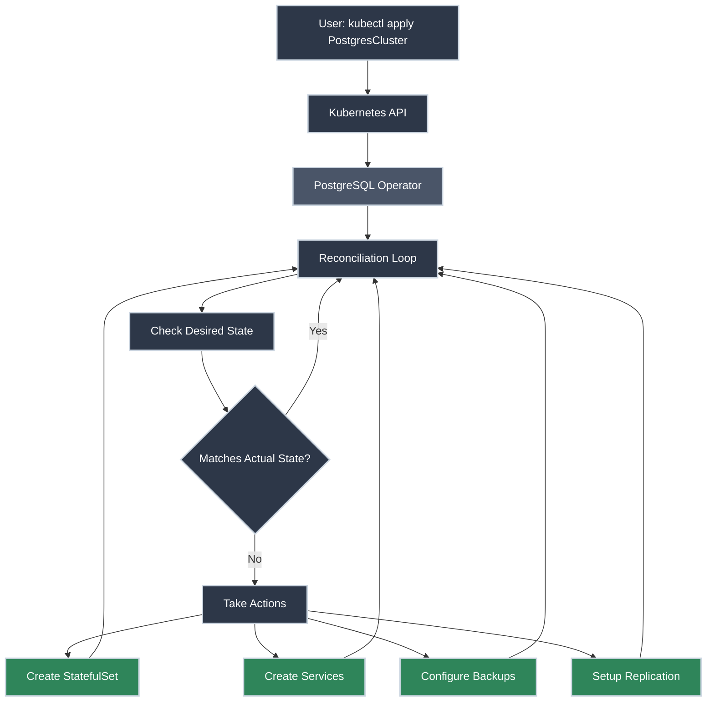

# Operators and Custom Resources

!!! tip "Part of Level 6: Production Operations"
    This article is part of [Level 6: Production Operations](overview.md), focusing on tools and practices for running Kubernetes at scale.

You've deployed stateless applications with Deployments. You've managed configuration with ConfigMaps and Secrets. You've packaged applications with Helm. These tools work brilliantly for standard workloads, but some applications need **operational knowledge encoded into Kubernetes itself**.

Consider running PostgreSQL on Kubernetes. A Deployment can start the pods, but what about:

- **Automated backups** every night at 2 AM?
- **Failover** when the primary database crashes?
- **Version upgrades** with zero downtime?
- **Read replicas** that automatically sync with the primary?
- **Monitoring and alerting** tailored to database metrics?

You could write custom scripts and CronJobs to handle this, but you're essentially building an operator. Someone already built one—the **CloudNativePG operator** automates PostgreSQL entirely. Install it once, create a `PostgresCluster` resource, and it handles backups, failover, upgrades, and monitoring automatically.

**That's the power of operators.**

!!! info "What You'll Learn"

    By the end of this article, you'll know how to:

    - **Understand operators** - What they are and why they exist
    - **Work with CRDs** - Custom Resource Definitions extend Kubernetes
    - **Use popular operators** - Prometheus, cert-manager, database operators
    - **Install operators** - Via Operator Lifecycle Manager or direct manifests
    - **Create custom resources** - Declare desired state for operator-managed apps
    - **Compare operators vs Helm** - When to use each approach
    - **Understand operator patterns** - Reconciliation loops and controller architecture
    - **Explore operator development** - Operator SDK and Kubebuilder frameworks

## The Operator Pattern



---

## What Is an Operator?

**An operator is a Kubernetes-native application that manages other applications.**

More precisely:

- **It extends Kubernetes** by defining Custom Resource Definitions (CRDs)
- **It watches custom resources** you create (like `PostgresCluster`)
- **It runs a reconciliation loop** continuously ensuring actual state matches desired state
- **It encodes operational knowledge** (backups, upgrades, scaling, failover) as code

Think of an operator as **a human operator's knowledge automated**.

### Core Components

<div class="grid cards" markdown>

-   :material-file-document: **Custom Resource Definition (CRD)**

    ---

    **What it is:** A schema that extends the Kubernetes API with new resource types.

    Once installed, you can run `kubectl get postgresclusters` just like `kubectl get pods`. The CRD defines what fields are valid, required, and their types.

    **Why it matters:** CRDs make custom resources first-class Kubernetes citizens. They're stored in etcd, validated by the API server, and work with all kubectl commands.

-   :material-cog: **Controller**

    ---

    **What it is:** The brains of the operator—a control loop that watches resources and takes action.

    The controller subscribes to events (resource created, updated, deleted) and reconciles the actual state to match desired state.

    **Why it matters:** This is where operational logic lives. The controller knows how to provision databases, perform backups, handle failover—all the operational knowledge.

-   :material-refresh: **Reconciliation Loop**

    ---

    **What it is:** Continuous monitoring and correction to ensure desired state.

    ```
    LOOP forever:
      1. Watch for changes to custom resources
      2. Compare desired state (YAML) to actual state (running pods/services)
      3. If different, take corrective action
      4. Repeat
    ```

    **Why it matters:** Self-healing. If someone manually deletes a database pod, the operator recreates it. If backup fails, the operator retries.

-   :material-package-variant: **Custom Resource (CR)**

    ---

    **What it is:** An instance of a CRD—the YAML you write declaring what you want.

    ```yaml
    apiVersion: postgresql.cnpg.io/v1
    kind: PostgresCluster
    metadata:
      name: my-database
    spec:
      instances: 3
      primaryUpdateStrategy: unsupervised
      storage:
        size: 100Gi
    ```

    **Why it matters:** You declare "I want a 3-node PostgreSQL cluster with 100GB storage," and the operator makes it happen. This is declarative infrastructure.

</div>

---

## Custom Resource Definitions (CRDs)

CRDs are Kubernetes' extension mechanism. They add new resource types to your cluster.

### Installing a CRD

Let's install the **cert-manager CRD** (manages TLS certificates):

⚠️ **Caution (Modifies Cluster API):**

```bash title="Install cert-manager CRDs"
kubectl apply -f https://github.com/cert-manager/cert-manager/releases/download/v1.13.3/cert-manager.crds.yaml
# customresourcedefinition.apiextensions.k8s.io/certificaterequests.cert-manager.io created
# customresourcedefinition.apiextensions.k8s.io/certificates.cert-manager.io created
# customresourcedefinition.apiextensions.k8s.io/challenges.acme.cert-manager.io created
# customresourcedefinition.apiextensions.k8s.io/clusterissuers.cert-manager.io created
# customresourcedefinition.apiextensions.k8s.io/issuers.cert-manager.io created
# customresourcedefinition.apiextensions.k8s.io/orders.acme.cert-manager.io created
```

✅ **Safe (Read-Only):**

```bash title="List installed CRDs"
kubectl get crds
# NAME                                  CREATED AT
# certificates.cert-manager.io          2026-02-11T20:15:00Z
# issuers.cert-manager.io               2026-02-11T20:15:00Z
# ...
```

```bash title="See CRD details"
kubectl get crd certificates.cert-manager.io -o yaml
# Shows the schema: what fields are valid, required, types, descriptions
```

!!! warning "CRDs Are Cluster-Wide"
    CRDs are **not namespaced**. Once installed, they're available cluster-wide. Any namespace can create custom resources based on installed CRDs (subject to RBAC).

### Understanding CRD Structure

Here's a simplified CRD for a hypothetical `Database` resource:

```yaml title="database-crd.yaml" linenums="1"
apiVersion: apiextensions.k8s.io/v1
kind: CustomResourceDefinition
metadata:
  name: databases.example.com  # (1)!
spec:
  group: example.com  # (2)!
  names:
    kind: Database  # (3)!
    plural: databases  # (4)!
    singular: database
    shortNames:
      - db  # (5)!
  scope: Namespaced  # (6)!
  versions:
    - name: v1  # (7)!
      served: true
      storage: true
      schema:
        openAPIV3Schema:
          type: object
          properties:
            spec:
              type: object
              properties:
                engine:  # (8)!
                  type: string
                  enum: ["postgres", "mysql"]
                version:
                  type: string
                storage:
                  type: string
                  pattern: '^\d+Gi$'
              required:
                - engine
                - version
            status:  # (9)!
              type: object
              properties:
                ready:
                  type: boolean
                endpoint:
                  type: string
```

1. Full name: `plural.group`
2. API group (shows in `apiVersion: example.com/v1`)
3. Kind used in YAML (`kind: Database`)
4. Plural for `kubectl get databases`
5. Shortcut: `kubectl get db`
6. Namespaced (or Cluster for cluster-wide)
7. Version (can have multiple versions for backwards compatibility)
8. Spec defines desired state (what user declares)
9. Status defines observed state (what operator updates)

### Creating Custom Resources

Once the CRD is installed, you can create instances:

```yaml title="my-database.yaml" linenums="1"
apiVersion: example.com/v1
kind: Database  # (1)!
metadata:
  name: my-app-db
  namespace: production
spec:
  engine: postgres  # (2)!
  version: "15.2"
  storage: 100Gi
```

1. Custom kind defined by the CRD
2. Fields validated against CRD schema

⚠️ **Caution (Creates Resource):**

```bash title="Create custom resource"
kubectl apply -f my-database.yaml
# database.example.com/my-app-db created
```

✅ **Safe (Read-Only):**

```bash title="View custom resources"
kubectl get databases
# NAME         ENGINE     VERSION   STORAGE   READY
# my-app-db    postgres   15.2      100Gi     True
```

```bash title="Use shortname"
kubectl get db my-app-db -o yaml
```

**The operator watches for this resource and provisions the actual database.**

---

## Popular Operators in Action

### cert-manager: Automated TLS Certificates

**What it does:** Automatically provisions, renews, and manages TLS certificates from Let's Encrypt or other CAs.

**Installation:**

⚠️ **Caution (Installs Operator):**

```bash title="Install cert-manager with kubectl"
kubectl apply -f https://github.com/cert-manager/cert-manager/releases/download/v1.13.3/cert-manager.yaml
# Creates namespace, CRDs, deployments, services, RBAC
```

Or via Helm:

```bash title="Install with Helm"
helm repo add jetstack https://charts.jetstack.io
helm repo update
helm install cert-manager jetstack/cert-manager \
  --namespace cert-manager \
  --create-namespace \
  --version v1.13.3
```

**Usage:**

Create an `Issuer` (tells cert-manager how to get certificates):

```yaml title="letsencrypt-issuer.yaml" linenums="1"
apiVersion: cert-manager.io/v1
kind: ClusterIssuer  # (1)!
metadata:
  name: letsencrypt-prod
spec:
  acme:
    server: https://acme-v02.api.letsencrypt.org/directory
    email: admin@example.com  # (2)!
    privateKeySecretRef:
      name: letsencrypt-prod-key
    solvers:
      - http01:  # (3)!
          ingress:
            class: nginx
```

1. ClusterIssuer is cluster-wide; Issuer is namespaced
2. Email for Let's Encrypt notifications
3. HTTP-01 challenge proves you control the domain

Request a certificate:

```yaml title="certificate.yaml" linenums="1"
apiVersion: cert-manager.io/v1
kind: Certificate
metadata:
  name: example-com-tls
  namespace: production
spec:
  secretName: example-com-tls  # (1)!
  issuerRef:
    name: letsencrypt-prod
    kind: ClusterIssuer
  dnsNames:
    - example.com
    - www.example.com
```

1. cert-manager stores the certificate in this Secret

⚠️ **Caution (Requests Certificate):**

```bash title="Apply certificate request"
kubectl apply -f certificate.yaml
# certificate.cert-manager.io/example-com-tls created
```

**What happens:**

1. cert-manager sees the Certificate resource
2. It contacts Let's Encrypt via ACME protocol
3. It solves the HTTP-01 challenge (creates temporary Ingress)
4. Let's Encrypt issues certificate
5. cert-manager stores it in `example-com-tls` Secret
6. It auto-renews before expiration (every 60 days)

✅ **Safe (Read-Only):**

```bash title="Check certificate status"
kubectl get certificate example-com-tls
# NAME               READY   SECRET              AGE
# example-com-tls    True    example-com-tls     2m
```

```bash title="View certificate details"
kubectl describe certificate example-com-tls
# Shows: issuer, status, renewal time, events
```

**Use it in Ingress:**

```yaml title="ingress.yaml"
apiVersion: networking.k8s.io/v1
kind: Ingress
metadata:
  name: my-app
  annotations:
    cert-manager.io/cluster-issuer: letsencrypt-prod  # (1)!
spec:
  tls:
    - hosts:
        - example.com
      secretName: example-com-tls  # (2)!
  rules:
    - host: example.com
      http:
        paths:
          - path: /
            pathType: Prefix
            backend:
              service:
                name: my-app
                port:
                  number: 80
```

1. cert-manager annotation triggers automatic certificate creation
2. TLS secret managed by cert-manager

**Result:** Fully automated HTTPS with auto-renewal. No manual certificate management.

---

### Prometheus Operator: Monitoring Stack

**What it does:** Manages Prometheus, Alertmanager, and Grafana as Kubernetes-native applications.

**Installation:**

```bash title="Install with Helm (kube-prometheus-stack)"
helm repo add prometheus-community https://prometheus-community.github.io/helm-charts
helm repo update
helm install prometheus prometheus-community/kube-prometheus-stack \
  --namespace monitoring \
  --create-namespace
```

This installs:

- **Prometheus Operator** (manages Prometheus instances)
- **Prometheus** (metrics collection)
- **Alertmanager** (alert routing)
- **Grafana** (visualization)
- **ServiceMonitors** (define what to scrape)

**Usage:**

Monitor your application with a `ServiceMonitor`:

```yaml title="servicemonitor.yaml" linenums="1"
apiVersion: monitoring.coreos.com/v1
kind: ServiceMonitor
metadata:
  name: my-app
  namespace: production
  labels:
    release: prometheus  # (1)!
spec:
  selector:
    matchLabels:
      app: my-app  # (2)!
  endpoints:
    - port: metrics  # (3)!
      interval: 30s
      path: /metrics
```

1. Label selector so Prometheus finds this ServiceMonitor
2. Selects Services with this label
3. Scrapes the `metrics` port every 30 seconds

**What happens:**

1. Prometheus Operator sees the ServiceMonitor
2. It reconfigures Prometheus to scrape your app
3. Metrics flow into Prometheus
4. You can query them in Grafana

**Create custom alerts:**

```yaml title="prometheusrule.yaml" linenums="1"
apiVersion: monitoring.coreos.com/v1
kind: PrometheusRule
metadata:
  name: my-app-alerts
  namespace: production
  labels:
    release: prometheus
spec:
  groups:
    - name: my-app
      interval: 30s
      rules:
        - alert: HighErrorRate
          expr: rate(http_requests_total{status="500"}[5m]) > 0.05
          for: 10m
          labels:
            severity: warning
          annotations:
            summary: "High error rate on {{ $labels.instance }}"
            description: "Error rate is {{ $value }} errors/sec"
```

**The operator loads this into Prometheus automatically.** No manual Prometheus config editing.

---

### CloudNativePG: PostgreSQL Operator

**What it does:** Runs production-grade PostgreSQL clusters with automated backups, failover, and upgrades.

**Installation:**

```bash title="Install CloudNativePG operator"
kubectl apply -f https://raw.githubusercontent.com/cloudnative-pg/cloudnative-pg/release-1.21/releases/cnpg-1.21.0.yaml
```

**Usage:**

Create a PostgreSQL cluster:

```yaml title="postgres-cluster.yaml" linenums="1"
apiVersion: postgresql.cnpg.io/v1
kind: Cluster  # (1)!
metadata:
  name: my-postgres
  namespace: production
spec:
  instances: 3  # (2)!
  primaryUpdateStrategy: unsupervised  # (3)!

  storage:
    size: 100Gi
    storageClass: fast-ssd

  bootstrap:
    initdb:
      database: myapp
      owner: myapp_user

  backup:
    barmanObjectStore:  # (4)!
      destinationPath: s3://my-bucket/postgres-backups
      s3Credentials:
        accessKeyId:
          name: s3-creds
          key: ACCESS_KEY_ID
        secretAccessKey:
          name: s3-creds
          key: SECRET_ACCESS_KEY
      wal:
        compression: gzip
    retentionPolicy: "30d"

  monitoring:
    enablePodMonitor: true  # (5)!
```

1. CloudNativePG custom resource
2. 3-node cluster with automatic replication
3. Operator handles rolling updates automatically
4. Automated backups to S3 with WAL archiving
5. Integrates with Prometheus Operator

⚠️ **Caution (Creates Database Cluster):**

```bash title="Create PostgreSQL cluster"
kubectl apply -f postgres-cluster.yaml
# cluster.postgresql.cnpg.io/my-postgres created
```

**What happens:**

1. Operator creates StatefulSet with 3 replicas
2. It configures primary/replica replication
3. It sets up automated backups to S3
4. It creates Services for read/write and read-only traffic
5. It monitors health and handles failover automatically

✅ **Safe (Read-Only):**

```bash title="Check cluster status"
kubectl get cluster my-postgres
# NAME          AGE   INSTANCES   READY   STATUS
# my-postgres   5m    3           3       Cluster in healthy state
```

```bash title="View cluster details"
kubectl cnpg status my-postgres
# Cluster Summary
# Primary instance: my-postgres-1
# Instances: 3
# Ready instances: 3
# ...detailed status...
```

**Connect to database:**

```bash title="Get connection details"
kubectl get secret my-postgres-app -o jsonpath='{.data.password}' | base64 -d
# Shows auto-generated password

kubectl port-forward svc/my-postgres-rw 5432:5432
# Connect at localhost:5432
```

**What you get automatically:**

- **High availability** - Primary failover in ~30 seconds
- **Backups** - Daily full backups + continuous WAL archiving
- **Point-in-time recovery** - Restore to any moment
- **Read replicas** - Automatic replication and split read/write traffic
- **Rolling updates** - Upgrade PostgreSQL version with zero downtime
- **Monitoring** - Prometheus metrics for database health

**All from one YAML file. No manual DBA work.**

---

## Installing Operators

### Method 1: Direct Manifests

**Simplest approach:** Apply operator's installation YAML.

```bash title="Install operator"
kubectl apply -f https://example.com/operator.yaml
```

**Pros:**

- Simple and direct
- Full control over installation
- Easy to version in git

**Cons:**

- Manual updates
- No dependency management
- Limited discovery (have to find operator URLs)

### Method 2: Helm Charts

**Most popular approach:** Many operators publish Helm charts.

```bash title="Install via Helm"
helm repo add operator-repo https://charts.example.com
helm install my-operator operator-repo/operator \
  --namespace operator-system \
  --create-namespace
```

**Pros:**

- Easy updates (`helm upgrade`)
- Configurable via values files
- Dependency management
- Wide ecosystem

**Cons:**

- Requires Helm knowledge
- Another layer of abstraction

### Method 3: Operator Lifecycle Manager (OLM)

**Enterprise approach:** OLM manages operator installation, upgrades, and dependencies.

**Install OLM:**

```bash title="Install OLM"
curl -sL https://github.com/operator-framework/operator-lifecycle-manager/releases/download/v0.26.0/install.sh | bash -s v0.26.0
```

**Install operator via OLM:**

```yaml title="subscription.yaml" linenums="1"
apiVersion: operators.coreos.com/v1alpha1
kind: Subscription
metadata:
  name: my-operator
  namespace: operators
spec:
  channel: stable
  name: my-operator
  source: operatorhubio-catalog
  sourceNamespace: olm
```

```bash title="Apply subscription"
kubectl apply -f subscription.yaml
# OLM installs and manages the operator
```

**Pros:**

- Centralized operator management
- Automated updates within channels (stable, beta, etc.)
- Dependency resolution
- Designed for production clusters

**Cons:**

- Additional complexity (OLM itself is an operator)
- More moving parts
- Steeper learning curve

!!! tip "Which Method to Use?"
    - **Direct manifests** - Development, simple operators, full control
    - **Helm** - Production, easy updates, standard tooling
    - **OLM** - Large enterprises, many operators, centralized management

---

## Operators vs Helm: When to Use Each

<div class="grid cards" markdown>

-   :material-package: **Use Helm When:**

    ---

    **Application is stateless or simple stateful.**

    - Web applications
    - APIs
    - Microservices
    - Standard databases (you manage backups/failover)

    **You need templating and reusability.**

    - Same app across dev/staging/prod
    - Configuration management via values files
    - Version-controlled deployments

    **Operational complexity is low.**

    - Standard Kubernetes resources (Deployment, Service, Ingress)
    - No complex Day 2 operations (backups, upgrades, failover)

    **Example:** Deploy a Node.js API to multiple environments with different replica counts and resource limits.

-   :material-robot: **Use Operators When:**

    ---

    **Application has complex operational requirements.**

    - Databases (PostgreSQL, MongoDB, MySQL)
    - Distributed systems (Kafka, Elasticsearch, Cassandra)
    - Stateful applications with complex lifecycles

    **You need automated Day 2 operations.**

    - Automated backups and restores
    - Zero-downtime upgrades
    - Automatic failover and self-healing
    - Scaling with data rebalancing

    **Operational knowledge should be encoded.**

    - Following best practices automatically
    - Industry-standard configurations
    - Expert-level operations without expert knowledge

    **Example:** Run a 3-node PostgreSQL cluster with automated backups, failover, and monitoring—all handled by CloudNativePG operator.

-   :material-account-multiple: **Use Both Together:**

    ---

    **Common pattern: Helm for app, operators for infrastructure.**

    ```yaml
    # Install database operator
    helm install postgres-operator cloudnative-pg/cloudnative-pg

    # Use operator to create database
    kubectl apply -f postgres-cluster.yaml

    # Deploy application with Helm, referencing operator-managed database
    helm install my-app ./charts/my-app \
      --set database.host=my-postgres-rw.production.svc \
      --set database.existingSecret=my-postgres-app
    ```

    **Why it works:**

    - Operator handles complex stateful infrastructure
    - Helm manages stateless application deployment
    - Best tool for each job

</div>

---

## Operator Development Frameworks

Building an operator from scratch is complex. These frameworks provide scaffolding:

### Operator SDK

**What it is:** Framework from Red Hat for building operators in Go, Ansible, or Helm.

**Install:**

```bash title="Install Operator SDK"
# macOS
brew install operator-sdk

# Linux
curl -LO https://github.com/operator-framework/operator-sdk/releases/download/v1.33.0/operator-sdk_linux_amd64
chmod +x operator-sdk_linux_amd64
sudo mv operator-sdk_linux_amd64 /usr/local/bin/operator-sdk
```

**Create operator scaffold:**

```bash title="Initialize new operator project"
operator-sdk init --domain example.com --repo github.com/myorg/my-operator
# Creates project structure
```

**Create API (CRD + controller):**

```bash title="Add new API"
operator-sdk create api --group app --version v1 --kind MyApp --resource --controller
# Generates CRD and controller boilerplate
```

**Generated structure:**

```
my-operator/
├── api/v1/myapp_types.go           # CRD schema (Go structs)
├── controllers/myapp_controller.go  # Reconciliation logic
├── config/                          # Kustomize manifests
└── main.go                          # Operator entry point
```

**Implement reconciliation logic:**

```go title="controllers/myapp_controller.go (simplified)"
func (r *MyAppReconciler) Reconcile(ctx context.Context, req ctrl.Request) (ctrl.Result, error) {
    // 1. Fetch the custom resource
    var myApp appv1.MyApp
    if err := r.Get(ctx, req.NamespacedName, &myApp); err != nil {
        return ctrl.Result{}, client.IgnoreNotFound(err)
    }

    // 2. Reconcile: ensure desired state matches actual state
    // Create/update Deployment, Service, etc.
    deployment := constructDeployment(myApp)
    if err := r.Create(ctx, deployment); err != nil {
        return ctrl.Result{}, err
    }

    // 3. Update status
    myApp.Status.Ready = true
    if err := r.Status().Update(ctx, &myApp); err != nil {
        return ctrl.Result{}, err
    }

    return ctrl.Result{}, nil
}
```

**Build and deploy:**

```bash title="Build operator image"
make docker-build docker-push IMG=myregistry/my-operator:v0.1.0
```

```bash title="Deploy to cluster"
make deploy IMG=myregistry/my-operator:v0.1.0
```

!!! tip "Operator SDK Simplifies:"
    - CRD generation from Go structs
    - Controller scaffolding with best practices
    - Makefile for building/deploying
    - Testing utilities
    - Metrics and health endpoints

---

### Kubebuilder

**What it is:** Kubernetes SIG project for building operators in Go (Operator SDK uses it internally).

Very similar to Operator SDK but more low-level:

```bash title="Install Kubebuilder"
curl -L -o kubebuilder https://go.kubebuilder.io/dl/latest/$(go env GOOS)/$(go env GOARCH)
chmod +x kubebuilder
sudo mv kubebuilder /usr/local/bin/
```

```bash title="Initialize project"
kubebuilder init --domain example.com --repo github.com/myorg/my-operator
kubebuilder create api --group app --version v1 --kind MyApp
```

**When to use:**

- **Operator SDK** - Higher-level, more opinionated, Ansible/Helm options
- **Kubebuilder** - Lower-level, more control, Go-only

---

## Common Operator Patterns

### Level-Based Capability Model

Operators have **maturity levels** based on capabilities:

**Level 1: Basic Install**

- Automated application provisioning
- Configuration via CRD

**Level 2: Seamless Upgrades**

- Automated rolling upgrades
- Version management

**Level 3: Full Lifecycle**

- Backups and restores
- Failure recovery
- Monitoring integration

**Level 4: Deep Insights**

- Metrics, alerts, log aggregation
- Tuning recommendations

**Level 5: Auto Pilot**

- Self-healing
- Automated scaling based on metrics
- Predictive analytics

**Most production operators are Level 3-4. Level 5 is aspirational.**

---

### Finalizers for Cleanup

**Problem:** User deletes custom resource, but external resources (cloud databases, S3 buckets) still exist.

**Solution:** Finalizers let operators clean up before resource deletion.

```yaml title="Custom resource with finalizer"
apiVersion: example.com/v1
kind: Database
metadata:
  name: my-db
  finalizers:
    - database.example.com/cleanup  # (1)!
spec:
  engine: postgres
```

1. Operator adds this finalizer

**What happens:**

1. User runs `kubectl delete database my-db`
2. Kubernetes marks it for deletion (adds `deletionTimestamp`)
3. Operator sees deletion timestamp, performs cleanup (delete cloud DB, S3 backups, etc.)
4. Operator removes finalizer from resource
5. Kubernetes deletes the resource from etcd

**Without finalizers, external resources would leak.**

---

## Practice Exercises

??? question "Exercise 1: Install and Use cert-manager"

    **Goal:** Set up cert-manager and automatically provision a TLS certificate.

    **Prerequisites:** A cluster with ingress controller (nginx-ingress).

    **Steps:**

    1. Install cert-manager
    2. Create a ClusterIssuer for Let's Encrypt staging
    3. Create a Certificate resource
    4. Verify certificate issuance
    5. Use certificate in Ingress

    ??? tip "Solution"

        **Step 1: Install cert-manager**

        ```bash
        kubectl apply -f https://github.com/cert-manager/cert-manager/releases/download/v1.13.3/cert-manager.yaml
        # Wait for pods to be ready
        kubectl wait --for=condition=ready pod -l app.kubernetes.io/instance=cert-manager -n cert-manager --timeout=120s
        ```

        **Step 2: Create ClusterIssuer (staging for testing)**

        Create `letsencrypt-staging.yaml`:

        ```yaml
        apiVersion: cert-manager.io/v1
        kind: ClusterIssuer
        metadata:
          name: letsencrypt-staging
        spec:
          acme:
            server: https://acme-staging-v02.api.letsencrypt.org/directory
            email: your-email@example.com  # Change this
            privateKeySecretRef:
              name: letsencrypt-staging-key
            solvers:
              - http01:
                  ingress:
                    class: nginx
        ```

        ```bash
        kubectl apply -f letsencrypt-staging.yaml
        ```

        **Step 3: Create Certificate**

        Create `certificate.yaml`:

        ```yaml
        apiVersion: cert-manager.io/v1
        kind: Certificate
        metadata:
          name: example-cert
          namespace: default
        spec:
          secretName: example-tls
          issuerRef:
            name: letsencrypt-staging
            kind: ClusterIssuer
          dnsNames:
            - test.example.com  # Change to your domain
        ```

        ```bash
        kubectl apply -f certificate.yaml
        ```

        **Step 4: Verify certificate**

        ```bash
        kubectl get certificate example-cert
        # NAME           READY   SECRET        AGE
        # example-cert   True    example-tls   2m

        kubectl describe certificate example-cert
        # Check Events for issuance progress

        kubectl get secret example-tls
        # Contains tls.crt and tls.key
        ```

        **Step 5: Use in Ingress**

        Create `ingress.yaml`:

        ```yaml
        apiVersion: networking.k8s.io/v1
        kind: Ingress
        metadata:
          name: example-ingress
          annotations:
            cert-manager.io/cluster-issuer: letsencrypt-staging
        spec:
          ingressClassName: nginx
          tls:
            - hosts:
                - test.example.com
              secretName: example-tls
          rules:
            - host: test.example.com
              http:
                paths:
                  - path: /
                    pathType: Prefix
                    backend:
                      service:
                        name: my-service
                        port:
                          number: 80
        ```

        ```bash
        kubectl apply -f ingress.yaml
        ```

        **Test:**

        ```bash
        curl -k https://test.example.com
        # -k flag accepts staging certificate (not trusted by browsers)
        ```

        **What you learned:**

        - Installing operators with kubectl apply
        - Creating ClusterIssuers for certificate authorities
        - Requesting certificates via Certificate resources
        - Using operator-managed Secrets in Ingress
        - Automated TLS certificate provisioning

??? question "Exercise 2: Deploy PostgreSQL with CloudNativePG"

    **Goal:** Run a highly available PostgreSQL cluster using the CloudNativePG operator.

    **Steps:**

    1. Install CloudNativePG operator
    2. Create a 3-node PostgreSQL cluster
    3. Verify cluster health
    4. Connect to the database
    5. Test automatic failover

    ??? tip "Solution"

        **Step 1: Install operator**

        ```bash
        kubectl apply -f https://raw.githubusercontent.com/cloudnative-pg/cloudnative-pg/release-1.21/releases/cnpg-1.21.0.yaml
        # Wait for operator to be ready
        kubectl wait --for=condition=ready pod -l app.kubernetes.io/name=cloudnative-pg -n cnpg-system --timeout=120s
        ```

        **Step 2: Create PostgreSQL cluster**

        Create `postgres-cluster.yaml`:

        ```yaml
        apiVersion: postgresql.cnpg.io/v1
        kind: Cluster
        metadata:
          name: pg-cluster
          namespace: default
        spec:
          instances: 3
          primaryUpdateStrategy: unsupervised

          storage:
            size: 10Gi

          bootstrap:
            initdb:
              database: appdb
              owner: appuser
              secret:
                name: appuser-secret

          monitoring:
            enablePodMonitor: false
        ```

        Create user credentials Secret:

        ```bash
        kubectl create secret generic appuser-secret \
          --from-literal=username=appuser \
          --from-literal=password=changeme123
        ```

        Apply cluster:

        ```bash
        kubectl apply -f postgres-cluster.yaml
        # Cluster will take 2-3 minutes to become ready
        ```

        **Step 3: Verify cluster health**

        ```bash
        # Watch pods come up
        kubectl get pods -l cnpg.io/cluster=pg-cluster -w

        # Check cluster status
        kubectl get cluster pg-cluster
        # NAME         AGE   INSTANCES   READY   STATUS
        # pg-cluster   3m    3           3       Cluster in healthy state

        # Detailed status
        kubectl cnpg status pg-cluster
        ```

        **Step 4: Connect to database**

        ```bash
        # Get app credentials
        kubectl get secret appuser-secret -o jsonpath='{.data.password}' | base64 -d
        # changeme123

        # Port forward to primary
        kubectl port-forward svc/pg-cluster-rw 5432:5432 &

        # Connect with psql
        PGPASSWORD=changeme123 psql -h localhost -U appuser -d appdb
        # appdb=> CREATE TABLE test (id serial PRIMARY KEY, name text);
        # appdb=> INSERT INTO test (name) VALUES ('Hello from operator');
        # appdb=> SELECT * FROM test;
        #  id |        name
        # ----+---------------------
        #   1 | Hello from operator
        # appdb=> \q
        ```

        **Step 5: Test automatic failover**

        ```bash
        # Identify primary pod
        kubectl get pods -l cnpg.io/cluster=pg-cluster -L role
        # NAME           READY   STATUS    RESTARTS   AGE   ROLE
        # pg-cluster-1   1/1     Running   0          5m    primary
        # pg-cluster-2   1/1     Running   0          4m    replica
        # pg-cluster-3   1/1     Running   0          3m    replica

        # Delete primary pod (simulate failure)
        kubectl delete pod pg-cluster-1
        # pod "pg-cluster-1" deleted

        # Watch failover (operator promotes replica to primary)
        kubectl get pods -l cnpg.io/cluster=pg-cluster -L role -w
        # Within ~30 seconds, one replica becomes primary

        # Data is preserved
        kubectl port-forward svc/pg-cluster-rw 5432:5432 &
        PGPASSWORD=changeme123 psql -h localhost -U appuser -d appdb -c "SELECT * FROM test;"
        #  id |        name
        # ----+---------------------
        #   1 | Hello from operator
        # Data intact!
        ```

        **Clean up:**

        ```bash
        kubectl delete cluster pg-cluster
        kubectl delete secret appuser-secret
        ```

        **What you learned:**

        - Installing operators from manifests
        - Creating custom resources for complex stateful apps
        - Operator-managed high availability
        - Automatic failover in stateful systems
        - Production-grade database management without manual DBA work

??? question "Exercise 3: Create a Simple CRD"

    **Goal:** Define and use a custom CRD (without writing operator code).

    **Scenario:** Create a `WebApp` CRD that doesn't do anything yet—just validates the schema.

    ??? tip "Solution"

        **Step 1: Define CRD**

        Create `webapp-crd.yaml`:

        ```yaml
        apiVersion: apiextensions.k8s.io/v1
        kind: CustomResourceDefinition
        metadata:
          name: webapps.example.com
        spec:
          group: example.com
          names:
            kind: WebApp
            plural: webapps
            singular: webapp
            shortNames:
              - wa
          scope: Namespaced
          versions:
            - name: v1
              served: true
              storage: true
              schema:
                openAPIV3Schema:
                  type: object
                  properties:
                    spec:
                      type: object
                      properties:
                        image:
                          type: string
                        replicas:
                          type: integer
                          minimum: 1
                          maximum: 10
                        port:
                          type: integer
                      required:
                        - image
                    status:
                      type: object
                      properties:
                        ready:
                          type: boolean
        ```

        **Step 2: Install CRD**

        ```bash
        kubectl apply -f webapp-crd.yaml
        # customresourcedefinition.apiextensions.k8s.io/webapps.example.com created
        ```

        **Step 3: Verify CRD**

        ```bash
        kubectl get crds webapps.example.com
        # NAME                   CREATED AT
        # webapps.example.com    2026-02-11T21:30:00Z

        kubectl explain webapp
        # Shows schema documentation
        ```

        **Step 4: Create custom resource**

        Create `my-webapp.yaml`:

        ```yaml
        apiVersion: example.com/v1
        kind: WebApp
        metadata:
          name: my-app
          namespace: default
        spec:
          image: nginx:1.21
          replicas: 3
          port: 80
        ```

        ```bash
        kubectl apply -f my-webapp.yaml
        # webapp.example.com/my-app created
        ```

        **Step 5: Interact with custom resource**

        ```bash
        kubectl get webapps
        # NAME     AGE
        # my-app   10s

        kubectl get wa my-app -o yaml
        # Shows full resource

        kubectl describe webapp my-app
        ```

        **Step 6: Test validation**

        Try invalid values:

        ```bash
        # Invalid replicas (> 10)
        kubectl apply -f - <<EOF
        apiVersion: example.com/v1
        kind: WebApp
        metadata:
          name: invalid-app
        spec:
          image: nginx:1.21
          replicas: 20
          port: 80
        EOF
        # Error: validation failed - replicas must be <= 10
        ```

        **Step 7: Clean up**

        ```bash
        kubectl delete webapp my-app
        kubectl delete crd webapps.example.com
        ```

        **What you learned:**

        - Defining CRD schemas with OpenAPI validation
        - Installing CRDs in your cluster
        - Creating and managing custom resources
        - Schema validation enforced by Kubernetes API
        - Foundation for building operators (CRD is step 1, controller is step 2)

---

## Quick Recap

| Concept | Description |
|---------|-------------|
| **Operator** | Kubernetes-native app that manages other apps |
| **CRD** | Custom Resource Definition—extends Kubernetes API |
| **Custom Resource** | Instance of a CRD—what you create in YAML |
| **Controller** | Code that watches resources and takes action |
| **Reconciliation** | Continuous loop ensuring desired state = actual state |
| **Finalizers** | Cleanup hooks before resource deletion |
| **OLM** | Operator Lifecycle Manager—manages operator installation |
| **Operator SDK** | Framework for building operators (Go/Ansible/Helm) |
| **Kubebuilder** | Lower-level framework for building operators (Go) |

---

## Further Reading

### Official Documentation

- [Kubernetes Operator Pattern](https://kubernetes.io/docs/concepts/extend-kubernetes/operator/) - Official K8s docs on operators
- [Custom Resources](https://kubernetes.io/docs/concepts/extend-kubernetes/api-extension/custom-resources/) - Understanding CRDs and custom resources
- [Operator Hub](https://operatorhub.io) - Repository of certified operators

### Operator Examples

- [cert-manager](https://cert-manager.io/docs/) - TLS certificate automation
- [Prometheus Operator](https://prometheus-operator.dev/) - Monitoring stack management
- [CloudNativePG](https://cloudnative-pg.io/) - PostgreSQL operator
- [Strimzi](https://strimzi.io/) - Apache Kafka operator
- [MongoDB Community Operator](https://github.com/mongodb/mongodb-kubernetes-operator) - MongoDB on Kubernetes

### Development Guides

- [Operator SDK](https://sdk.operatorframework.io/) - Official SDK documentation
- [Kubebuilder Book](https://book.kubebuilder.io/) - Comprehensive guide to building operators
- [Writing Controllers](https://kubernetes.io/docs/concepts/architecture/controller/) - Controller pattern fundamentals

### Deep Dives

- [Operator Capability Levels](https://sdk.operatorframework.io/docs/overview/operator-capabilities/) - Maturity model for operators
- [Best Practices for Operators](https://cloud.google.com/blog/products/containers-kubernetes/best-practices-for-building-kubernetes-operators-and-stateful-apps) - Google Cloud guide

### Related Articles

- [Level 6: Production Operations](overview.md) - Overview of Level 6 topics
- [Helm Package Manager](helm.md) - When to use Helm vs operators

---

## What's Next?

You've completed Level 6! You now understand:

- How operators extend Kubernetes with custom resources
- Popular operators for production workloads
- When to use operators vs Helm
- How to install and manage operators
- The foundations of building your own operators

**Beyond operators:**

- **GitOps** - ArgoCD and Flux automate operator and Helm deployments from git
- **Service Meshes** - Istio and Linkerd are implemented as operators
- **Multi-cluster Management** - Tools like Rancher and OpenShift use operators extensively
- **Advanced Operator Development** - Build your own operators with Operator SDK

**Congratulations on reaching the end of the Exploring Kubernetes journey!** You've gone from deploying your first pod to understanding production operations at scale.

---

**You are now equipped to operate Kubernetes in production.**
