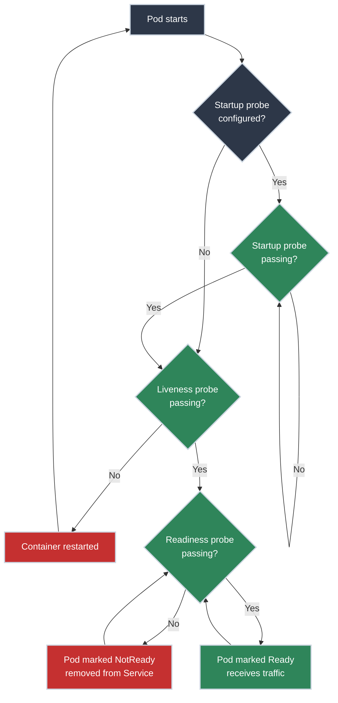

# Health Checks and Probes

!!! tip "Part of Level 6: Production Operations"
    This article is part of [Level 6: Production Operations](overview.md). At this level, you're running production Kubernetes and need to ensure traffic only goes to healthy pods.

Your application is deployed. Pods are running. Metrics look good. Then a pod's database connection fails. The pod is still running—the container didn't crash—but every request returns 500 errors.

Kubernetes keeps sending traffic to this broken pod because, from its perspective, the pod is "healthy" (the container process is running). Users are getting errors. Your SRE team is getting paged.

**This is the problem probes solve.** Just because a container is running doesn't mean your application is healthy. Probes let you define "health" on your terms—and Kubernetes will route traffic accordingly.

!!! info "What You'll Learn"

    By the end of this article, you'll understand:

    - **Liveness probes** - When to restart a pod
    - **Readiness probes** - When to send traffic to a pod
    - **Startup probes** - Handling slow-starting applications
    - **Probe types** - HTTP, TCP, exec (command)
    - **Initial delays and thresholds** - Tuning probe timing
    - **Graceful shutdown patterns** - Handling SIGTERM correctly
    - **Common probe mistakes** - What NOT to do
    - **Production probe patterns** - Best practices for real applications

## The Probe Decision Tree



---

## Understanding the Three Probe Types

### Liveness Probe: Is the Container Alive?

**Purpose:** Detect when your application is stuck in an unrecoverable state.

**What Kubernetes does when liveness probe fails:**

- Restarts the container
- Increments restart count
- Applies backoff delay (exponential backoff for repeated failures)

**When to use:**

- Application can deadlock (infinite loop, race condition)
- Application can become unresponsive (hung on external dependency)
- Restarting the container will fix the issue

**When NOT to use:**

- Temporary issues that will self-heal (don't restart for transient errors)
- Failures that restarting won't fix (database is down, external API unavailable)

<div class="grid cards" markdown>

-   :material-heart-pulse: **Use Case: Deadlock Detection**

    ---

    **Scenario:** Your application has a bug that causes it to deadlock occasionally. The process is running, but it's not processing requests.

    **Solution:** Liveness probe detects the deadlock (no response to probe) and restarts the container.

    ``` yaml title="Liveness probe for deadlock detection"
    livenessProbe:
      httpGet:
        path: /healthz
        port: 8080
      initialDelaySeconds: 30
      periodSeconds: 10
      timeoutSeconds: 5
      failureThreshold: 3
    ```

    **Result:** If `/healthz` fails 3 times in a row (30 seconds), Kubernetes restarts the container.

-   :material-alert-circle: **Anti-Pattern: Checking External Dependencies**

    ---

    **WRONG:**

    ``` yaml title="DON'T check database in liveness probe"
    livenessProbe:
      httpGet:
        path: /healthz
        port: 8080
      # /healthz checks: "Is database reachable?"
    ```

    **Problem:** If the database is temporarily unreachable, Kubernetes restarts your pod—which doesn't help because the database is still down. Now you have a crash loop.

    **Right approach:** Check external dependencies in **readiness probe**, not liveness probe.

</div>

### Readiness Probe: Is the Container Ready for Traffic?

**Purpose:** Determine whether the pod should receive traffic from Services.

**What Kubernetes does when readiness probe fails:**

- Marks pod as NotReady
- Removes pod from Service endpoints (no traffic sent)
- Does NOT restart the container

**When to use:**

- Application is starting up and not ready yet (loading data, warming caches)
- Application depends on external services (database, cache) that might be temporarily unavailable
- Application is overloaded and can't handle more traffic

**When NOT to use:**

- For issues that require a restart (use liveness probe)
- For permanent failures (application will never recover without intervention)

<div class="grid cards" markdown>

-   :material-traffic-light: **Use Case: Database Dependency**

    ---

    **Scenario:** Your application needs a working database connection to serve requests.

    **Solution:** Readiness probe checks database connectivity. If database is down, pod is marked NotReady and removed from Service.

    ``` yaml title="Readiness probe checking database"
    readinessProbe:
      httpGet:
        path: /ready
        port: 8080
      initialDelaySeconds: 5
      periodSeconds: 10
      timeoutSeconds: 3
      successThreshold: 1
      failureThreshold: 3
    ```

    **Application /ready endpoint:**

    ``` go title="Example readiness endpoint"
    func readyHandler(w http.ResponseWriter, r *http.Request) {
        // Check database connection
        if err := db.Ping(); err != nil {
            http.Error(w, "Database unavailable", http.StatusServiceUnavailable)
            return
        }
        // Check cache connection
        if err := cache.Ping(); err != nil {
            http.Error(w, "Cache unavailable", http.StatusServiceUnavailable)
            return
        }
        w.WriteHeader(http.StatusOK)
        w.Write([]byte("OK"))
    }
    ```

    **Result:** When database is down, pod is removed from load balancing. When database recovers, pod is added back automatically.

-   :material-timer-sand: **Use Case: Startup Delay**

    ---

    **Scenario:** Your application takes 60 seconds to load data into memory before it can serve requests.

    **Solution:** Readiness probe ensures traffic isn't sent until startup is complete.

    ``` yaml title="Readiness probe for slow startup"
    readinessProbe:
      httpGet:
        path: /ready
        port: 8080
      initialDelaySeconds: 60  # Wait for startup
      periodSeconds: 5
    ```

    **Result:** Pod starts, loads data, then begins receiving traffic after 60 seconds (when probe starts passing).

</div>

### Startup Probe: Has the Container Finished Starting?

**Purpose:** Handle slow-starting applications without interfering with liveness checks.

**What Kubernetes does:**

- Disables liveness and readiness probes until startup probe succeeds
- Gives application time to start without being killed by liveness probe
- After startup probe succeeds once, liveness/readiness probes take over

**When to use:**

- Legacy applications with slow initialization (minutes to start)
- Applications with unpredictable startup time
- Applications that could be killed by liveness probe before finishing startup

**When NOT to use:**

- Fast-starting applications (< 30 seconds)—just use `initialDelaySeconds` on liveness/readiness

<div class="grid cards" markdown>

-   :material-rocket-launch: **Use Case: Legacy Application with Slow Startup**

    ---

    **Scenario:** Your legacy Java application takes 5 minutes to initialize (loading data, warming JVM, connecting to services).

    **Problem without startup probe:** Liveness probe starts checking at 30 seconds, fails repeatedly (app not ready), Kubernetes restarts container → crash loop.

    **Solution:** Startup probe gives application time to start.

    ``` yaml title="Startup probe for slow-starting app"
    startupProbe:
      httpGet:
        path: /healthz
        port: 8080
      initialDelaySeconds: 0
      periodSeconds: 10
      failureThreshold: 30  # 30 * 10s = 5 minutes max startup time
    livenessProbe:
      httpGet:
        path: /healthz
        port: 8080
      periodSeconds: 10
      failureThreshold: 3
    ```

    **Result:** Kubernetes waits up to 5 minutes for startup probe to succeed. Once it does, liveness probe takes over with strict failure threshold.

</div>

---

## Probe Mechanisms

Kubernetes supports three ways to check pod health:

### HTTP Probe

**Most common probe type.** Kubernetes sends HTTP GET request to a specified path and port.

**Success:** HTTP response code 200-399

**Failure:** Any other response code, timeout, or connection error

``` yaml title="HTTP probe example" linenums="1"
livenessProbe:
  httpGet:
    path: /healthz  # (1)!
    port: 8080  # (2)!
    httpHeaders:  # (3)!
    - name: X-Custom-Header
      value: health-check
    scheme: HTTP  # (4)!
  initialDelaySeconds: 30
  periodSeconds: 10
  timeoutSeconds: 5
  successThreshold: 1
  failureThreshold: 3
```

1. HTTP path to request (your application must implement this endpoint)
2. Port to connect to (container port, not Service port)
3. Optional HTTP headers to include in request
4. HTTP or HTTPS (default: HTTP)

**When to use:** Most applications with HTTP endpoints (web servers, APIs, microservices).

### TCP Probe

**Simplest probe.** Kubernetes tries to open a TCP connection to specified port.

**Success:** Connection established

**Failure:** Connection refused or timeout

``` yaml title="TCP probe example" linenums="1"
readinessProbe:
  tcpSocket:
    port: 3306  # (1)!
  initialDelaySeconds: 5
  periodSeconds: 10
```

1. TCP port to connect to (e.g., 3306 for MySQL, 6379 for Redis)

**When to use:**

- Non-HTTP services (databases, caches, message queues)
- When you just need to check "is the port listening?"

**Limitation:** Doesn't check if application is actually functional, only that port is open.

### Exec Probe

**Runs a command inside the container.**

**Success:** Command exits with status code 0

**Failure:** Any non-zero exit code

``` yaml title="Exec probe example" linenums="1"
livenessProbe:
  exec:
    command:  # (1)!
    - cat
    - /tmp/healthy
  initialDelaySeconds: 5
  periodSeconds: 10
```

1. Command to run—must be available inside the container

**More complex example (check database):**

``` yaml title="Exec probe checking database connection"
readinessProbe:
  exec:
    command:
    - /bin/sh
    - -c
    - "pg_isready -h localhost -U myapp || exit 1"
  initialDelaySeconds: 10
  periodSeconds: 5
```

**When to use:**

- When HTTP/TCP probes aren't sufficient
- Need to run custom health check logic
- Legacy applications without HTTP endpoints

**Caution:** Exec probes have overhead (fork process, run command). Use HTTP probes when possible.

---

## Configuring Probe Timing

### Probe Configuration Fields

| Field | Purpose | Default | Recommendation |
|-------|---------|---------|----------------|
| **initialDelaySeconds** | Delay before first probe | 0 | Set to expected startup time (or use startup probe) |
| **periodSeconds** | How often to probe | 10 | 5-10s for readiness, 10-30s for liveness |
| **timeoutSeconds** | Probe timeout | 1 | 3-5s (less than periodSeconds) |
| **successThreshold** | Consecutive successes to mark healthy | 1 | Usually 1 (except for flaky checks) |
| **failureThreshold** | Consecutive failures to mark unhealthy | 3 | 3-5 (avoid false positives) |

### Example: Tuning Probe Timing

=== "Fast-Starting Application"
    **Scenario:** Lightweight Go microservice, starts in < 5 seconds.

    ``` yaml title="Probes for fast-starting app"
    readinessProbe:
      httpGet:
        path: /ready
        port: 8080
      initialDelaySeconds: 5  # App is ready quickly
      periodSeconds: 5  # Check frequently for fast traffic routing
      timeoutSeconds: 2
      failureThreshold: 3
    livenessProbe:
      httpGet:
        path: /healthz
        port: 8080
      initialDelaySeconds: 10  # Give a bit more time
      periodSeconds: 10  # Check less frequently
      timeoutSeconds: 3
      failureThreshold: 3
    ```

=== "Slow-Starting Application"
    **Scenario:** Spring Boot Java app, takes 60-90 seconds to start.

    ``` yaml title="Probes for slow-starting app"
    startupProbe:
      httpGet:
        path: /healthz
        port: 8080
      initialDelaySeconds: 0
      periodSeconds: 10
      failureThreshold: 12  # 12 * 10s = 120s max startup time
    readinessProbe:
      httpGet:
        path: /ready
        port: 8080
      periodSeconds: 5
      timeoutSeconds: 3
      failureThreshold: 3
    livenessProbe:
      httpGet:
        path: /healthz
        port: 8080
      periodSeconds: 15
      timeoutSeconds: 5
      failureThreshold: 3
    ```

=== "Database-Dependent Application"
    **Scenario:** Application requires database to be available.

    ``` yaml title="Probes checking external dependencies"
    readinessProbe:
      httpGet:
        path: /ready  # Checks database connectivity
        port: 8080
      initialDelaySeconds: 10
      periodSeconds: 5
      timeoutSeconds: 3
      failureThreshold: 3
    livenessProbe:
      httpGet:
        path: /healthz  # Only checks internal state, NOT database
        port: 8080
      initialDelaySeconds: 30
      periodSeconds: 10
      timeoutSeconds: 5
      failureThreshold: 3
    ```

    **Key difference:**

    - **Readiness `/ready`:** Checks database—if database is down, pod is removed from traffic
    - **Liveness `/healthz`:** Only checks internal application state—does NOT check database

---

## Implementing Health Check Endpoints

### Liveness Endpoint (/healthz)

**Purpose:** Check if application is alive and not deadlocked.

**Should check:**

- Application can respond to requests (not deadlocked)
- Critical internal components are functioning

**Should NOT check:**

- External dependencies (database, cache, APIs)—these belong in readiness
- Disk space, memory (these are node-level concerns, not app-level)

=== "Go Example"
    ``` go title="Simple liveness endpoint"
    func healthzHandler(w http.ResponseWriter, r *http.Request) {
        // Just return 200 OK if handler can execute
        w.WriteHeader(http.StatusOK)
        w.Write([]byte("OK"))
    }

    func main() {
        http.HandleFunc("/healthz", healthzHandler)
        http.ListenAndServe(":8080", nil)
    }
    ```

=== "Python (Flask) Example"
    ``` python title="Simple liveness endpoint"
    from flask import Flask

    app = Flask(__name__)

    @app.route('/healthz')
    def healthz():
        # Just return 200 OK
        return 'OK', 200

    if __name__ == '__main__':
        app.run(port=8080)
    ```

=== "Node.js (Express) Example"
    ``` javascript title="Simple liveness endpoint"
    const express = require('express');
    const app = express();

    app.get('/healthz', (req, res) => {
      // Just return 200 OK
      res.status(200).send('OK');
    });

    app.listen(8080, () => {
      console.log('Server running on port 8080');
    });
    ```

!!! tip "Keep Liveness Probes Simple"
    Liveness endpoint should be fast and lightweight. Avoid expensive checks. If liveness probe times out or is slow, you risk false positive restarts.

### Readiness Endpoint (/ready)

**Purpose:** Check if application is ready to receive traffic.

**Should check:**

- External dependencies (database, cache, message queue)
- Application initialization complete (data loaded, caches warmed)
- Application not overloaded (queue depth, goroutine count, etc.)

**Should NOT check:**

- Issues that require a restart (use liveness for those)

=== "Go Example (with Database)"
    ``` go title="Readiness endpoint checking database"
    func readyHandler(w http.ResponseWriter, r *http.Request) {
        // Check database connection
        ctx, cancel := context.WithTimeout(context.Background(), 2*time.Second)
        defer cancel()

        if err := db.PingContext(ctx); err != nil {
            http.Error(w, "Database unavailable", http.StatusServiceUnavailable)
            return
        }

        // Check Redis cache
        if _, err := redisClient.Ping(ctx).Result(); err != nil {
            http.Error(w, "Cache unavailable", http.StatusServiceUnavailable)
            return
        }

        // All checks passed
        w.WriteHeader(http.StatusOK)
        w.Write([]byte("READY"))
    }
    ```

=== "Python (Flask) Example"
    ``` python title="Readiness endpoint checking database"
    from flask import Flask
    import psycopg2

    app = Flask(__name__)

    @app.route('/ready')
    def ready():
        try:
            # Check database connection
            conn = psycopg2.connect(
                dbname='myapp',
                user='myapp',
                host='postgres',
                connect_timeout=2
            )
            conn.close()

            # All checks passed
            return 'READY', 200
        except Exception as e:
            return f'Not ready: {str(e)}', 503

    if __name__ == '__main__':
        app.run(port=8080)
    ```

=== "Node.js (Express) Example"
    ``` javascript title="Readiness endpoint checking database"
    const express = require('express');
    const { Pool } = require('pg');

    const app = express();
    const pool = new Pool({
      connectionTimeoutMillis: 2000,
    });

    app.get('/ready', async (req, res) => {
      try {
        // Check database connection
        await pool.query('SELECT 1');

        // All checks passed
        res.status(200).send('READY');
      } catch (err) {
        res.status(503).send(`Not ready: ${err.message}`);
      }
    });

    app.listen(8080);
    ```

!!! warning "Timeout Your Readiness Checks"
    If checking external dependencies, set short timeouts (2-3 seconds). Otherwise, slow dependencies can cause readiness probe timeouts.

---

## Graceful Shutdown and Termination

### The Problem: Requests in Flight

**What happens during pod termination:**

1. Pod receives SIGTERM signal
2. Pod is removed from Service endpoints (no new requests routed)
3. Pod has `terminationGracePeriodSeconds` (default: 30s) to finish existing requests
4. After grace period, pod receives SIGKILL (forced termination)

**The race condition:**

- Endpoint removal takes time to propagate (kube-proxy, iptables updates, DNS caching)
- New requests can arrive AFTER SIGTERM but BEFORE endpoint removal completes
- If application shuts down immediately on SIGTERM, these requests fail (connection refused, 502 errors)

### The Solution: Graceful Shutdown Pattern

<div class="grid cards" markdown>

-   :material-timer: **Step 1: Fail Readiness Probe**

    ---

    **On SIGTERM:** Immediately fail readiness probe.

    **Result:** Pod is removed from Service endpoints. No new requests routed.

    ``` go title="Set readiness to false on SIGTERM"
    var ready atomic.Bool
    ready.Store(true)

    func readyHandler(w http.ResponseWriter, r *http.Request) {
        if !ready.Load() {
            http.Error(w, "Shutting down", http.StatusServiceUnavailable)
            return
        }
        w.WriteHeader(http.StatusOK)
    }

    func main() {
        http.HandleFunc("/ready", readyHandler)

        sigChan := make(chan os.Signal, 1)
        signal.Notify(sigChan, syscall.SIGTERM)

        go func() {
            <-sigChan
            ready.Store(false)  // Fail readiness probe
            time.Sleep(10 * time.Second)  // Wait for endpoint removal
            // Then gracefully shutdown server...
        }()

        http.ListenAndServe(":8080", nil)
    }
    ```

-   :material-clock-outline: **Step 2: Wait for Endpoint Propagation**

    ---

    **After failing readiness:** Wait 5-15 seconds for endpoint removal to propagate.

    **Why:** Give kube-proxy, iptables, and load balancers time to update.

    ``` go title="Wait before shutting down"
    <-sigChan
    ready.Store(false)  // Fail readiness probe

    log.Println("SIGTERM received, waiting for endpoint removal...")
    time.Sleep(10 * time.Second)  // Wait for propagation

    log.Println("Shutting down server...")
    // Now safe to shutdown
    ```

-   :material-check-circle: **Step 3: Finish In-Flight Requests**

    ---

    **Gracefully shutdown server:** Stop accepting new requests, finish existing requests.

    ``` go title="Graceful HTTP server shutdown"
    srv := &http.Server{Addr: ":8080"}

    go func() {
        <-sigChan
        ready.Store(false)
        time.Sleep(10 * time.Second)

        ctx, cancel := context.WithTimeout(context.Background(), 15*time.Second)
        defer cancel()

        if err := srv.Shutdown(ctx); err != nil {
            log.Printf("Shutdown error: %v", err)
        }
    }()

    srv.ListenAndServe()
    ```

    **Result:** Existing requests complete gracefully. No 502 errors.

</div>

### Configuring Termination Grace Period

``` yaml title="Set termination grace period" linenums="1"
apiVersion: v1
kind: Pod
metadata:
  name: my-app
spec:
  terminationGracePeriodSeconds: 60  # (1)!
  containers:
  - name: app
    image: myapp:1.0
```

1. Default is 30 seconds—increase if your application needs more time to finish requests

**Choose grace period based on:**

- Longest expected request duration (e.g., large file uploads, long-running reports)
- Time for endpoint removal propagation (10-15 seconds)
- Time to drain connections and cleanup resources

!!! warning "Grace Period vs. Readiness Probe Delay"
    **Common mistake:** Setting `terminationGracePeriodSeconds: 5` but waiting 10 seconds in SIGTERM handler.

    **Result:** Pod is SIGKILL'd before graceful shutdown completes.

    **Fix:** Ensure `terminationGracePeriodSeconds` > (propagation wait + shutdown time).

---

## Common Probe Mistakes

### Mistake 1: Checking External Dependencies in Liveness Probe

**WRONG:**

``` yaml title="DON'T do this"
livenessProbe:
  httpGet:
    path: /healthz
  # /healthz checks database connectivity
```

**Problem:** Database is temporarily down → liveness fails → pod restarts → database still down → crash loop.

**RIGHT:**

``` yaml title="Check dependencies in readiness, not liveness"
readinessProbe:
  httpGet:
    path: /ready
  # /ready checks database connectivity

livenessProbe:
  httpGet:
    path: /healthz
  # /healthz only checks internal application state
```

### Mistake 2: No Readiness Probe

**WRONG:**

``` yaml title="Only liveness probe"
livenessProbe:
  httpGet:
    path: /healthz
# No readiness probe
```

**Problem:** Pod receives traffic immediately on start, even if application isn't ready → requests fail during startup.

**RIGHT:**

``` yaml title="Always use readiness probe"
readinessProbe:
  httpGet:
    path: /ready
  initialDelaySeconds: 5
livenessProbe:
  httpGet:
    path: /healthz
  initialDelaySeconds: 30
```

### Mistake 3: Liveness Probe Kills Slow-Starting Apps

**WRONG:**

``` yaml title="Liveness probe starts too early"
livenessProbe:
  httpGet:
    path: /healthz
  initialDelaySeconds: 10  # App takes 2 minutes to start
  failureThreshold: 3
  periodSeconds: 10
# After 10 + (3 * 10) = 40 seconds, app is killed
```

**Problem:** Application takes 120 seconds to start, but liveness probe kills it at 40 seconds → crash loop.

**RIGHT:**

``` yaml title="Use startup probe for slow-starting apps"
startupProbe:
  httpGet:
    path: /healthz
  periodSeconds: 10
  failureThreshold: 18  # 18 * 10s = 180s max startup
livenessProbe:
  httpGet:
    path: /healthz
  periodSeconds: 10
  failureThreshold: 3
```

### Mistake 4: Expensive or Slow Health Checks

**WRONG:**

``` go title="DON'T run expensive checks in liveness"
func healthzHandler(w http.ResponseWriter, r *http.Request) {
    // Run full database query
    rows, err := db.Query("SELECT COUNT(*) FROM users")
    // This is slow and puts load on database
}
```

**Problem:** Health check takes 2+ seconds → timeout → false positive restarts.

**RIGHT:**

``` go title="Keep liveness checks fast"
func healthzHandler(w http.ResponseWriter, r *http.Request) {
    // Just return 200 OK—check if handler can execute
    w.WriteHeader(http.StatusOK)
    w.Write([]byte("OK"))
}
```

**Reserve expensive checks for readiness probe** (and set appropriate timeouts).

### Mistake 5: Not Handling SIGTERM

**WRONG:**

``` python title="Application ignores SIGTERM"
if __name__ == '__main__':
    app.run(port=8080)
# No signal handling—receives SIGTERM, doesn't gracefully shutdown
```

**Problem:** Pod termination is abrupt. In-flight requests fail with connection errors.

**RIGHT:**

``` python title="Handle SIGTERM gracefully"
import signal
import sys
from flask import Flask

app = Flask(__name__)
ready = True

@app.route('/ready')
def readiness():
    if not ready:
        return 'Shutting down', 503
    return 'OK', 200

def handle_sigterm(signum, frame):
    global ready
    ready = False
    print("SIGTERM received, waiting for endpoint removal...")
    time.sleep(10)
    print("Shutting down...")
    sys.exit(0)

signal.signal(signal.SIGTERM, handle_sigterm)

if __name__ == '__main__':
    app.run(port=8080)
```

---

## Production Probe Patterns

### Pattern 1: Separate Liveness and Readiness Endpoints

**Always use different endpoints:**

- `/healthz` - Liveness (simple, fast, no dependencies)
- `/ready` - Readiness (checks dependencies, can be slower)

**Why:** Different concerns, different failure modes.

### Pattern 2: Readiness Gates for Multi-Dependency Apps

**Scenario:** Application depends on database, cache, message queue, external API.

**Strategy:** Check all dependencies in readiness probe.

``` go title="Readiness probe checking multiple dependencies"
func readyHandler(w http.ResponseWriter, r *http.Request) {
    checks := []struct {
        name string
        fn   func() error
    }{
        {"database", checkDatabase},
        {"cache", checkCache},
        {"message_queue", checkMessageQueue},
    }

    for _, check := range checks {
        if err := check.fn(); err != nil {
            http.Error(w, fmt.Sprintf("%s unavailable: %v", check.name, err), 503)
            return
        }
    }

    w.WriteHeader(http.StatusOK)
    w.Write([]byte("READY"))
}
```

### Pattern 3: Circuit Breaker Integration

**Scenario:** External API is flaky. Don't mark pod NotReady on every transient failure.

**Strategy:** Use circuit breaker pattern in readiness check.

``` go title="Circuit breaker in readiness probe"
var circuitBreaker *gobreaker.CircuitBreaker

func readyHandler(w http.ResponseWriter, r *http.Request) {
    _, err := circuitBreaker.Execute(func() (interface{}, error) {
        return checkExternalAPI()
    })

    if err != nil {
        // Circuit breaker open—too many failures
        http.Error(w, "Circuit breaker open", http.StatusServiceUnavailable)
        return
    }

    w.WriteHeader(http.StatusOK)
}
```

**Result:** Readiness probe tolerates transient failures (circuit breaker closed). After sustained failures, circuit opens and pod is marked NotReady.

### Pattern 4: Readiness for Load Shedding

**Scenario:** Application is overloaded (queue depth high, goroutines exhausted).

**Strategy:** Fail readiness probe to shed load.

``` go title="Readiness probe checking queue depth"
func readyHandler(w http.ResponseWriter, r *http.Request) {
    queueDepth := len(workQueue)
    if queueDepth > 1000 {
        http.Error(w, "Queue overloaded", http.StatusServiceUnavailable)
        return
    }

    w.WriteHeader(http.StatusOK)
}
```

**Result:** Overloaded pod is removed from Service. Load is distributed to other pods.

---

## Practice Exercises

??? question "Exercise 1: Add probes to a deployment"
    **Goal:** Configure liveness and readiness probes for a deployment.

    **Scenario:** You have a deployment running nginx. Add HTTP probes.

    ??? tip "Solution"
        ``` yaml title="deployment-with-probes.yaml" linenums="1"
        apiVersion: apps/v1
        kind: Deployment
        metadata:
          name: nginx-with-probes
        spec:
          replicas: 3
          selector:
            matchLabels:
              app: nginx
          template:
            metadata:
              labels:
                app: nginx
            spec:
              containers:
              - name: nginx
                image: nginx:1.21
                ports:
                - containerPort: 80
                livenessProbe:
                  httpGet:
                    path: /  # nginx serves index.html at /
                    port: 80
                  initialDelaySeconds: 10
                  periodSeconds: 10
                  timeoutSeconds: 3
                  failureThreshold: 3
                readinessProbe:
                  httpGet:
                    path: /
                    port: 80
                  initialDelaySeconds: 5
                  periodSeconds: 5
                  timeoutSeconds: 2
                  failureThreshold: 3
        ```

        **Apply and verify:**

        ``` bash
        kubectl apply -f deployment-with-probes.yaml

        kubectl get pods
        # Wait for READY 1/1 status

        kubectl describe pod <pod-name>
        # Check Events section for probe results
        ```

        **What you learned:**

        - Adding HTTP probes to a deployment
        - Choosing appropriate timing values
        - Verifying probes in pod events

??? question "Exercise 2: Simulate probe failure"
    **Goal:** Understand what happens when a readiness probe fails.

    **Scenario:** Deploy nginx with a readiness probe. Manually break the probe and observe behavior.

    ??? tip "Solution"
        **Step 1: Deploy nginx with readiness probe checking specific file**

        ``` yaml title="nginx-with-readiness.yaml"
        apiVersion: apps/v1
        kind: Deployment
        metadata:
          name: nginx-readiness-test
        spec:
          replicas: 2
          selector:
            matchLabels:
              app: nginx-readiness
          template:
            metadata:
              labels:
                app: nginx-readiness
            spec:
              containers:
              - name: nginx
                image: nginx:1.21
                ports:
                - containerPort: 80
                readinessProbe:
                  exec:
                    command:
                    - cat
                    - /tmp/ready  # File must exist for probe to pass
                  initialDelaySeconds: 5
                  periodSeconds: 5
        ---
        apiVersion: v1
        kind: Service
        metadata:
          name: nginx-readiness-svc
        spec:
          selector:
            app: nginx-readiness
          ports:
          - port: 80
        ```

        ``` bash
        kubectl apply -f nginx-with-readiness.yaml
        ```

        **Step 2: Create /tmp/ready file in pods**

        ``` bash
        kubectl get pods -l app=nginx-readiness
        # Note pod names

        kubectl exec nginx-readiness-test-xxx-abc -- touch /tmp/ready
        kubectl exec nginx-readiness-test-xxx-def -- touch /tmp/ready

        # Wait a few seconds, then check pod status
        kubectl get pods -l app=nginx-readiness
        # Both pods should be READY 1/1
        ```

        **Step 3: Check Service endpoints**

        ``` bash
        kubectl get endpoints nginx-readiness-svc
        # Should show both pod IPs
        ```

        **Step 4: Break readiness probe on one pod**

        ``` bash
        kubectl exec nginx-readiness-test-xxx-abc -- rm /tmp/ready
        ```

        **Step 5: Watch pod status change**

        ``` bash
        kubectl get pods -l app=nginx-readiness -w
        # After 3 failed probes (15 seconds), pod becomes READY 0/1
        ```

        **Step 6: Check Service endpoints again**

        ``` bash
        kubectl get endpoints nginx-readiness-svc
        # Only one pod IP now—broken pod removed from Service
        ```

        **Step 7: Fix readiness probe**

        ``` bash
        kubectl exec nginx-readiness-test-xxx-abc -- touch /tmp/ready

        # Watch pod become Ready again
        kubectl get pods -l app=nginx-readiness -w
        ```

        **What you learned:**

        - How readiness probe failures remove pods from Service
        - Pods are NOT restarted when readiness fails (only removed from traffic)
        - Pods are automatically re-added when readiness recovers

??? question "Exercise 3: Configure graceful shutdown"
    **Goal:** Implement graceful shutdown with readiness probe integration.

    **Scenario:** Write a simple Go application that handles SIGTERM gracefully.

    ??? tip "Solution"
        **Application code (main.go):**

        ``` go title="main.go"
        package main

        import (
            "context"
            "log"
            "net/http"
            "os"
            "os/signal"
            "sync/atomic"
            "syscall"
            "time"
        )

        var ready atomic.Bool

        func main() {
            ready.Store(true)

            http.HandleFunc("/", func(w http.ResponseWriter, r *http.Request) {
                w.Write([]byte("Hello from graceful shutdown demo"))
            })

            http.HandleFunc("/ready", func(w http.ResponseWriter, r *http.Request) {
                if !ready.Load() {
                    http.Error(w, "Shutting down", http.StatusServiceUnavailable)
                    return
                }
                w.WriteHeader(http.StatusOK)
                w.Write([]byte("READY"))
            })

            srv := &http.Server{Addr: ":8080"}

            // Handle SIGTERM
            sigChan := make(chan os.Signal, 1)
            signal.Notify(sigChan, syscall.SIGTERM, syscall.SIGINT)

            go func() {
                <-sigChan
                log.Println("SIGTERM received, failing readiness probe...")
                ready.Store(false)

                log.Println("Waiting 10 seconds for endpoint removal...")
                time.Sleep(10 * time.Second)

                log.Println("Shutting down server gracefully...")
                ctx, cancel := context.WithTimeout(context.Background(), 15*time.Second)
                defer cancel()

                if err := srv.Shutdown(ctx); err != nil {
                    log.Printf("Shutdown error: %v", err)
                }
            }()

            log.Println("Server starting on :8080")
            if err := srv.ListenAndServe(); err != http.ErrServerClosed {
                log.Fatalf("Server error: %v", err)
            }
        }
        ```

        **Dockerfile:**

        ``` dockerfile title="Dockerfile"
        FROM golang:1.21 AS builder
        WORKDIR /app
        COPY main.go .
        RUN go build -o server main.go

        FROM debian:bullseye-slim
        COPY --from=builder /app/server /server
        EXPOSE 8080
        CMD ["/server"]
        ```

        **Kubernetes deployment:**

        ``` yaml title="graceful-shutdown-deployment.yaml"
        apiVersion: apps/v1
        kind: Deployment
        metadata:
          name: graceful-app
        spec:
          replicas: 2
          selector:
            matchLabels:
              app: graceful-app
          template:
            metadata:
              labels:
                app: graceful-app
            spec:
              terminationGracePeriodSeconds: 60
              containers:
              - name: app
                image: your-registry/graceful-app:latest
                ports:
                - containerPort: 8080
                readinessProbe:
                  httpGet:
                    path: /ready
                    port: 8080
                  periodSeconds: 5
                  failureThreshold: 3
        ```

        **Test graceful shutdown:**

        ``` bash
        kubectl apply -f graceful-shutdown-deployment.yaml

        # Get pod name
        kubectl get pods -l app=graceful-app

        # Delete pod and watch logs
        kubectl delete pod <pod-name> --now=false

        # In another terminal, watch logs
        kubectl logs -f <pod-name>
        # You'll see:
        # SIGTERM received, failing readiness probe...
        # Waiting 10 seconds for endpoint removal...
        # Shutting down server gracefully...
        ```

        **What you learned:**

        - Handling SIGTERM in application code
        - Failing readiness probe on shutdown
        - Waiting for endpoint removal before stopping server
        - Configuring terminationGracePeriodSeconds

---

## Quick Recap

| Probe Type | Purpose | When It Fails |
|------------|---------|---------------|
| **Liveness** | Is application alive? | Container restarted |
| **Readiness** | Ready for traffic? | Pod removed from Service (not restarted) |
| **Startup** | Has app finished starting? | Delays liveness/readiness checks |

**Probe mechanisms:**

- **HTTP:** Most common, checks HTTP endpoint
- **TCP:** Checks if port is open
- **Exec:** Runs command inside container

**Graceful shutdown:**

1. Receive SIGTERM
2. Fail readiness probe
3. Wait for endpoint removal (10s)
4. Finish in-flight requests
5. Shutdown

---

## Further Reading

### Official Documentation

- [Kubernetes Docs: Configure Liveness, Readiness and Startup Probes](https://kubernetes.io/docs/tasks/configure-pod-container/configure-liveness-readiness-startup-probes/) - Complete probe configuration guide
- [Kubernetes Docs: Pod Lifecycle](https://kubernetes.io/docs/concepts/workloads/pods/pod-lifecycle/) - Understanding pod phases and conditions
- [Kubernetes Docs: Termination of Pods](https://kubernetes.io/docs/concepts/workloads/pods/pod-lifecycle/#pod-termination) - Graceful shutdown details

### Best Practices

- [Google Cloud: Best Practices for Application Health Checks](https://cloud.google.com/blog/products/containers-kubernetes/kubernetes-best-practices-setting-up-health-checks-with-readiness-and-liveness-probes) - Health check patterns
- [Learnk8s: Graceful Shutdown in Kubernetes](https://learnk8s.io/graceful-shutdown) - Comprehensive graceful shutdown guide
- [12-Factor App: Disposability](https://12factor.net/disposability) - Fast startup and graceful shutdown principles

### Related Articles

- [Logging Architecture](logging.md) - Centralized logging for troubleshooting probe failures
- [Monitoring and Metrics](monitoring.md) - Monitoring pod health and restarts
- [Level 6 Overview](overview.md) - All production operations topics

---

## What's Next?

You now understand how to keep traffic flowing to healthy pods and handle graceful shutdowns. Next in Level 6:

- **Helm Package Manager** - Package and deploy applications with Helm charts (coming soon)
- **Operators and Custom Resources** - Extend Kubernetes with custom functionality (coming soon)

Probes ensure **traffic goes to healthy pods**. Combined with logging and monitoring, you have complete production-grade observability.

---

**Your applications are now production-ready with health checks.**
