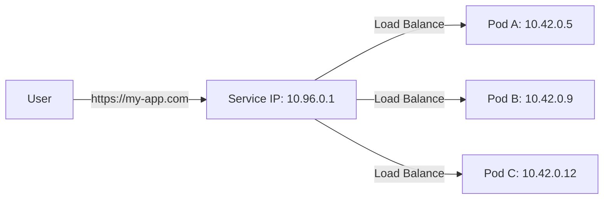

# Services: Stable Networking

In the Pod article, we learned that Pods are ephemeral—they are born and they die frequently. Every time a new Pod is born, it gets a **new IP address**.

If your Frontend needs to talk to your Backend, it can't use an IP address like `10.42.0.1`, because that IP will disappear tomorrow! To solve this, we use a **Service**.

## 1. The Stable Entry Point

A Service is a Kubernetes object that provides a **single, permanent IP address** and a **permanent DNS name** for a group of Pods.

-   The Pods can die and be replaced 1,000 times.
-   The Service's IP never changes.
-   The Service acts as a **Load Balancer**, automatically spreading traffic across all the healthy Pods in that group.

## 2. The Glue: Labels and Selectors

How does a Service know which Pods belong to it? It uses **Labels**.

1.  We give our Pods a label: `app: backend`.
2.  We tell our Service to look for a **Selector**: `app: backend`.

The Service constantly scans the cluster for any Pod matching that label. If a Pod dies, the Service removes it from the list. If a new Pod is born, the Service adds it.

## 3. Service Types

Where do you want the traffic to come from?

### A. ClusterIP (The Default)
The Service is only visible **inside the cluster**. 
-   *Use Case:* Your Backend database. You don't want the internet to see it, only your Frontend.

### B. NodePort
Exposes the Service on a specific port on **every node's IP**.
-   *Use Case:* Testing, or small clusters where you don't have a cloud load balancer.

### C. LoadBalancer
Integrates with your cloud provider (AWS, Azure, Google) to create a **Real External Load Balancer**.
-   *Use Case:* Exposing your website to the public internet.

## Visual Summary

## Practice Problems

??? question "Practice Problem 1: DNS Discovery"

    Your backend service is named `auth-svc`. How does your frontend code send a request to it?
    
    A. Use the IP address `10.42.0.5`.
    B. Use the hostname `http://auth-svc`.
    C. Use the environment variable `K8S_BACKEND_IP`.

    ??? tip "Solution"
        **B. Use the hostname `http://auth-svc`.** 
        
        Kubernetes has a built-in DNS service. Any Service you create is automatically registered by its name. This allows your code to stay simple: just talk to the service name, and Kubernetes handles the routing to the current Pod IPs.

??? question "Practice Problem 2: Selector Match"

    A Service has a selector `app: web`. You have two Pods:
    -   Pod A: `labels: {app: web, tier: frontend}`
    -   Pod B: `labels: {app: db, tier: database}`
    
    Which Pod will receive traffic from the Service?

    ??? tip "Solution"
        **Pod A.** 
        
        A Service matches any Pod that contains the labels listed in its selector. Since Pod A has `app: web`, it matches. Pod B does not have that label, so it is ignored.

## Key Takeaways

| Feature | Description |
| :--- | :--- |
| **Stable IP** | Provides a permanent address for ephemeral pods. |
| **Load Balancing** | Spreads traffic across multiple pods. |
| **Labels/Selectors** | The logic that connects Services to Pods. |
| **DNS** | Provides human-readable names for services. |

---

Services are the "glue" of the Kubernetes network. They transform a chaotic group of disappearing Pods into a reliable, reachable system that can scale and self-heal without ever breaking the connection to the outside world.
