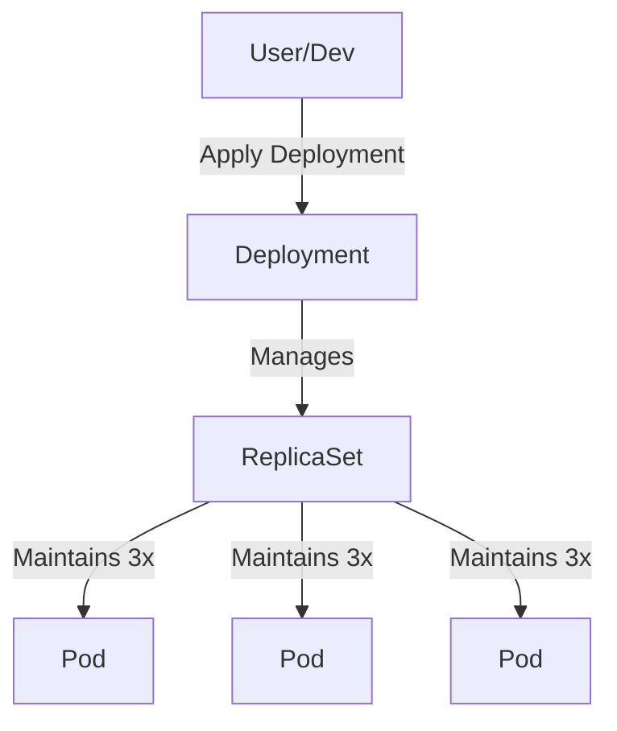

# Deployments: Scaling and Self-Healing

If Pods are the building blocks of Kubernetes, then **Deployments** are the architects.

In a real production environment, you almost never create a Pod directly. Instead, you create a **Deployment**, and the Deployment creates the Pods for you.

## 1. The Controller Loop: The Secret Sauce

Kubernetes works on a "Desired State" model. 
1.  You say: *"I want 3 copies of my Web App running."* (**Desired State**)
2.  The **Deployment Controller** looks at the cluster and sees 0 copies. (**Current State**)
3.  The Controller creates 3 Pods. (**Action**)

This loop runs forever. If you pull the plug on one server and a Pod dies, the Controller notices the count is now 2, and it immediately starts a new Pod on a healthy server to bring it back to 3. This is **Self-Healing**.

## 2. ReplicaSets: The Bodyguards

A Deployment doesn't actually manage Pods directly. It manages a **ReplicaSet**.
-   The **ReplicaSet's** only job is to ensure the exact number of Pods are running.
-   The **Deployment's** job is to manage the *version* of those Pods.

## 3. Rolling Updates: Zero Downtime

When you want to update your app from version 1 to version 2, you don't delete everything and start over. A Deployment performs a **Rolling Update**:

1.  It creates one new Pod (v2).
2.  Once the new Pod is healthy, it deletes one old Pod (v1).
3.  It repeats this until only v2 Pods remain.

This ensures your users never see a "404 Not Found" page while you are upgrading your software.

## 4. Rollbacks: The Panic Button

What if your new code has a bug and starts crashing? A Deployment keeps a history of your previous ReplicaSets. You can run one command to "Undo" the update, and Kubernetes will roll back to the previous stable version instantly.

## Visual Summary

## Practice Problems

??? question "Practice Problem 1: Manual Deletion"

    You have a Deployment managing 3 Pods. You manually delete one of the Pods using `kubectl delete pod`. What happens 5 seconds later?

    ??? tip "Solution"
        **A new Pod is born.** 
        
        The ReplicaSet controller will notice that the "Current State" (2 Pods) does not match your "Desired State" (3 Pods) and will immediately create a replacement Pod. This is how Kubernetes handles hardware failures automatically.

??? question "Practice Problem 2: Updating Images"

    You update the container image in your Deployment manifest. Does Kubernetes kill all 10 existing Pods at once?

    ??? tip "Solution"
        **No.** 
        
        By default, it performs a **Rolling Update**. it will gradually replace old Pods with new ones to ensure that the service remains available during the transition.

## Key Takeaways

| Object | Purpose |
| :--- | :--- |
| **Pod** | Atomic unit of execution. |
| **ReplicaSet** | Ensures the correct number of Pods exist. |
| **Deployment** | Manages updates, scaling, and rollbacks. |

---

Deployments turn Kubernetes into a self-driving system. By describing the "Desired State" of your application, you free yourself from the manual labor of monitoring servers and restarting failed processes.
